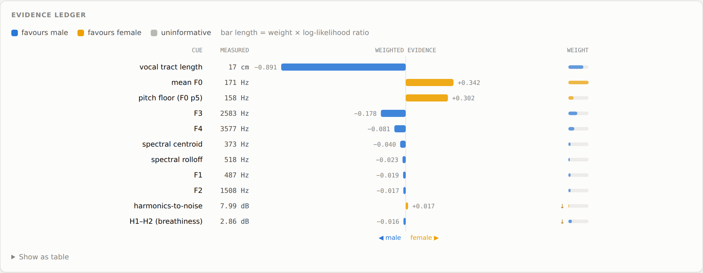

# voice-gender

A Claude Code skill that determines whether a voice recording is male or
female from its acoustics — with a calibrated probability, a full evidence
ledger, and an explicit refusal to answer when the audio cannot support a
verdict.

> This repository also carries a second skill, **[higgsfield](#higgsfield-generation)**,
> for video and image generation through the Higgsfield API.

## Design

The scripts measure; the model reasons. There is no trained classifier and no
model weights to ship. A DSP layer extracts thirteen acoustic features, scores
each against published population distributions as a log-likelihood ratio, and
emits an auditable ledger. Claude then reads that ledger, reconciles
conflicting cues, applies context the arithmetic cannot see, and writes the
finding.

```
audio ─> extract_features.py ─> features.json ─> score.py ─> ledger ─> Claude ─> report
         DSP measurement                         weighted LLR + gates   judgement
```

Every verdict decomposes into named measurements with units. Nothing is opaque.

## The visual analyser



A single-page browser analyser — live microphone, file upload, and a full
visual breakdown:

- **Verdict gauge** — the calibrated probability on a male↔female axis, with
  the abstention band drawn where it actually sits
- **Evidence ledger** — diverging bars, one per cue, length = weight × log-
  likelihood ratio. The whole argument in one picture: on a borderline voice
  you can see tract length outvoting both pitch cues
- **Pitch trace** — F0 over time against the population ranges, with the
  160–190 Hz overlap band called out
- **Resonance panel** — F1–F4 against both distributions, plus the pooled
  vocal-tract-length estimate on its own scale
- **Live monitor** — waveform, spectrum and instantaneous pitch while recording

```bash
python3 web/serve.py          # then open http://localhost:8000
```

A published copy is available as a private artifact:
<https://claude.ai/code/artifact/89f34606-e755-4eee-9eda-fa2e33f8518e> — built
from the same source by `web/build_artifact.py`, which inlines the priors and
opens the page on a worked example. File upload and the synthesised voices work
there; microphone capture may be withheld from a shared page, so `localhost`
remains the reliable route for live recording.

Everything runs locally in the browser; no audio is uploaded. Microphone
capture requires a secure context, which `localhost` provides and opening the
file directly does not.

The page scores with weights **generated** from `priors.json` by
`web/build_priors.py`, so the browser and the CLI cannot drift apart.

## Quick start

```bash
pip install -r requirements.txt

# Validate the pipeline against synthetic voices of known F0 and formants
python3 .claude/skills/voice-gender/scripts/selfcheck.py

# Analyse a recording
python3 .claude/skills/voice-gender/scripts/extract_features.py voice.wav -o f.json
python3 .claude/skills/voice-gender/scripts/score.py f.json
```

In Claude Code the skill triggers on its own — just supply an audio file and
ask.

## What it measures

| Block | Weight | Cues |
|---|---|---|
| Resonance | 0.46 | vocal tract length, F3, F4, F1, F2 |
| Pitch | 0.34 | mean F0, pitch floor |
| Voice quality | 0.15 | H1–H2, HNR, jitter, shimmer |
| Spectral shape | 0.05 | centroid, rolloff |

Resonance outweighs pitch deliberately. Pitch is the more separable cue in
isolation, but it is trainable, performable and consciously modifiable, and it
fails precisely inside the 160–190 Hz band where the sexes overlap. Vocal tract
length is fixed anatomy. That single weighting choice is what lets the system
classify a high-pitched male voice correctly.

## On accuracy

No acoustic system is 100% accurate on all voices, because the underlying
distributions physically overlap. This one instead aims at being right on the
cases it answers, and abstaining on the rest. Twelve quality gates can
disqualify a verdict outright — insufficient voiced audio, no detectable pitch,
a probable child, multiple speakers, a missing resonance block, or evidence
coverage below 55%. **An abstention is a correct outcome.**

## Validation

Three suites, all of which must pass:

| Suite | What it proves |
|---|---|
| `scripts/selfcheck.py` | 19 checks: measurement accuracy against synthetic ground truth, correct verdicts, correct abstentions, and that the degradation gates still fire |
| `tests/web_test.js` | The browser page loads, every demo voice reaches the right verdict, every chart draws, no console errors, no horizontal overflow |
| `tests/parity.js` | The browser analyser and the Python pipeline agree on identical audio |

```bash
python3 .claude/skills/voice-gender/scripts/selfcheck.py
npm install && npm test
```

The parity suite compares twice, because there are two different questions.
Against Python's **own LPC path** — the same algorithm the browser implements —
agreement is tight (worst deviation 2.3%), which is what catches a
mistranslated port. Against Python's **default Praat tracker** it is looser and
allowed to be: those are genuinely different estimators, and F1 is where they
differ most (up to 6.4%), which is exactly why F1 carries only 0.03 scoring
weight. Asserting tighter agreement there would claim a precision the two
methods do not have.

`selfcheck.py` synthesises voices through a source-filter model with known F0
and formants, then asserts the pipeline recovers them (F0 within 5%, F3 within
12%), reaches the right verdict, abstains on the four cases it should, and
still trips its degradation gates on band-limited and noisy audio. Nineteen
checks; all must pass before any result is trusted.

Included deliberately are `male_high_pitch` and `female_low_pitch` — voices
sitting inside the overlap band, where a pitch-dominant system fails.

## Limits

Read `.claude/skills/voice-gender/references/failure-modes.md` before using
this on anything consequential. In brief: it is near chance on children,
degrades on elderly speakers, cannot detect synthetic or performed speech,
measures anatomy rather than gender identity, and is calibrated on
predominantly English-language corpora.

## Layout

```
.claude/skills/voice-gender/
├── SKILL.md                    workflow and interpretation protocol
├── priors.json                 distributions and weights, as tunable data
├── scripts/
│   ├── extract_features.py     DSP measurement -> JSON
│   ├── score.py                weighted LLR -> evidence ledger
│   └── selfcheck.py            synthetic ground-truth validation
└── references/
    ├── feature-tiers.md        every feature, what it physically measures
    ├── weighting.md            weight table and LLR mathematics
    ├── decision-rules.md       gates, bands, conflict resolution
    └── failure-modes.md        where this degrades and where it must not be used
```

---

# Higgsfield generation

A second Claude Code skill: video and image generation through the
[Higgsfield API](https://docs.higgsfield.ai/docs) — 48 models spanning Sora 2,
Veo 3.1, Kling, Hailuo, Seedance, Wan, Flux, Reve, and Higgsfield's own Soul
and DoP.

## Design

The same principle as the voice skill: **the script handles mechanism, the
model handles judgement.** The client validates, submits, polls and downloads.
Choosing the model and writing the prompt — the two decisions that determine
whether the output is usable — are left to Claude and the user.

```
intent ─> model choice ─> estimate ─> submit ─> poll ─> download
          judgement       cost        client   client   client
```

The model catalogue is **generated from Higgsfield's live OpenAPI
specification**, so parameter validation cannot drift from the API the server
actually exposes — the same generated-data discipline `web/build_priors.py`
applies to the scoring weights.

## Quick start

```bash
cp .env.example .env          # then add your key from https://cloud.higgsfield.ai
python3 .claude/skills/higgsfield/scripts/higgsfield.py doctor
```

`doctor` checks the catalogue, the credentials and the network in one pass.

```bash
H=.claude/skills/higgsfield/scripts/higgsfield.py

python3 $H models --output video          # what is available
python3 $H show veo3.1/image-to-video     # what it takes
python3 $H estimate veo3.1 --prompt "..." # what it costs

python3 $H run veo3.1/image-to-video \
  --prompt "slow dolly-in across the factory floor, warm morning light" \
  --image ./site-photo.jpg \
  -p duration=8 -p resolution=1080 -p generate_audio=true \
  -o ./out
```

`--image` takes an https URL or a local file, which it uploads first. `run`
submits, polls with backoff, and downloads. Output URLs expire after about
seven days, so `-o DIR` is how anything gets kept.

In Claude Code the skill triggers on its own — describe the shot you want.

## Validation before spending

Every request is checked against the generated catalogue **before it leaves the
machine**: unknown parameters, invalid enum values, out-of-range numbers and
missing inputs are all caught locally, with suggestions.

```bash
python3 $H run sora-2/text-to-video --prompt x -p duration=7 --dry-run
# error: /sora-2/text-to-video rejected 1 parameter problem(s):
#   - duration=7 is not allowed. Valid: 4, 8, 12
```

`--dry-run` prints the exact request body without sending it, and needs no
credentials.

## Spending discipline

Generation costs credits and the account limit is **concurrency**, not requests
per second. The client is built around three rules:

- `estimate` before anything expensive or repeated in bulk
- Generation `POST`s are **never** retried automatically — the API has no
  idempotency key, so a blind retry can bill twice. Only `GET` status calls
  retry.
- Draft on a fast tier, finish on the quality tier

`failed` and `nsfw` requests are not charged and reserved credits are refunded.

## Validation

```bash
python3 .claude/skills/higgsfield/scripts/selfcheck.py          # 46 offline checks
python3 .claude/skills/higgsfield/scripts/selfcheck.py --live   # + reachability (49)
```

Catalogue integrity, model resolution, parameter validation, type coercion,
request shaping, credential redaction, and a property test asserting that every
one of the 48 models accepts a minimal payload. Nothing is generated and no
credits are spent, so it is safe in CI and without an account.

Refresh the catalogue when Higgsfield ships new models:

```bash
python3 .claude/skills/higgsfield/scripts/build_models.py           # regenerate
python3 .claude/skills/higgsfield/scripts/build_models.py --check   # is it stale?
```

## Credentials

Read from `HF_API_KEY_ID` + `HF_API_KEY_SECRET`, or `HF_KEY` in
`key-id:key-secret` form, or a `.env` file found by searching upward from the
repository. `.env` is gitignored; `.env.example` shows the shape.

Secrets are redacted from the client's error output. Credentials are
server-side only — never put them in browser or mobile code, and never commit
them.

## Layout

```
.claude/skills/higgsfield/
├── SKILL.md                 workflow, model selection, spending discipline
├── models.json              GENERATED catalogue: 48 models and their schemas
├── scripts/
│   ├── higgsfield.py        client: validate, submit, poll, download
│   ├── build_models.py      regenerates models.json from the live OpenAPI spec
│   └── selfcheck.py         49 checks, no credits spent
└── references/
    ├── models.md            all 48 models, and how to choose between them
    ├── api.md               lifecycle, auth, errors, limits, billing, retention
    └── prompting.md         prompt construction per model family
```
