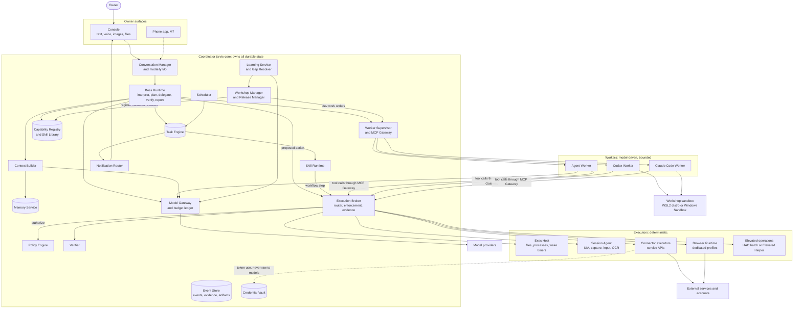
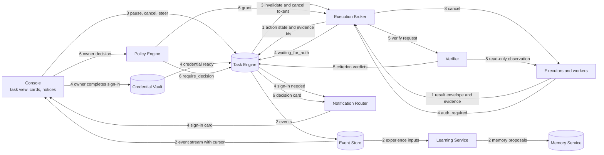
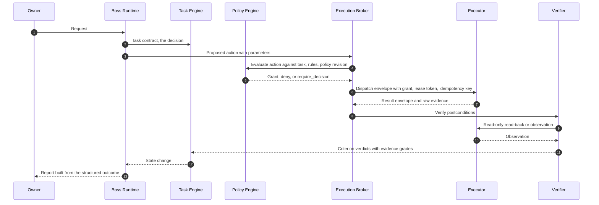
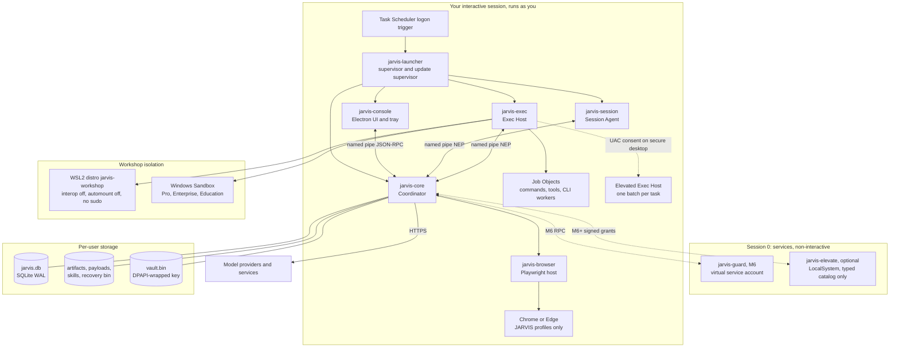
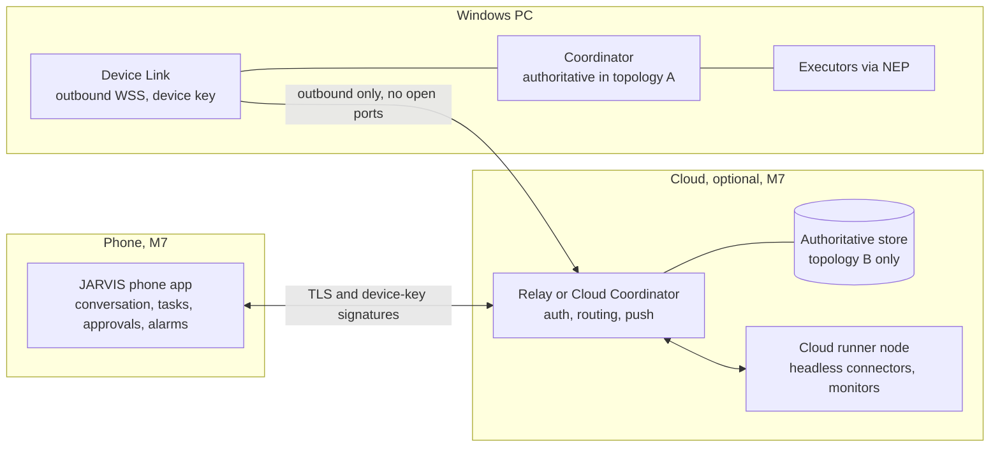

# 01 · System Architecture and Deployment

Deliverables 3–6. Terms are defined in the [README glossary](README.md#glossary).

---

# 3. Logical architecture

## 3.1 Design stance: a modular monolith with hard edges where they matter

The first implementation is **one Coordinator process** containing well-separated modules, plus a small number of separate processes. A component gets its own process only when one of these is true:

- **The operating system forces it.** Desktop interaction must run in your interactive session. Services cannot touch it, because of Session 0 isolation, below.
- **Isolation buys real safety.** Workers and untrusted code are separated from the policy and memory owner.
- **Failure containment matters.** A browser or UI crash must not take tasks down.
- **The language is different.** Native Windows automation is C#/.NET.

There is no message broker, no microservice mesh, no vector database, and no graph database. Module boundaries are enforced by typed interfaces, and each module owns its tables. Inter-process boundaries use one protocol family (JSON-RPC 2.0 over named pipes). This keeps v1 manageable while preserving the seams needed for the later cloud split.

## 3.2 Forward path

## 3.3 Return paths: results, events, cancellation, authentication, verification, decisions

The forward diagram hides the paths that make the system trustworthy. This diagram shows them. Numbers are path families.

| Path | Carrier | Guarantee |
|---|---|---|
| 1 Results | Result envelope ([05 §11.14](05-capabilities-and-execution.md#1114-common-result-envelope-and-evidence)) with `effect_state` and evidence | No success-shaped text is ever treated as success. Status comes from typed fields. |
| 2 Events | Append-only Event Store with per-node sequence numbers | Clients resume from a cursor after reconnecting. Learning consumes the same events. |
| 3 Cancellation | Task revision plus cancel tokens plus Job Object termination | A conversation summary changing does not stop anything. Tokens and process control do. |
| 4 Authentication | `auth_required` error class moves the task to `waiting_for_auth` | The task resumes automatically when the credential is ready, from a fresh observation. |
| 5 Verification | Verifier uses read-only observations, never the executing worker's word | Completion requires acceptable evidence per criterion. |
| 6 Decisions | Decision request cards bound to a proposal fingerprint | Approving a card creates a grant for *that* proposal only. |

## 3.4 The four concerns

| Concern | Sole owner | Deterministic? | What it may not do |
|---|---|---|---|
| **Decide** what to do | Boss Runtime (model-assisted) and workers within work orders | No: model reasoning inside deterministic scaffolding | Authorize, execute directly, or mark anything complete |
| **Authorize** | Policy Engine | Yes. Rule *authoring* is model-assisted, but the structured result must be confirmed by you. Evaluation is pure code. | Execute, or accept a model's claim of permission as input |
| **Execute** | Execution Broker and executors | Yes. Visual actions are proposed by a vision model but executed and checked deterministically. | Execute anything without a valid grant and lease |
| **Verify** | Verifier, with the Task Engine applying verdicts | Mostly. Semantic criteria may use a model judge, labeled as weaker evidence. | Trust the executing worker's report as evidence |

## 3.5 Where models are used

| Component | Deterministic parts | Model-assisted parts | Model failure behavior |
|---|---|---|---|
| Conversation Manager | Persistence, trust labels, control-command parser ("stop", "pause", "cancel that") | Interpreting free-form turns | Messages stored and acknowledged. "Received. I can't reason right now." |
| Boss Runtime | Controller loop, plan validation, budget checks, state transitions | Interpretation, planning, choices within bounds, summaries | Tasks pause at the next reasoning step. Deterministic steps continue. |
| Context Builder | Rule applicability, structured lookups, text search, budget packing | Optional embeddings. Cached derived summaries. | Falls back to text search and structured retrieval |
| Memory Service | Storage, versioning, dedup keys, supersession, deletion | Extraction and classification *proposals* | Proposals wait. Explicit "remember" still works. |
| Policy Engine | Evaluation, grants, bounds checks | Drafting structured rules from your words, confirmed by you | Unaffected |
| Execution Broker and executors | Everything | Vision-action proposals (visual computer use only) | Visual route unavailable. Others unaffected. |
| Verifier | File, read-back, test, and postcondition checks | Semantic judgement (graded weak or moderate) | Criterion stays unverified, so the task is partially completed |
| Scheduler | Timing, recurrence, missed runs, deduplication | Turning natural-language time into a structured schedule, validated and shown to you | Existing schedules unaffected |
| Capability Registry | Filtering, health, lifecycle | Optional semantic search over descriptions | Text search fallback |
| Learning and Gap Resolver | Bounds, promotion rules, cycle detection | Failure analysis, lesson drafting | Proposals queue |
| Workshop | Validation pipeline, packaging, activation | Coding workers | Build waits. Task preserved. |
| Notification Router | Attention scoring, budgets, quiet hours | Optional digest wording | Plain templated notices |
| Model Gateway | Routing, budgets, retries, usage | — | Fallback chain or wait, per policy |

---

# 4. Windows deployment

## 4.1 Process topology

| Process | Kind | Runs as | Session | Started by | Language | Why it is separate |
|---|---|---|---|---|---|---|
| `jarvis-launcher` | Background app (no window) | You | Interactive | Task Scheduler "at log on" trigger for your account [I], or the `HKCU\...\Run` key | C#/.NET | Must outlive and restart everything else. It is also the Update Supervisor and is never modified by self-improvement. |
| `jarvis-core` | Background app | You | Interactive | Launcher | TypeScript/Node | Owns state. Must survive UI restarts. |
| `jarvis-session` | Background app with hidden windows for hooks and notifications | You | Interactive | Launcher | C#/.NET | UI Automation, input, and capture must run in your desktop session. Crash containment. |
| `jarvis-exec` | Background app | You. Spawns sandboxed and elevated children. | Interactive | Launcher | C#/.NET | Job Objects, restricted tokens, DPAPI, and Task Scheduler COM are native APIs. Isolates process-spawning risk. |
| `jarvis-browser` | Child of core | You | Interactive | Coordinator | TypeScript/Node | Playwright host. Browser crashes and memory bloat stay out of core. |
| `jarvis-console` | Electron desktop app plus tray | You | Interactive | Launcher, or you | TypeScript | Closable UI. Microphone capture and playback. |
| Worker processes | CLI or agent processes | You (T1) only for owner-tier agents. Workshop identity for coding workers (T2). | Interactive or WSL VM | Exec Host | — | Bounded, killable, resource-limited |
| `jarvis-guard` (M6) | Windows service | Virtual service account | Session 0 | Service Control Manager | C#/.NET | Protected policy, vault, and audit outside your user's write access |
| `jarvis-elevate` (optional, M6+) | Windows service | LocalSystem | Session 0 | Service Control Manager | C#/.NET | Narrow typed catalog of admin operations, only on signed grants |

**Why not a Windows service for the Coordinator in v1?** Since Windows Vista, services run in Session 0 and cannot directly interact with a user's desktop. Microsoft's recommended patterns are RPC or named pipes to a process in the user's session, `WTSSendMessage` for simple prompts, or `CreateProcessAsUser` for UI [V-S: [Microsoft, Interactive Services](https://learn.microsoft.com/en-us/windows/win32/services/interactive-services)]. A service would also need its own access to your files, DPAPI secrets, and browser profiles. A per-user Coordinator gets all of that naturally. The cost is honest and visible: **nothing runs while you are signed out.** Most personal PCs stay signed in and locked, and in that state the Coordinator keeps running.

## 4.2 Deployment diagram with session boundaries

**Local IPC.** All local channels are JSON-RPC 2.0 over Windows named pipes. Each pipe's ACL grants access only to your user SID (and the Guard's service SID later). The Launcher creates a random per-boot session secret, passes it to its children over an inherited handle, and uses it in the connection handshake.

This prevents other Windows users and accidental cross-talk from reaching the pipes. It does **not** stop malicious code already running as you, because such code can read your processes' memory. That limit is stated in [04 §10.9](04-policy-and-trust.md#109-enforcement-levels-and-privilege-tiers). The executors' protocol is the **Node Execution Protocol (NEP)** ([12 §17.6](12-stack-and-contracts.md#176-interface-contracts)). It is the same contract a remote node will use later.

## 4.3 What needs an interactive, unlocked desktop

| Operation | Needs you signed in (v1) | Needs an unlocked desktop | Notes |
|---|---|---|---|
| File operations, shell, API connectors, scheduled headless jobs | Yes | No | Continue while locked |
| Headless browser contexts | Yes | No | Research and read-only browsing continue while locked |
| Headed JARVIS-profile browser via Playwright/CDP | Yes | Usually no [U] | CDP input does not use OS input. Rendering of hidden windows may be throttled. Verified in M0. |
| UI Automation reads of desktop apps | Yes | Treated as required [U] | Behavior while locked varies. JARVIS treats the desktop as unavailable when locked. |
| OS input injection (mouse and keyboard) | Yes | Yes | `SendInput` is also subject to UIPI. It cannot drive windows at a higher integrity level unless the process has UIAccess [V-S: [SendInput](https://learn.microsoft.com/en-us/windows/win32/api/winuser/nf-winuser-sendinput)] |
| Screen capture | Yes | Yes | |
| Windows notifications | Yes | Shown after unlock | Alarms also use sound |
| Alarm sound playback | Yes | No [I] | Requires the PC awake and audio not muted |
| Push-to-talk hotkey and microphone | Yes | Yes | |
| UAC consent | Yes | Yes | The owner must be present. The secure desktop cannot be automated. |

## 4.4 Lifecycle behavior

| Event | What continues | What pauses | What is unavailable | On return |
|---|---|---|---|---|
| **First run** | Onboarding: profile, timezone, privacy posture, budgets, quiet hours. Creates the logon task. No accounts connected until you connect them. | — | — | — |
| **PC booted, not signed in** | Nothing (v1) | Everything | Everything, including alarms | At sign-in: recovery scan and missed-run policy |
| **Sign-in** | Launcher starts all processes. Coordinator runs the recovery scan (§4.5). | — | — | Resumes tasks from checkpoints |
| **Lock** | Coordinator, Scheduler, connectors, headless browser, shell jobs, workers | Desktop steps. The Session Agent revokes the `desktop:input` lease on lock (via `WTS_SESSION_LOCK` notification [I]). | Desktop input and capture. The state reads "waiting for your PC to be unlocked." | Re-observe before resuming any desktop step |
| **Sleep or hibernate** | Nothing. Processes are suspended. | Everything. Network connections drop. | Everything, except schedules with a working wake timer | Resume: clock-jump detection, reconciliation of uncertain actions, missed-run policy, lease renewal, token refresh |
| **Sign-out or shutdown** | — | Graceful stop: checkpoint, release leases, mark unacknowledged external actions `uncertain` | Everything | Recovery at next sign-in. If Windows terminates processes early, crash recovery covers it. |
| **Fast user switch or RDP disconnect** | Background work | Desktop steps | Desktop input and capture [I] | Re-observe |
| **Console closed** | Everything | — | Voice input | Reopening syncs from the event cursor |
| **Coordinator crash** | Session Agent (drops the input lease when the core heartbeat is lost). Exec Host (keeps workers for a short re-attach window). | New dispatches | — | Launcher restarts it with backoff. Three crashes in 10 minutes enter **safe mode**: UI and memory browsing only, no dispatch, deterministic alarms still delivered. |
| **Session Agent crash** | Everything else | Desktop steps | Desktop. Notifications fall back to the Console. | Restart, then re-observe |
| **Exec Host crash** | Coordinator | Shell, file, and sandbox actions | Its Job Objects terminate the children (kill-on-close) | In-flight actions become `uncertain` and are reconciled. Worker sessions are resumed by session ID where the provider supports it. |
| **Network loss** | Local work, alarms, deterministic jobs | Model reasoning, connectors, remote browsing | Boss reasoning ("waiting for network") | Backoff and resume |
| **Clock or timezone change, DST** | — | — | — | Scheduler recomputes the next fire times ([10 §15.2](10-time-and-attention.md#152-schedules-and-time-semantics)) |
| **Update** | Handled by the Update Supervisor ([08 §13.11](08-workshop-and-release.md#1311-self-improvement-of-jarvis-itself)) | Drains tasks at checkpoints | Briefly, JARVIS itself | Health check, then canary or rollback |

## 4.5 Startup and recovery scan

1. The Launcher resolves the current installed version and starts the Exec Host, the Coordinator, the Session Agent, and the Console tray, in that order.
2. The Coordinator opens `jarvis.db` and runs `PRAGMA quick_check`. It applies migrations only if the Update Supervisor has staged them with a verified backup, then loads the compiled policy snapshot. **If policy cannot load, it starts in safe mode and dispatches nothing.**
3. It then runs a deterministic recovery scan:
   - Actions in `dispatched` without an acknowledgement become `uncertain` and are queued for reconciliation. They are never retried blindly ([02 §8.7](02-boss-and-tasks.md#87-external-action-lifecycle)).
   - Tasks in `running` or `verifying` resume from their last checkpoint. Grants are re-validated for policy revision and expiry, and leases are re-acquired with new fencing tokens.
   - Work orders re-attach to live worker sessions where possible. Otherwise they restart from the checkpoint with the same context package.
   - Leases held by dead process instances expire.
   - Schedules apply their missed-run policies. Monitors resume from their cursors.
4. The Console shows a single recovery summary, for example: "Back online: 2 tasks resumed, 1 booking outcome being checked, 1 reminder was missed while the PC was off."

---

# 5. Phone and cloud extension

## 5.1 Two future topologies

| | **A: PC-authoritative with relay** | **B: Cloud-authoritative coordinator** |
|---|---|---|
| Where memory, tasks, and policy live | Your PC | A cloud deployment you control |
| Phone when the PC is off | Can read cached summaries and queue commands. Cannot run tasks. | Full conversation. Headless tasks run on a cloud node. |
| Relay sees content? | No. It can be end-to-end encrypted between phone and PC, because the relay never needs plaintext. | The coordinator processes plaintext. It is encrypted at rest under your control. |
| Desktop actions | PC only | PC node only, when online and unlocked |
| Alarms | Phone-native alarms become possible through the phone app | Same |
| Complexity | Lower | Higher (hosting, backups, availability) |

**Recommendation.** Design every contract for B, and decide between A and B at M7 (owner decision U-07). Nothing in v1 prevents either choice.

## 5.2 Extension diagram

## 5.3 Ownership and synchronization

- **One authority.** Exactly one Coordinator per owner is authoritative for tasks, memory, policy, and the registry at any time. Other devices are **clients**, which send commands, or **nodes**, which execute NEP commands. There is no multi-master replication of memory or policy.
- **Commands, not writes.** Clients never write authoritative state directly. An offline phone queues *intents* (for example "snooze this reminder" or "approve decision `dec_...`"), each with an expiry. The authority applies them and resolves conflicts.
- **Policy conflicts are never last-write-wins.** Two conflicting rule edits produce a policy conflict that you must resolve. Protected rules require presence proof on the device making the change ([04 §10.8](04-policy-and-trust.md#108-policy-revisions-and-propagation)).
- **Memory edits** merge at field level with an explicit conflict record when two edits touch the same field of the same record revision ([03 §9.17](03-memory.md#917-sync-readiness-and-conflict-policy)).
- **Migration A→B** is an export and import that preserves IDs, revisions, and provenance ([03 §9.18](03-memory.md#918-portability)). The PC then re-registers as a node.

## 5.4 Device registration, availability, and commands

| Concern | Design |
|---|---|
| **Registration** | You start pairing in the Console. The new device generates a key pair, hardware-backed where available, and shows or scans a one-time pairing code. The authority records a `DeviceRegistration` with role (client or node) and scopes (for example, "phone may approve decisions but not change protected rules without presence proof"). |
| **Capability advertisement** | Nodes send a `CapabilityAdvertisement` with their capabilities and health, their availability state (unlocked, locked, asleep, offline), the policy revision they hold, and their active leases ([12 §17.7](12-stack-and-contracts.md#177-central-schemas-and-schema-index)). The Router treats availability as dynamic. |
| **Transport** | An outbound WebSocket over TLS from the PC to the relay. No inbound ports on the PC, and never an exposed desktop-control port. Command envelopes are signed by the authority and verified by the node, so a compromised relay cannot forge commands. |
| **Command expiry** | Every command carries `expires_at`. Interactive actuation (a click or keystrokes) expires within about two minutes. Queued background work can wait longer. An expired command is rejected with `expired` and never executed late. |
| **Duplicate delivery** | `command_id` is an idempotency key. The node keeps processed IDs and their results for 24 hours and returns the stored result on redelivery. |
| **Reconnect** | Exponential backoff with jitter. The node resumes from the last acknowledged sequence number, and the authority resends unexpired, unacknowledged commands. The node replays unacknowledged events, which the authority deduplicates by `event_id`. |
| **Revocation** | Revoking a device marks it revoked, rotates relay credentials, and pushes a revocation. A revoked node refuses all NEP commands. Credentials bound to the device key stop working. |
| **Leases across nodes** | Leases and fencing tokens are issued only by the authority. A node that reconnects with a stale fencing token has its commands rejected. |

## 5.5 What stays the same

Task, action, and event IDs. The event envelope. The NEP contract and result envelope. Memory ownership and provenance. Policy revisions and grants. Skill packages and version pins. This is why v1 builds these as if the network already existed, even though every call is local.

---

# 6. Component responsibility table

"Authoritative state" means the component is the single source of truth for that data. Anything not listed is a cache.

| Component | Kind / process | Inputs | Outputs | Authoritative state | Depends on | Failure behavior |
|---|---|---|---|---|---|---|
| **Console** | Electron app | Your text, voice, files, clicks. Event stream. | Commands, decisions, edits | UI layout preferences only | Coordinator | JARVIS continues without it. It re-syncs from the event cursor on reopen. |
| **Conversation Manager** | Coordinator module | Client messages, transcripts, attachments | Persisted messages with trust labels, control commands, boss turns | Conversations, messages | Boss, Memory | Persist-before-process. Replies "received, can't reason right now" if models are down. |
| **Boss Runtime** | Coordinator module | Messages, task events, context packages | Contracts, revisions, plans, work orders, proposed actions, reports | None (writes go through the Task Engine and Memory) | Model Gateway, Context Builder, Task Engine, Registry | Reasoning pauses. Deterministic work continues. |
| **Task Engine** | Coordinator module | Contracts, revisions, step results, verdicts, controls | State transitions, events, checkpoints | Tasks, revisions, steps, actions, attempts, leases, checkpoints | DB | DB failure stops all dispatch. The UI goes read-only. |
| **Scheduler** | Coordinator module | Schedules | Fire events to the Task Engine and Notification Router | Schedules, fires, monitors, cursors | Task Engine, Exec Host (wake timers) | Single-instance DB lease. Missed-run evaluation after restart. |
| **Memory Service** | Coordinator module | Proposals, explicit memory commands, corrections, deletions | Records, search results, change events | Memory tables, owner profile | DB, embedding adapter (optional) | Unavailable means no restricted actions (§9.9) |
| **Context Builder** | Coordinator module | Task or turn descriptors | Context packages with source IDs | Cache only | Memory, Policy snapshot, Registry | Rebuilds on cache miss. Fails closed without rules. |
| **Policy Engine** | Coordinator module; the Guard from M6 | Action requests, rule edits, decisions | Grants, denials with reasons, decision requests | Rules, policy revisions, grants | DB, later the Guard | Unavailable means deny (fail closed) |
| **Execution Broker** | Coordinator module | Proposed actions from the boss, skills, and workers | NEP dispatches, action states, evidence | Action records (through the Task Engine) | Policy, Registry, Vault, executors | Reroutes or waits. Uncertain outcomes are reconciled. |
| **Verifier** | Coordinator module | Success criteria, action results | Verdicts with graded evidence | Evidence records | Executors (read-only), Model Gateway | An unverifiable criterion means partially completed |
| **Capability Registry** | Coordinator module | Installs, releases, health probes | Descriptors, search results, health | Capabilities, packages, health | DB | Disabled or unhealthy capabilities are rejected at dispatch |
| **Skill Runtime** | Coordinator module | Skill invocations | Workflow steps, execution records | Skill runs | Registry, Broker | Classified failure goes to the Gap Resolver |
| **Learning Service / Gap Resolver** | Coordinator module | Experiences, failures, gap reports | Improvement proposals, development work orders, memory and lesson candidates | Proposals, gap reports, lessons | Model Gateway, Workshop Manager | Over budget, proposals queue |
| **Workshop Manager / Release Manager** | Coordinator module | Development work orders, candidates | Builds, validation reports, releases | Releases, candidate packages | Workers, Exec Host, Registry | Build failure preserves the workspace and diagnostics. Activation is atomic. |
| **Model Gateway** | Coordinator module | Requests by role | Responses, streams, usage | Budget ledger, routing configuration | Providers, Vault | Fallback per policy, or wait. Budget exhausted means deny. |
| **Connector Hub** | Coordinator module plus connector executors | Connector tool calls | API results, health | Account connections, connector configuration | Vault, Registry | `auth_required` or `rate_limited` with backoff |
| **Worker Supervisor / MCP Gateway** | Coordinator module | Work orders | Worker sessions, per-work-order MCP endpoints | Work-order runtime state | Exec Host, adapters | Heartbeat timeout, then cancel and kill, then retry or escalate |
| **Notification Router** | Coordinator module | Notices, suggestions | Deliveries per channel | Notifications, attention statistics | Session Agent, Console | Falls to the next channel or queues |
| **Event Store** | Coordinator module | Events, evidence, artifacts | Streams, queries | Events, payloads, evidence, artifacts | DB, file store | No dispatch without a write-ahead record |
| **Credential Vault** | Coordinator module; the Guard from M6 | Store and use requests | Token *use*, never raw tokens to models | Encrypted credentials | DPAPI (via Exec Host) | Connectors show "needs sign-in". No plaintext fallback. |
| **Session Agent** | .NET process | NEP desktop commands | Observations, input results, lock, power, and takeover events | None durable | UI Automation, capture, and input APIs | Restarted by the Launcher. Steps re-observe. |
| **Exec Host** | .NET process | NEP process and file commands | Results, bounded output, evidence | Recovery-bin index | Win32 APIs, WSL, Windows Sandbox | Children die with it. Actions become uncertain and are reconciled. |
| **Browser Runtime** | Node child process | NEP browser commands | Page observations, results, downloads | Browser profiles on disk | Playwright, Chrome or Edge | Relaunched. Submissions reconciled. |
| **Launcher / Update Supervisor** | .NET process | Process health, update packages | Restarts, version switches | Installed versions, update journal | OS | Crash loop enters safe mode. Rollback on a failed health check. |
| **Workers** (Agent, Codex, Claude Code) | Child processes | Work orders | Results, artifacts, events, proposals | Provider session state (a cache) | Model Gateway or provider CLIs | Supervised, bounded, killable |
| **Guard** (M6) | Windows service | Policy changes, grant requests, vault operations | Signed grants, audit chain | Policy store, vault, audit | Service account, Windows Hello | Unavailable means consequential actions fail closed |
| **Elevated Helper** (optional) | Windows service | Signed admin requests | Results and evidence | Operation journal | Guard | Falls back to the UAC path |
| **Device Link** (M7) | Coordinator module | NEP over the network | — | Device registrations | Relay | Offline means commands queue with expiry |
