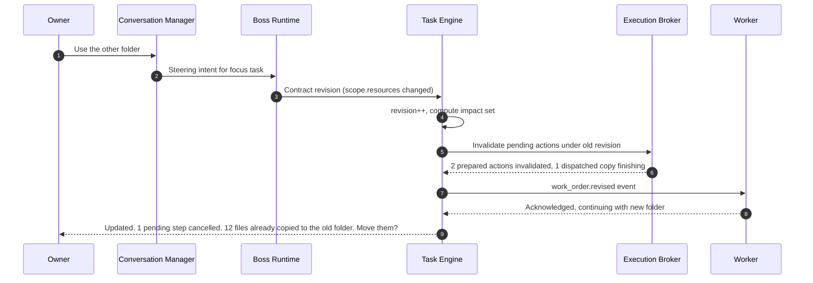
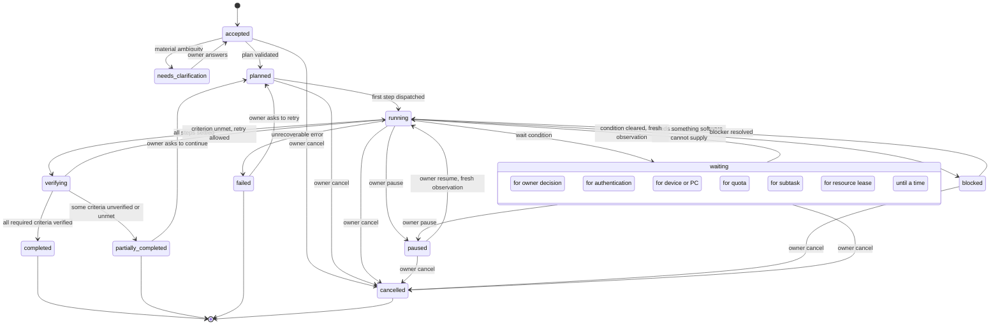
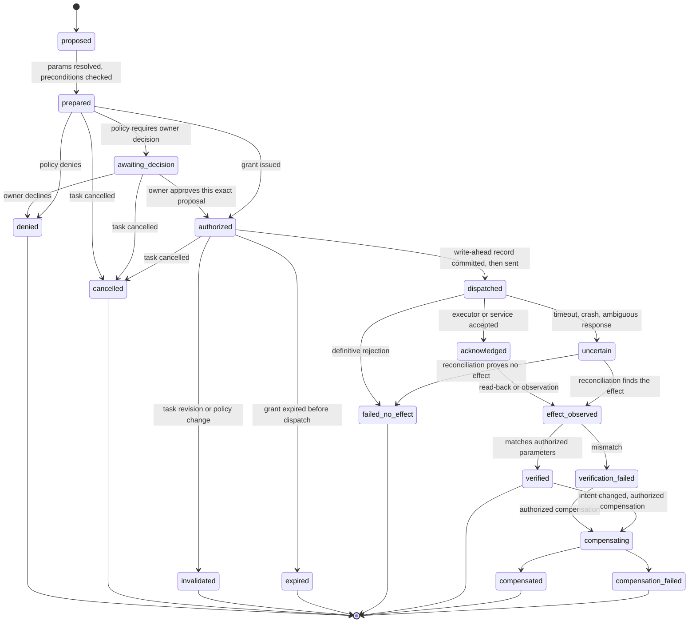

# 02 · Boss, Workers, Task Contracts, and State Machines

Deliverables 7 and 8. Terms are defined in the [README glossary](README.md#glossary).

---

# 7. Boss and worker coordination

## 7.1 Boss Runtime anatomy

The "boss" is not one long model conversation. It is application code with a reasoning model called at specific decision points. Identity, memory, rules, tasks, and transcripts live in the application.

| Module | Responsibility | Deterministic or model-assisted |
|---|---|---|
| **Conversation Manager** | Persists every turn with a trust label. Parses control commands. Tracks the *focus task* and resolves references ("that", "the alarm", "the other folder"). | Deterministic, with a model for ambiguous references |
| **Intent Interpreter** | Turns a message into typed intents: `reply`, `new_task`, `steer_task`, `control`, `remember`, `correct_memory`, `set_rule`, `schedule`, `question` | Model with structured output, validated deterministically |
| **Contract Builder** | Builds or revises the Task Contract (§8.2). Applies defaults and the materiality test (§8.4). | Mixed |
| **Planner** | Proposes plan steps with capability references, dependencies, effects, and criteria mapping | Model proposes. The Plan Validator checks: capabilities exist and are healthy, effects stay within the contract ceiling, budget fits, no cycles. It also runs a dry-run policy check of planned targets, so a step aimed at a protected folder is caught at planning time. |
| **Delegation Manager** | Decides between inline work, one worker, parallel workers, and review (§7.6). Writes work orders. | Rules plus a model estimate |
| **Step Controller** | Drives steps through the Skill Runtime, Broker, and Worker Supervisor. Handles results, replans within bounds, and asks the owner when required. | Deterministic loop |
| **Verifier interface** | Requests verification and applies verdicts through the Task Engine | Deterministic |
| **Reporter** | Writes progress and final reports **from structured outcomes**. A wording guard blocks completion language that the structured status does not support. | Model writes the prose. Code checks the claims against state. |
| **Persona layer** | Name, tone, verbosity, humor, spoken versus written style. It is configuration you can edit. | Configuration |

## 7.2 A replaceable reasoning model inside a stable identity

Every model call goes through the Model Gateway using a provider-neutral request:

```ts
interface ReasoningAdapter {
  id: string;                                  // e.g. "anthropic:claude-opus-5-5"
  capabilities(): {
    tools: boolean; vision: boolean; structured_output: boolean;
    max_context_tokens: number; streaming: boolean; prompt_caching: boolean;
  };
  run(req: ReasoningRequest, signal: AbortSignal): AsyncIterable<ReasoningEvent>;
}

interface ReasoningRequest {
  role: "boss.reasoning" | "boss.fast" | "agent.worker" | "vision.interpret" | "vision.act";
  system: SystemBlock[];             // persona, policy summary, instructions: application-owned text
  context_package_id: string;        // resolved into provenance-wrapped blocks (03 §9.9)
  transcript: NeutralMessage[];      // application-owned, provider-neutral history
  tools?: ToolSpec[];                // JSON Schema tool specs: meta-tools or work-order-scoped tools
  output_schema?: JSONSchema;        // for decisions that must be machine-readable
  limits: { max_output_tokens: number; timeout_s: number; budget_id: string };
  correlation: Correlation;          // task_id, step_id, work_order_id, conversation_id
}

type ReasoningEvent =
  | { type: "text_delta"; text: string }
  | { type: "tool_call"; call_id: string; tool: string; input: unknown }
  | { type: "structured_output"; value: unknown }
  | { type: "usage"; usage: UsageReport }                      // 12 §17.7
  | { type: "stop"; reason: "end" | "tool_use" | "max_tokens" | "refusal" | "error"; error?: StructuredError };
```

| Owned by the application (survives any provider change) | Provider-side caches (disposable) |
|---|---|
| Persona and identity configuration | Provider session or thread IDs |
| Full transcripts in `messages` | Prompt caches |
| Memory, rules, tasks, skills, events | Provider-side conversation history |
| Tool specifications and schemas | Provider tool-search indexes |

**Switching the boss model** is a routing-configuration release ([08 §13.11](08-workshop-and-release.md#1311-self-improvement-of-jarvis-itself)). The candidate runs the boss evaluation suite ([14 §19.3](14-verification-and-observability.md#193-evaluation-plan)) on the same neutral transcripts and context packages. You approve the switch when it changes cost or privacy characteristics. After the switch, the next turn simply renders the same application-owned state for the new adapter.

The configured candidates are Claude Opus 5.5 (`claude-opus-5-5`, the current Opus model) and your requested label Claude Opus 5 (`claude-opus-5`), which Anthropic's models overview lists as a legacy model that is still available [V: [Models overview](https://platform.claude.com/docs/en/about-claude/models/overview), [V-S] for the `claude-opus-5` ID]. Neither is hard-coded (owner decision in [15 §20.8](15-decisions-and-traceability.md#208-owner-decisions)).

## 7.3 Two loops: conversation latency versus durable execution

```text
CONVERSATION LOOP (latency-bound; one per incoming owner message)
  persist(msg, trust = channel.verified ? owner_verified : owner_unverified)
  if ControlParser.match(msg):                       # "stop", "pause", "cancel that", "stop talking"
      apply control deterministically; acknowledge; return
  focus = ConversationState.resolveFocus(msg)        # explicit ref > focused card > recent task
  ctx   = ContextBuilder.forTurn(msg, focus)          # compact; rules by applicability
  intents = Boss.interpret(ctx, msg)                  # structured output, validated
  for intent in intents:
      reply           -> stream answer (voice: speak a short acknowledgement first)
      new_task        -> TaskEngine.create(ContractBuilder.build(intent)) ; ack with one-line interpretation
      steer_task      -> TaskEngine.revise(task, ContractBuilder.diff(intent))       # §7.9
      control         -> TaskEngine.control(task, op)
      remember        -> MemoryService.writeExplicit(...) ; echo "Saved: …"
      correct_memory  -> MemoryService.correct(...)                                  # 03 §9.12
      set_rule        -> PolicyEngine.proposeRule(...) ; confirmation card for enforceable kinds
      schedule        -> Scheduler.propose(...) ; show exact interpretation
      question        -> ask; record open question on the relevant task

TASK LOOP (durable; event-driven; one logical loop per task)
  on task ready:
      plan = Planner.propose(contract, ctx) ; PlanValidator.check(plan) or replan (bounded)
      while exists ready step:
          leases = LeaseManager.acquire(step.resources)      # may wait: waiting_for_resource
          switch step.kind:
              tool      -> Broker.execute(action)             # authorize, dispatch, evidence
              skill     -> SkillRuntime.run(skill@pinned, params)
              worker    -> WorkerSupervisor.dispatch(workOrder)
              ask_owner -> TaskEngine.wait(owner_decision)
              reason    -> Boss.decideNext(bounded)           # exploratory step, budgeted
              wait      -> TaskEngine.waitUntil(t)
          record result; checkpoint; update plan (bounded replans)
      verdicts = Verifier.check(contract.success_criteria)
      TaskEngine.settle(verdicts)                            # completed | partially_completed | failed
      Reporter.report(task) ; LearningService.onTaskClosed(task)
```

A voice request is acknowledged within the conversation loop ("On it. I'll look for hotels near the venue and come back with options."). Execution proceeds asynchronously, and progress arrives as events. Acknowledgement never implies completion.

## 7.4 Worker types

| Worker | Runtime | Typical use | Tier | Tools available | Resume | Steering |
|---|---|---|---|---|---|---|
| **Agent Worker** | JARVIS's own tool loop on the Model Gateway | Research, drafting, analysis, the browser agent, visual computer use | T1 through the Broker only. It has no raw OS access. | Scoped per work order | Application transcript | Revision message injected at the next turn |
| **Codex Worker** | Codex SDK, app-server, or `codex exec` ([06 §11.18](06-connectors-providers-budgets.md#1118-coding-worker-adapters)) | Coding, repository work, file-heavy transformations in a workspace | T2 (Workshop) | Its built-in tools inside its sandbox, plus JARVIS tools through the MCP Gateway | Thread ID | App-server `turn/steer` and `turn/interrupt` [V: method names listed in the [app-server README](https://github.com/openai/codex/blob/main/codex-rs/app-server/README.md)], or interrupt and resume |
| **Claude Code Worker** | `claude -p` with `stream-json`, or the Agent SDK | Coding, analysis, repository work | T2 (Workshop) | Its built-in tools inside its sandbox, plus JARVIS tools through the MCP Gateway | `--resume <session_id>` [V: [headless docs](https://code.claude.com/docs/en/headless)] | SDK `interrupt()` [V], then resume with a revision note |
| *(Skill Runtime, not a worker)* | Deterministic workflow engine | Known procedures | Per step, through the Broker | Declared in the skill manifest | Checkpoint | Revision re-evaluates pending steps |

## 7.5 Work orders and worker results

```ts
interface WorkOrder {
  work_order_id: string;            // wo_…
  task_id: string; step_id: string; task_revision: number;
  parent_work_order_id?: string;
  worker_type: "agent" | "codex" | "claude_code";
  objective: string;                // bounded, testable
  context_package_id: string;       // minimum sufficient context (03 §9.9)
  inputs: ArtifactRef[];            // 12 §17.7
  allowed_capabilities: string[];   // exact tool ids exposed through the MCP Gateway
  allowed_effects: EffectClass[];   // subset of the task's intended_effects
  leases: string[];                 // lse_… held on the worker's behalf
  workspace?: { kind: "git_worktree" | "scratch" | "wsl_workspace" | "windows_sandbox"; path: string; isolation: "T1" | "T2" };
  budget: { max_cost?: Money; max_wall_time: string; max_tool_calls?: number;
            subscription_allowed: boolean; paid_fallback: "never" | "within_cap" | "ask" };
  deadline?: string;
  output_schema: JSONSchema;        // what the result's `output` must satisfy
  verification: { required_evidence: EvidenceType[]; tests?: string[]; holdout_ref?: string };
  policy_revision: number;
  constraints: string[];            // explicit constraints in plain text, restated from the contract
  report: { progress: boolean; questions: "allowed" | "forbidden"; heartbeat_s: number };
  capability_token_ref: string;     // MCP Gateway token scoped to this work order, expires with it
}

interface WorkerResult {
  work_order_id: string;
  status: "succeeded" | "partial" | "failed" | "blocked" | "cancelled";
  output?: unknown;                              // validated against output_schema
  claims: { text: string; evidence_ids: string[] }[];   // a claim without evidence stays a claim
  artifacts: ArtifactRef[];
  proposed_memory_updates: MemoryProposal[];     // 03 §9.11; never direct writes
  proposed_skill_updates?: string[];             // imp_… proposals
  failures: StructuredError[];                   // 05 §11.6
  questions?: { question: string; why: string }[];
  usage: UsageReport;
  remaining_risks: string[];
}
```

## 7.6 Delegation policy

| Situation | Choice | Reason |
|---|---|---|
| A few tool calls, and the boss already has the context | **Inline.** The Step Controller drives tools through the Broker. | No handoff cost |
| A long autonomous loop with large intermediate context: coding, multi-page browsing, analysis of many files | **One worker** | Keeps the boss context small. Bounded budget. Isolated workspace. |
| Independent subtasks with no shared mutable resource and a real time saving | **Parallel workers** (default limit 2, configurable) | Wall-clock time |
| Consequential code (tools with `communicate`, `spend`, `commit`, `publish`, `access_control`, or `admin` effects, or code touching credentials), or when strong evidence is unavailable | **A second worker reviews**, preferably from a different provider. It receives the specification, diff, and tests, not the author's reasoning. | Independent scrutiny with less anchoring |
| Sources disagree in research | One worker plus a deterministic source cross-check. A second opinion only if the conflict is material. | Cost |
| Anything else | **No extra agents** | Committees add cost without value |

Every added worker must carry a stated expected benefit (time saved or risk reduced) in its delegation record. The evaluation suite periodically compares outcomes with and without the extra worker for that task class.

## 7.7 Accountability without abdication

- A worker's `WorkerResult` is input to the boss, not a conclusion. The Step Controller accepts a result only after the work order's `verification` requirements pass through the Verifier.
- If a worker reports success but the evidence fails, the Task Engine emits `worker.claim_rejected`. The step is retried with a different approach or escalated, and the owner-facing report never repeats the unsupported claim.
- The final report is generated from task state and evidence. The Reporter's wording guard rejects drafts that use completion language ("done", "booked", "sent") for criteria that are not in a verified state, and forces the correct partial wording.

## 7.8 Resource ownership and isolation

- **Leases** protect shared resources: `desktop:input` (exclusive), `desktop:observe` (shared), `browser_profile:<name>` (exclusive), `fs:<path>` (exclusive write or shared read), `account:<connector>:<account>:send` (serialized sends), and `workspace:<id>`. Leases have an expiry, a heartbeat, and a monotonically increasing **fencing token** ([12 §17.7](12-stack-and-contracts.md#177-central-schemas-and-schema-index)).
- **Fencing at the real boundary.** Every NEP command carries the lease token and the task revision. The Session Agent rejects input commands with a stale desktop token. The Exec Host rejects writes into a leased path without the current token. The Broker rejects actions with a stale task revision. This binds JARVIS-mediated actions only. A coding worker's own shell inside its sandbox is contained by the sandbox, not by fencing.
- **Workspaces.** Coding work orders each get their own git worktree or sandbox workspace. Document work writes to a staging area, and the apply step checks target files against hashes captured when the lease was taken. If you changed a file in the meantime, JARVIS does not overwrite it. It produces a merged copy or asks.
- **No two workers edit the same thing.** An exclusive `fs:` or `workspace:` lease is required for writes. Integration of parallel coding results happens in the Workshop's merge step, with tests run after merge ([08 §13.6](08-workshop-and-release.md#136-handoff-protocol)).

## 7.9 Mid-task correction (steering)



1. **Identify the task.** An explicit reference wins, then the task card focused in the Console, then the most recently discussed active task. If more than one task is plausible and the change affects external effects, JARVIS asks "Which task?"
2. **Revise, don't rewrite.** The Boss emits a contract revision (a JSON Patch plus `reason` and `source_message_id`). The Task Engine applies it atomically and increments `revision`.
3. **Compute impact.**
   - Unstarted steps are replanned.
   - `prepared`, `awaiting_decision`, and `authorized` actions whose parameters or authorization basis changed become `invalidated`. Unaffected ones are cheaply re-validated.
   - `dispatched` actions are cancelled if cancellable, otherwise allowed to finish and flagged for the report.
   - Work orders receive `work_order.revised`. Live sessions are steered where the worker supports it. Otherwise the worker is interrupted and resumed with the revision.
4. **Fence.** The Broker rejects any later action that still carries the old task revision (`conflict`, stale revision). A revision can declare itself non-impacting for specific effects, for example a change of notification preference.
5. **Report plainly** what changed, what was cancelled, and which completed effects no longer match the new intent (§8.4).

| Correction | Contract change | Immediate consequence |
|---|---|---|
| "Use the other folder" | `scope.resources` updated | Pending writes to the old folder invalidated. Completed copies reported, with a move offered. |
| "Stop applying and just show matches" | `mode: execute → research`, and `commit`/`communicate`/`spend` removed from `intended_effects` | All pending applications invalidated. A submission already in flight is reconciled and reported. |
| "Make it cheaper" (for this trip) | `overrides` entry against the price-tier preference | Replan the search. Memory is unchanged. |
| "Don't send it, just draft" | `communicate` removed | The pending send is invalidated. The draft becomes an artifact. |

---

# 8. Task contract and state machines

## 8.1 When a request becomes a task

- **Pure conversation** (no tools, no side effects) stays a conversation turn and creates no task.
- **Tool-using but read-only questions** create a lightweight internal task so they get checkpoints and evidence. The Console shows them only if they run longer than a few seconds.
- **Substantial requests** create a full contract. You see a task card with a one-line interpretation, for example: *"Finding hotels near the conference venue, 14–17 Oct, up to €180/night, free cancellation: options only."* (HYPOTHETICAL.) The contract itself is internal and concise. Defaults fill most fields, and questions appear only under the materiality test.

## 8.2 Task contract schema

```ts
interface TaskContract {
  task_id: string;                     // tsk_…
  parent_task_id?: string;             // e.g. a development subtask points to the original task
  root_task_id: string;
  schema: "jarvis.task_contract/1";
  revision: number;                    // increments on every change
  created_at: string; updated_at: string;

  origin: {
    channel: "console_text" | "console_voice" | "schedule" | "monitor" | "phone" | "system";
    conversation_id?: string;
    message_ids: string[];             // owner messages this contract rests on
    owner_verified: boolean;           // arrived through an authenticated owner channel
    transcript_confidence?: "high" | "medium" | "low";       // voice only
  };
  request_text_ref: string;            // payload reference to your original words // SENSITIVE
  objective: string;                   // concise interpreted objective
  mode: TaskMode;                      // §8.3
  project_id?: string;                 // prj_…

  inputs: InputRef[];                  // artifacts, files, records, URLs
  assumptions: { text: string; basis: "memory" | "default" | "inference"; source_ids: string[]; material: boolean }[];
  open_questions: { question: string; why_material: string; blocks_step_ids: string[] }[];

  scope: {
    resources: ResourceSelector[];     // folders, accounts, sites, applications
    accounts: string[];                // acc_…
    exclusions: ResourceSelector[];
  };
  intended_effects: EffectClass[];     // hard ceiling for this task, enforced by the Broker
  constraints: Constraint[];           // structured bounds: dates, amounts, recipients, locations
  overrides: TaskOverride[];           // temporary exceptions (§8.4)

  authorization: {
    basis: ("explicit_instruction" | "standing_permission" | "schedule_owner_intent" | "owner_decision")[];
    envelope?: AuthorizationEnvelope;  // bounds derived from an explicit instruction (04 §10.6)
    grant_ids: string[];
    policy_revision: number;           // at creation; re-checked at dispatch
  };
  success_criteria: SuccessCriterion[];
  budget: BudgetEnvelope;
  deadline?: string;
  retry_policy: "default" | RetryPolicyOverride;
  cancellation: { on_cancel: "stop_and_report" | "stop_and_offer_compensation"; children: "cancel" | "keep" };
  required_capabilities: string[];     // capability ids or capability-search intents
  dependencies: string[];              // task ids or external conditions
  planned_artifacts: { name: string; kind: string; destination?: ResourceSelector }[];
  notifications: { progress: "quiet" | "milestones" | "verbose"; on_complete: Channel[]; on_decision: Channel[] };
  memory_plan: { propose_updates: boolean; retain_task_details: "summary" | "full" | "none" };

  status: TaskStatus;                  // §8.5
  wait_reason?: WaitReason;
  status_detail?: string;              // owner-facing, e.g. "Needs you to sign in to ExampleStays"
}

interface SuccessCriterion {
  id: string;
  description: string;                 // "Booking exists for 14–17 Oct at the selected hotel"
  check: { kind: "file_exists" | "file_content" | "service_readback" | "confirmation_captured"
                 | "tests_pass" | "postcondition" | "model_judgement" | "owner_confirmation"; spec: object };
  acceptable_evidence: EvidenceType[]; // 14 §19.4
  required: boolean;
}

interface Constraint {
  id: string; field: string;           // e.g. "price.per_night"
  op: "<=" | ">=" | "==" | "in" | "not_in" | "between" | "matches";
  value: unknown;
  source: { kind: "owner_message" | "rule" | "memory"; ref: string };
  hard: boolean;                       // hard constraints bound authorization; soft ones guide choice
}

interface TaskOverride {               // temporary exception; dies with the task
  id: string;
  target: { kind: "preference" | "rule"; ref: string };   // mem_… or rul_… (never a protected rule)
  replacement: unknown;
  source_message_id: string;
}

interface BudgetEnvelope {
  ai_cost_cap: { amount: Money; kind: "hard" | "soft" };  // model, API, and speech costs for this task
  subscription_usage: "allowed" | "not_allowed";
  paid_api_fallback: "never" | "within_cap" | "ask";
  max_wall_time?: string;              // ISO 8601 duration
  max_dev_depth: number;               // default 2
  max_attempts_per_gap: number;        // default 3
}
```

External spending limits, such as a hotel price ceiling, are `constraints` bound into the authorization envelope. They are never mixed with the AI cost budget.

## 8.3 Modes and effect ceilings

The mode sets the maximum effects the task may have. The Broker enforces the ceiling: an action whose effect class is not in `intended_effects` is denied without consulting any rule.

| Mode | Meaning | Default effect ceiling |
|---|---|---|
| `advise` | Give an opinion or recommendation | `read.*` |
| `plan` | Produce a plan and no effects | `read.*`, `write.local` (the plan artifact) |
| `research` | Gather and synthesize information | `read.*`, `write.local` (notes) |
| `draft` | Produce content for your review | `read.*`, `write.local`, and `write.account` only for drafts you asked to be placed in an account |
| `prepare` | Stage everything up to the point of commitment: fill forms, build a cart, compose a message | `read.*`, `write.local`, `write.account`. Never `communicate`, `publish`, `spend`, or `commit`. |
| `execute` | Carry out the authorized effect | Exactly the effects the explicit instruction or standing permission authorizes |
| `monitor` | Watch and notify | `read.*`, `notify_owner`, `write.local` (records) |
| `build` | Create or repair software in the Workshop | `read.local` (scoped), `write.local` (workspace), `execute_code` and `install` inside the sandbox. Activation follows the release policy. |

## 8.4 Interpretation rules

**Examples versus instructions.** "It should be able to book a flight" states a requirement. It creates no task with external effects. At most it becomes a capability note or a planning discussion. Imperative requests with concrete parameters ("book the 7:10 train tomorrow") are instructions. When the Intent Interpreter's classification is uncertain, the request is treated as `plan` or `advise`, the safe direction.

**The materiality test.** JARVIS asks a question only if at least one of these holds:

1. The answer changes the **target, recipient, amount, date, destination, or reversibility** of an external effect.
2. Plausible interpretations lead to materially different outcomes, and a wrong guess costs more than a question.
3. A required input can be neither inferred from memory nor defaulted sensibly.

Otherwise JARVIS proceeds with recorded assumptions and shows the material ones on the task card ("Assuming 1 guest, based on your usual conference travel.").

**Temporary exceptions versus permanent changes.**

| What you say | What changes |
|---|---|
| "For this trip, use a cheaper option." | A `TaskOverride` against the price-tier preference. It expires with the task, and memory is untouched. |
| "From now on, economy is fine for domestic flights." | Memory: the old preference is superseded with `valid_until = now`, and a new scoped preference is recorded. Echo: "Updated: economy for domestic flights." |
| "I prefer cheaper options." (ambiguous scope) | A task override now, plus a non-blocking chip: "Keep this for future trips?" |
| A statement contradicting an existing rule | If it is clearly a change, a rule revision is proposed. If unclear, both statements are shown and you pick. JARVIS blocks only if the current action depends on the answer. |
| An instruction conflicting with a *normal* constraint ("send it now" at 9 pm against "no client emails after 8 pm") | One-tap decision: "Override once" or "Keep rule". An explicit acknowledgement in the instruction ("send it now even though it's late") counts as the override. |
| An instruction conflicting with a *protected* constraint | Denied, with the rule named. The change must go through the protected process ([04 §10.5](04-policy-and-trust.md#105-precedence-and-conflicts)). |

**Intent changes after an irreversible action.** JARVIS reports the completed effect exactly, from the action record ("The booking at Hotel A was confirmed at 14:02, confirmation EX-48213 (HYPOTHETICAL)"). It then assesses compensating options: cancellation within the free-cancellation window, a follow-up correction email, a refund request. A compensating action is a new action that needs its own authorization. JARVIS never claims a reversal it has not verified.

## 8.5 Task state machine



Storage uses `status = waiting` plus a `wait_reason`. The Console always renders a meaningful phrase and the next expected event, for example "Waiting for your PC to be unlocked. Resumes automatically."

| From → To | Initiator | Condition or evidence required |
|---|---|---|
| `accepted → needs_clarification` | Contract Builder | Materiality test fails |
| `accepted → planned` | Plan Validator | Plan is valid: capabilities exist or gaps are flagged, effects ⊆ ceiling, budget fits |
| `planned → running` | Step Controller | First step dispatched (a write-ahead record exists) |
| `running → waiting (reason)` | Step Controller or Broker | Typed error or explicit wait: `auth_required`, `unavailable_device`, `rate_limited`, a decision request, a lease queue, a subtask, or a timer |
| `waiting → running` | Task Engine | The matching event (credential ready, device available, quota reset, decision recorded, lease granted, subtask settled, time reached). Always re-observe first. |
| `running ↔ paused` | Owner only | Control command. Resuming re-observes and re-validates grants. |
| `running → verifying` | Step Controller | All steps are `done`, `skipped`, or `failed` with a fallback recorded |
| `verifying → completed` | Verifier through the Task Engine | **Every required criterion has acceptable evidence.** A model's statement cannot trigger this transition. |
| `verifying → partially_completed` | Verifier | At least one required criterion unverified or unmet. The report lists each one. |
| `running → failed` | Task Engine | A non-retryable error, retries exhausted, and no alternative route or blocker applies |
| `running → blocked` | Gap Resolver | Blocker class is external restriction, missing access, owner participation, or hardware |
| `* → cancelled` | Owner (or a parent task's cancellation) | Cancel command. The cancellation report lists completed effects. |

## 8.6 Plan steps, checkpoints, and restart recovery

```ts
interface PlanStep {
  step_id: string; task_id: string; task_revision: number;
  kind: "tool" | "skill" | "worker" | "ask_owner" | "reason" | "verify" | "wait";
  description: string;
  capability?: string;                 // pinned "id@version#hash" when the step starts (07 §12.9)
  params?: unknown;                    // may contain placeholders {{mem:…}} {{art:…}} (04 §10.12)
  depends_on: string[];
  effects: EffectClass[];
  resources: string[];                 // lease resource keys
  status: "pending" | "ready" | "running" | "waiting" | "done" | "failed" | "skipped" | "invalidated";
  attempts: number;
  outputs: string[];                   // art_… / evd_…
  checkpoint_ref?: string;
}
```

A **checkpoint** records step statuses, output references, worker session IDs, held leases, and progress cursors (for example, "processed 120 of 300 files"). Checkpoints are written after every step and at bounded intervals inside long steps. After a restart, the recovery scan ([01 §4.5](01-architecture.md#45-startup-and-recovery-scan)) resumes each task from its last checkpoint. It does not re-derive progress from chat history.

## 8.7 External action lifecycle

Every externally meaningful action goes through this state machine. That includes messages, bookings, payments, uploads, sharing changes, document creation in accounts, deletions, and installs.



| State | Meaning | Set by | Persisted with it |
|---|---|---|---|
| `proposed` | A boss, skill, or worker wants this action | Broker | Capability, raw parameters, requesting work order |
| `prepared` | Parameters resolved and preconditions checked (fresh price, recipient exists, correct account) | Broker | Resolved parameters, fingerprint, idempotency key, preview |
| `awaiting_decision` | Needs your decision on a concrete proposal ([04 §10.7](04-policy-and-trust.md#107-minimizing-approvals)) | Policy Engine | Decision request `dec_…` |
| `authorized` | A valid grant is bound | Policy Engine | `grt_…`, bounds, expiry |
| `dispatched` | **Committed write-ahead**, then sent | Broker | Attempt `att_…`, time sent |
| `acknowledged` | The executor or service accepted the request | Executor | Service response ID if any |
| `uncertain` | Outcome unknown: timeout, crash, ambiguous page | Broker or recovery scan | Reason, reconciliation plan |
| `effect_observed` | The effect is seen in the world | Verifier or reconciler | Evidence records |
| `verified` | The observed effect matches the authorized parameters | Verifier | Evidence grade |
| `failed_no_effect` | Proven not applied | Executor or reconciler | Rejection evidence |
| `invalidated` / `expired` / `cancelled` / `denied` | Never dispatched | Task Engine or Policy Engine | Reason |
| `compensating` → `compensated` / `compensation_failed` | A separate, authorized compensating action | Broker | Linked compensating action ID |

**Rules that make this safe.**

1. **Write-ahead (outbox).** The action record and attempt are committed *before* anything leaves the process. A crash after sending but before recording therefore cannot hide an action.
2. **Idempotency keys.** Every attempt has a key. JARVIS uses provider-supported idempotency where it exists (an idempotency header, a client request ID, an email `Message-ID` set by JARVIS). Otherwise it defines a **natural reconciliation key**: for a booking, property + dates + guest name; for an upload, destination + content hash.
3. **No blind retries of consequential effects.** For `communicate`, `publish`, `spend`, `commit`, `access_control`, and `delete.*`, retrying from `uncertain` is allowed only after reconciliation proves `failed_no_effect`. If reconciliation stays inconclusive past its window, JARVIS asks you and shows what it checked ("No booking found under My Trips and no confirmation email after 20 minutes. Retrying could double-book.").
4. **Reconciliation strategies** are declared per capability: read back through the API, search sent mail by `Message-ID`, check "My bookings" pages, search for confirmation emails, hash a file at its destination.
5. **No exactly-once claims.** Transport is at-least-once with deduplication. Effects are "effectively once" where the service allows verification or idempotency. Otherwise they are "at most once, with owner-assisted reconciliation."

## 8.8 Retry policy by error class

The error vocabulary is canonical in [05 §11.6](05-capabilities-and-execution.md#116-shared-error-vocabulary).

| Error class | Retry? | Backoff | Default maximum | Then |
|---|---|---|---|---|
| `invalid_input` | No. Replan with corrected parameters. | — | 1 replan | Ask if the bad input came from you |
| `missing_permission` (policy) | No | — | 0 | Decision request, or report the rule that denied it |
| `missing_credential` / `auth_required` | No. Wait. | Event-driven | — | `waiting_for_auth` and a sign-in card |
| `unavailable_device` | Wait or reroute | Availability event | Until deadline | Notify if the deadline is at risk |
| `unsupported_operation` | No | — | — | Gap Resolver |
| `transient_service_error` | Only if read-only or idempotent | Exponential with jitter, 2 s → 60 s | 3 | Reroute or wait |
| `rate_limited` | After `Retry-After` | Provider hint | Budget-bounded | `waiting_for_quota` |
| `uncertain_external_effect` | **Reconcile first, never blind** | Reconcile at 1, 5, and 20 minutes (configurable) | Window | Ask you, with options |
| `verification_failed` | Possibly, by a different method | — | 1–2 | `partially_completed` or `failed` |
| `precondition_changed` (price, availability) | Re-evaluate against bounds | — | — | Decision if out of bounds |
| `conflict` (stale lease or revision) | Re-acquire or replan | Short | 3 | Report |
| `timeout` | Transient if read-only. Treated as `uncertain_external_effect` if the action had side effects. | — | — | — |
| `budget_exhausted` | No | — | — | Your choice (§8.9) |
| `external_refusal` (service denied, account restricted) | No | — | — | Blocker report |
| `internal_error` | Once | — | 1 | Fail safe, with diagnostics |

Repeating an authorization error is never treated as recovery.

## 8.9 Pause, cancel, and compensate

| Operation | Effect on dispatching | In-flight work | Workers | Leases | What you see |
|---|---|---|---|---|---|
| **Pause** | Stops | The current atomic operation completes. Reads may be interrupted. | Interrupted at a turn boundary | Desktop lease released immediately. Others kept up to a maximum pause duration, then released. | "Paused. Nothing new will happen. Resume or cancel." |
| **Cancel** | Stops permanently | Cancellable operations cancelled. Others finish and are reconciled. | Terminated. The whole process tree is killed through the Job Object, or through the sandbox or WSL process group. | Released | Cancellation report: completed effects, preserved artifacts, compensation options |
| **Compensate** | New actions | — | — | As needed | A proposal: "Cancel the booking (free until 10 Oct)?" This is authorized like any action. |

Child tasks are cancelled recursively unless you choose to keep them (development subtasks are often worth keeping). Artifacts are never deleted by cancellation. A cancelled task can still have completed effects, and the report always lists them.

Example cancellation report (HYPOTHETICAL): *"Cancelled. Before you cancelled: 2 of 5 emails were sent (to Dana and Sam, message IDs recorded). The remaining 3 drafts are saved in your Drafts folder. Nothing else changed. Want me to send a correction to Dana and Sam?"*
