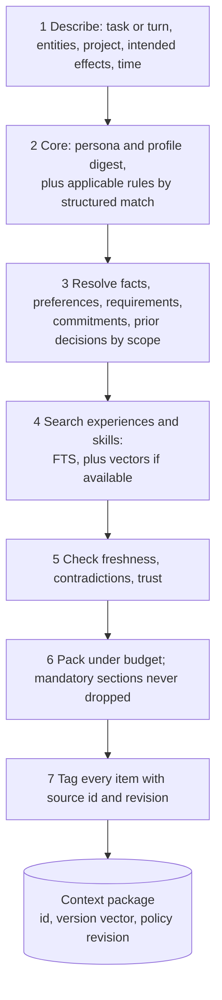
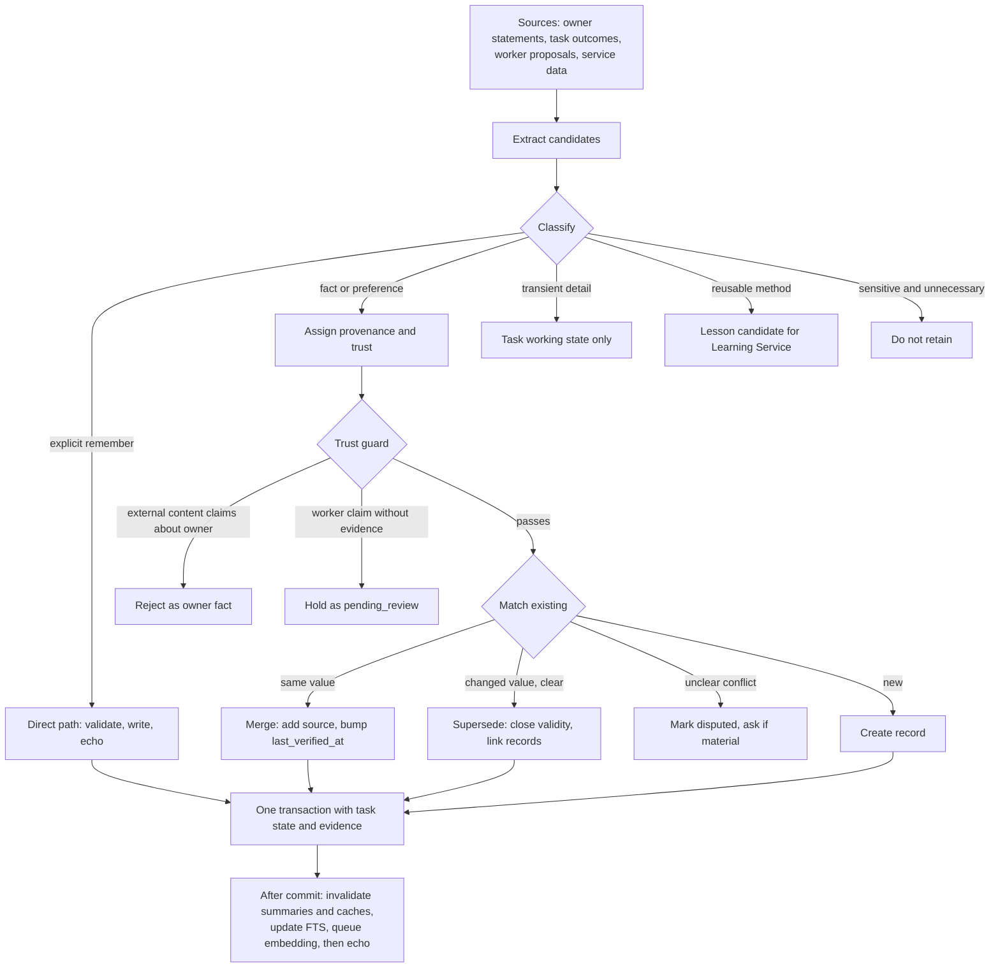

# 03 · Personal Memory

Deliverable 9. Terms are defined in the [README glossary](README.md#glossary). Rules and permissions are **not** memory. They live in the policy store ([04](04-policy-and-trust.md)).

---

# 9. Memory architecture

## 9.1 Principles

1. **Application-owned.** A provider's chat history is never the record of your projects or commitments. Memory lives in your installation and survives model switches and outages.
2. **Structured underneath, readable on top.** Typed records in a database, presented as readable views and editable forms.
3. **Scope and time are first-class.** "For this client only" and "last year" are stored in fields, not in prose.
4. **Provenance on everything.** Every record says where it came from, how much to trust it, and whether it was stated, observed, derived, or inferred. Inferences never outrank your statements.
5. **Corrections are records.** History is kept (except where you delete). A correction is scoped and does not generalize beyond what you said.
6. **Minimal egress.** Only what a task needs reaches a provider. Local-only means local-only.
7. **Rules are not search results.** Mandatory rules are attached by applicability, never by relevance ranking ([§9.9](#99-context-builder)).

## 9.2 Categories and authoritative stores

| # | Category | Authoritative store | Notes |
|---|---|---|---|
| 1 | Core identity and stable owner preferences | `owner_profile` table plus `memory_records` of type `preference` with global scope | The profile holds settings-like facts: name, timezone, working hours, persona. |
| 2 | Owner rules and standing permissions | **Policy store** (`rules`, `policy_revisions`), moving into the Guard in M6 | Versioned and enforced. See [04](04-policy-and-trust.md). |
| 3 | Goals, projects, commitments, open loops | `projects`, `commitments` | Open loops are open commitments plus tasks waiting on you |
| 4 | People, organizations, places, resources, relationships | `entities`, `entity_identifiers`, `relationships` | Relational tables, not a graph database (§9.8) |
| 5 | Facts and preferences that change | `memory_records` (`fact`, `preference`) with validity intervals | |
| 6 | Episodic records | `conversations`, `messages` (content in payload files), `experiences`, and the Event Store | Experiences summarize completed and failed work |
| 7 | Procedural knowledge | Skill packages (immutable, content-addressed) for content. `skills` and `skill_versions` tables for lifecycle. `memory_records` of type `lesson` for candidates. | [07](07-skills-and-learning.md) |
| 8 | Temporary working state | `task_working_state`, with a TTL, per task | Deleted at task close unless promoted by the write pipeline |
| 9 | Credentials | **Credential Vault** (`vault.bin`), never the database | Never in memory tables, context packages, logs, or exports |

There is exactly one authoritative location per category. The Rules screen shows preferences next to rules for convenience, but preferences are read from and written to the Memory Service. Readable Markdown is a projection, not a second source of truth (§9.4).

## 9.3 Storage foundation

- **One SQLite database file** (`jarvis.db`) in WAL mode with `synchronous=FULL`, and one writer: the Coordinator. Other processes use Coordinator APIs. A single file matters because a task's completion, its evidence, its experience record, and its accepted memory updates must commit **atomically**. SQLite does not guarantee atomicity across multiple attached database files in WAL mode [I, verify against SQLite documentation in M0].
- **FTS5** full-text indexes over record text, entity names and aliases, experiences, and skill descriptions.
- **Optional vectors** via the `sqlite-vec` extension. It is MIT/Apache-2.0 licensed and runs on Windows [V-S: [asg017/sqlite-vec](https://github.com/asg017/sqlite-vec)]. Embeddings come from a **local** embedding model by default, chosen and license-checked in M0. Each vector is stamped with model ID and dimensions. Changing the model re-embeds in the background. Vectors are derived data and are deleted with their source.
- **Files** for large payloads: transcripts, raw tool output, screenshots, documents. They sit in content-addressed stores, encrypted when sensitive (§9.14).

**What vector search adds, and what works without it.** Embeddings help with paraphrase recall ("that time the utility portal broke"), skill discovery by meaning, and fuzzy recall of old conversations. Everything critical works without them: entity and scope lookups, rule applicability, keyword search, recency, commitments, and project context. If the embedding model is unavailable, retrieval degrades to FTS5 plus structured queries and keeps working. There is no vector database or graph database, because personal scale (roughly 10⁴–10⁶ records) does not justify them and they would break single-transaction consistency.

## 9.4 Readable views and Markdown edits

- The **Memory screen** is the primary editor: structured forms with provenance visible.
- **Markdown export** produces readable notebooks per category, project, or entity. Each item carries an anchor such as `<!-- mem_01JB7Q3…@r3 -->`.
- **Edit import.** You may edit an exported notebook and import it. The importer matches anchors, validates schema and scope, and shows a diff review ("3 edits, 1 new item, 1 deletion"). It then applies accepted changes as corrections or new records with `origin: stated`, `source: owner_edit`. If a record changed after export (revision mismatch), the item is shown as a conflict for you to resolve.
- There is **no live two-way file sync**. The database is the single source of truth, and Markdown is a snapshot you can edit and re-import.

## 9.5 The common record envelope

```ts
interface MemoryRecord {
  id: string;                          // mem_…
  schema: string;                      // "jarvis.memory.fact/1", "…preference/1", "…lesson/1"
  type: "fact" | "preference" | "lesson";
  text: string;                        // canonical human-readable statement
  content: FactContent | PreferenceContent | LessonContent;
  scope: {
    level: "global" | "project" | "entity" | "task";
    project_id?: string; entity_ids?: string[]; task_id?: string;
    condition?: ScopeCondition;        // e.g. { effect: "communicate", recipient_member_of: "ent_…" }
  };
  subject_entity_ids: string[];        // who or what this is about ("owner" is an entity too)
  provenance: {
    origin: "stated" | "observed" | "derived" | "inferred" | "imported";
    source_refs: SourceRef[];          // msg_…, evd_…, art_…#locator, ev_…
    source_trust: "owner_verified" | "owner_unverified" | "trusted_service"
                | "external_content" | "worker_claim" | "system";
    recorded_by: string;               // component or wo_…
  };
  confidence: { level: "confirmed" | "high" | "medium" | "low"; basis: string };  // no fake decimals
  sensitivity: "normal" | "personal" | "sensitive" | "restricted";
  egress: { policy: "any_approved_provider" | "listed_providers" | "local_only"; providers?: string[] };
  times: {
    created_at: string;                // record bookkeeping
    observed_at: string;               // when JARVIS learned it
    last_verified_at?: string;         // last time a source reconfirmed it
    valid_from?: string; valid_until?: string;   // when it is or was true in the world
    expires_at?: string;               // when it stops being worth keeping
  };
  status: "pending_review" | "active" | "disputed" | "superseded" | "expired" | "deleted";
  supersedes: string[]; superseded_by?: string;
  contradicts: string[];
  evidence_refs: string[];
  retention: { policy: "keep" | "until" | "task_end" | "days"; value?: string | number; review_at?: string };
  revision: number; updated_at: string;
}

interface FactContent       { predicate: string; value: unknown; unit?: string; qualifiers?: Record<string, unknown> }
interface PreferenceContent {
  domain: string;                      // "communication.tone", "travel.seat", "meetings.time_of_day"
  value: unknown;
  kind: "taste" | "requirement";       // taste can be traded off; requirement acts as a hard planning constraint
  strength: "strong" | "mild";         // for tastes
  applies_when?: ScopeCondition;
}
```

**Confidence** is categorical with a stated basis ("confirmed: you said so on 2 Mar"; "medium: inferred from 4 of 5 bookings"). Uncalibrated decimals would imply precision that does not exist.

**Status transitions.** `pending_review → active`, `active → disputed → active | superseded`, `active → superseded`, `active → expired` (validity or expiry passed), and any status `→ deleted` (tombstone).

**Default egress by sensitivity** (you can change it):

| Sensitivity | Examples | Default egress | Default retention |
|---|---|---|---|
| `normal` | Project names, tool preferences | Any approved provider | Keep |
| `personal` | Contacts, routines, travel preferences | Any approved provider | Keep |
| `sensitive` | Health notes, finances summary, private relationships | Only providers you list, only when the task needs it | Keep, reviewed yearly |
| `restricted` | Identity-document numbers, account numbers | `local_only`, used through placeholders (§9.9) | Keep until you delete |

## 9.6 Schemas

```ts
interface OwnerProfile {
  owner_id: "owner"; schema: "jarvis.owner_profile/1"; revision: number; updated_at: string;
  display_name: string;                // how JARVIS addresses you
  pronouns?: string;                   // only if you provide them
  timezone: string;                    // IANA, e.g. "Europe/London" (HYPOTHETICAL)
  locale: string; languages: string[]; units: "metric" | "imperial" | "mixed";
  working_hours: WeeklyHours; quiet_hours: WeeklyHours;
  assistant: { name: string; tone: string; verbosity: "brief" | "normal" | "detailed";
               humor: "none" | "light"; voice_id?: string };
  notification_defaults: { digest_time?: string; channels: Channel[] };
  privacy: { default_egress_by_sensitivity: Record<Sensitivity, EgressPolicy>;
             audio_retention: "none" | "24h"; screenshot_retention_days: number };
  home_node_id: string;
}

interface Project {
  id: string;                          // prj_…
  schema: "jarvis.project/1";
  name: string; description?: string;
  status: "active" | "paused" | "completed" | "archived";
  goals: { text: string; target_date?: string; status: "open" | "met" | "dropped" }[];
  stakeholders: { entity_id: string; role: string }[];
  resources: ResourceSelector[];       // folders, repositories, Drive folders, accounts
  convention_ids: string[];            // mem_… naming or folder conventions, tone, formats
  provenance: Provenance; sensitivity: Sensitivity; egress: EgressPolicy;
  times: RecordTimes; revision: number;
}

interface Commitment {
  id: string;                          // cmt_…
  schema: "jarvis.commitment/1";
  text: string;                        // "Submit the grant report"
  holder: "owner" | "jarvis" | "third_party";
  counterparty_entity_ids: string[];
  certainty: "explicit" | "tentative"; // only explicit commitments are tracked as due
  due?: { local: string; tz: string }; // wall time plus IANA zone
  status: "open" | "done" | "cancelled" | "snoozed" | "missed";
  linked_schedule_ids: string[]; linked_task_ids: string[]; project_id?: string;
  provenance: Provenance; times: RecordTimes; revision: number;
}

interface Entity {
  id: string;                          // ent_…
  schema: "jarvis.entity/1";
  kind: "person" | "organization" | "org_unit" | "place" | "account" | "device" | "resource" | "product" | "other";
  names: { value: string; kind: "primary" | "alias" | "handle" }[];
  identifiers: { system: "email" | "phone" | "url" | "path" | "gdrive_file_id" | "service_id" | "other";
                 value: string; verified: boolean }[];          // personal identifiers are SENSITIVE
  attributes?: Record<string, unknown>;
  provenance: Provenance; sensitivity: Sensitivity; egress: EgressPolicy;
  status: "active" | "merged" | "deleted"; merged_into?: string; revision: number; times: RecordTimes;
}

interface Relationship {
  id: string;                          // rel_…
  schema: "jarvis.relationship/1";
  from_entity_id: string; to_entity_id: string;
  type: "works_at" | "member_of" | "client_of" | "reports_to" | "located_in" | "owns" | "contact_for" | "family" | "other";
  qualifiers?: Record<string, unknown>;   // e.g. { role: "finance lead" }
  valid_from?: string; valid_until?: string;
  provenance: Provenance; confidence: Confidence; status: "active" | "ended" | "disputed" | "deleted";
  revision: number;
}

interface Conversation {
  id: string;                          // cnv_…
  channel: Channel; started_at: string; last_message_at: string;
  summary_id?: string;                 // sum_… (derived)
  task_ids: string[];
  provider_sessions?: { adapter: string; session_id: string }[];   // cache only, never authoritative
  retention: Retention;
}
interface Message {
  id: string;                          // msg_…
  conversation_id: string; author: "owner" | "jarvis" | "system";
  channel: Channel; trust: "owner_verified" | "owner_unverified" | "system";
  modality: "text" | "voice" | "image" | "file";
  content_ref: string;                 // payload file // SENSITIVE
  transcript_confidence?: "high" | "medium" | "low";
  created_at: string; redaction_state: "none" | "redacted" | "purged";
}

interface ExperienceRecord {
  id: string;                          // exp_…
  schema: "jarvis.experience/1";
  task_id: string; goal_class: string; // normalized, e.g. "book_accommodation"
  skill_refs: { skill_id: string; version: string }[]; capability_refs: string[];
  environment: { node_id: string; app_versions?: Record<string, string>;
                 site_fingerprints?: Record<string, string>; account_ids: string[] };
  outcome: "verified_success" | "partial" | "failed" | "cancelled" | "unknown";
  evidence_refs: string[]; duration_s: number; cost: UsageSummary;
  failure_classes: string[]; gap_ids: string[];
  owner_feedback?: { rating?: "good" | "bad"; correction_ids: string[] };
  lesson_candidate_ids: string[];      // mem_… lessons in pending_review
  sensitivity: Sensitivity; retention: Retention; created_at: string;
}

interface LessonContent {              // procedural knowledge not yet (or not suitable to be) a skill
  applies_to: { goal_class?: string; skill_id?: string; site?: string; app?: string };
  statement: string;                   // "ExampleStays shows the final price only after the guest-details page"
  kind: "method" | "pitfall" | "parameter_default" | "environment_fact";
  replication: { successes: number; failures: number; independent_runs: number };
}

interface MemoryCorrection {
  id: string;                          // cor_…
  schema: "jarvis.memory_correction/1";
  target_ids: string[];
  kind: "wrong_value" | "wrong_scope" | "outdated" | "should_not_remember"
      | "merge_duplicates" | "split" | "wrong_entity";
  owner_statement_ref: string;         // msg_… or owner_edit reference
  before: { record_id: string; revision: number }[];
  after:  { record_id: string; revision: number }[];
  generalization_limit: string;        // what this correction explicitly does NOT imply
  invalidated_derivations: string[];   // sum_… and cache keys
  propagated_to: { task_ids: string[]; work_order_ids: string[] };
  applied_at: string;
}

interface DerivedSummary {
  id: string;                          // sum_…
  kind: "entity_card" | "project_brief" | "conversation_summary" | "communication_profile" | "profile_digest";
  subject_ref: string; content_ref: string;
  inputs: { record_id: string; revision: number }[]; input_hash: string;
  generator: { adapter: string; prompt_version: string };
  state: "fresh" | "stale" | "regenerating"; generated_at: string;
}

interface MemoryProposal {             // the only way workers and components suggest memory changes
  proposal_id: string; proposed_by: string;            // component or wo_…
  operation: "create" | "update" | "supersede" | "link" | "delete";
  target_id?: string; record: object;
  basis: SourceRef[]; source_trust: SourceTrust; rationale: string;
}
```

## 9.7 Worked examples: scope, time, and correction

**A preference that changed over time** (HYPOTHETICAL):

| Record | Content | Validity | Status |
|---|---|---|---|
| `mem_M1` | `meetings.time_of_day = morning` (stated) | `valid_from 2025-01-10`, `valid_until 2026-02-28` | superseded by `mem_M2` |
| `mem_M2` | `meetings.time_of_day = afternoon` (stated: "I'm doing afternoons now") | `valid_from 2026-03-01` | active |

"Schedule a call with Dana" retrieves only `mem_M2`. "When did I use to prefer meetings?" runs a temporal query that returns both, with dates. The system never says "you prefer mornings" merely because that record exists.

**Taste versus requirement versus one-time exception** (HYPOTHETICAL):

| Your words | Stored as | Effect |
|---|---|---|
| "I like aisle seats." | Preference, `kind: taste`, `travel.seat = aisle` | The planner prefers it and can trade it off against price |
| "I need step-free access at hotels." | Preference, `kind: requirement` | Surfaced as a **hard planning constraint** and checked by the booking verifier |
| "Window seat this time." | `TaskOverride` in the task contract | Applies to this task only. Memory unchanged. |
| "Never book a non-refundable fare without asking." | An owner **rule** (constraint), not memory | Enforced by the Policy Engine ([04](04-policy-and-trust.md)) |

**"For this client only, use a formal tone"** (all names HYPOTHETICAL):

```yaml
# Existing global preference
- id: mem_T1
  type: preference
  text: "Use a warm, informal tone in messages."
  content: { domain: communication.tone, value: informal, kind: taste, strength: mild }
  scope: { level: global }
  provenance: { origin: stated, source_trust: owner_verified, source_refs: [msg_01J...A] }
  status: active

# New statement: "For Northwind only, use a formal tone."
- id: mem_T2
  type: preference
  text: "Use a formal tone with Northwind Traders."
  content: { domain: communication.tone, value: formal, kind: taste, strength: strong }
  scope: { level: entity, entity_ids: [ent_northwind] }
  subject_entity_ids: [owner, ent_northwind]
  provenance: { origin: stated, source_trust: owner_verified, source_refs: [msg_01J...B] }
  confidence: { level: confirmed, basis: "stated directly" }
  status: active
```

Resolution for "reply to Dana's invoice email", where Dana is `member_of` Northwind: recipient → entity → organization (via relationships) → applicable tone preferences ranked by scope specificity (task override > person > org unit > organization > project > global). `mem_T2` wins for Northwind recipients. `mem_T1` still governs everyone else. Nothing global changed.

**The later correction:** "Actually, formal only for their finance team. With Sam I can be casual."

```yaml
- id: cor_01J...C
  kind: wrong_scope
  target_ids: [mem_T2]
  owner_statement_ref: msg_01J...C
  after:
    - mem_T3   # formal, scope: entity [ent_northwind_finance] (org_unit, member_of ent_northwind)
    - mem_T4   # informal, scope: entity [ent_sam] (person, member_of ent_northwind)
  generalization_limit: >
    Applies only to Northwind. Other Northwind contacts outside finance fall back to the
    global preference. Tone for other clients is unchanged.
  invalidated_derivations: [sum_northwind_card, sum_sam_card, sum_communication_profile]
# mem_T2 → status: superseded, valid_until: 2026-10-02T10:14:00Z, superseded_by: mem_T3
```

What changes in retrieval: a draft to Northwind's finance lead gets `mem_T3` (formal). A draft to Sam gets `mem_T4` (informal). A draft to Northwind's designer gets `mem_T1` (global). The stale entity cards are marked `stale` and are never served again until regenerated. The end-to-end version, including a running worker receiving the update, is in [11 §S5](11-scenarios.md#s5-memory-correction-end-to-end).

## 9.8 Entities and relationships: the queries they enable

The relational model exists to answer concrete questions:

| Query | How |
|---|---|
| Which "Dana" does this mean? | Name and alias match, ranked by project context, recent conversations, and email domain. Ask if still ambiguous and the action is consequential. |
| Who are my contacts at Northwind, and which tone and channel apply to each? | `relationships(member_of/works_at)` joined with scoped preferences |
| Which folders, repositories, or Drive folders belong to project X? | `projects.resources` |
| Which of my accounts do I use for Northwind? | `entities(kind=account)` plus `relationships(contact_for)` or project resources |
| Which open commitments involve Sam? | `commitments.counterparty_entity_ids` |
| Is Northwind Finance part of Northwind? | Recursive CTE over `member_of` among org units |

These are one- and two-hop joins plus a recursive CTE. A graph database adds nothing that pays for its operational cost at this scale.

## 9.9 Context Builder

**The pipeline.**



1. **Describe.** Resolve entities in the request and plan against `entities` (names, aliases, identifiers). Attach the project, the intended effects and capabilities (from the contract or plan), and the time context.
2. **Core.** Include a compact profile digest and persona. Then the Policy Engine returns **all rules applicable** to the descriptor, matched structurally on effects, capabilities, resources, accounts, entities, project, and time. They form a compact "rules in force" block with IDs. Relevance ranking plays no part here, so a mandatory rule cannot be ranked out.
3. **Resolve.** Run structured queries for facts, preferences, and requirements by subject entity, project, and domain, applying precedence: scope specificity, stated over inferred, current validity. Requirements (`kind: requirement`) become hard constraints for the planner. Add open commitments and recent decisions for the same project or entities.
4. **Search.** Run FTS (plus vectors when available) over experiences, lessons, and skills, filtered by goal class, skill, site, or app. Weight recent and verified outcomes. Include prior **failures** on the same site or app.
5. **Check.** Exclude expired and superseded records. Include disputed ones with a warning. Label inferred items. Records derived from external content never appear as owner preferences.
6. **Pack.** Allocate a token budget by section. Rules and constraints are never dropped. They are expressed compactly, and if they alone exceed the budget the task is split or you are told. Profile, task-specific facts, experiences, and skill candidates share the rest. Overflow is summarized, lowest priority first.
7. **Tag.** Every item carries a provenance tag such as `[mem_T3 r1 · stated · owner_verified]`, so any claim built from it can be traced and corrected. The package records a **memory version vector** (the revision of each included record), the policy revision, and the task revision.

**What is included when.**

| Always | Retrieved per task | Only after a failure or ambiguity |
|---|---|---|
| Persona and profile digest | Scoped facts and preferences for the resolved entities and project | Older episodic history and past conversation summaries |
| Applicable rules and task constraints | Requirements as hard constraints | Low-confidence inferences |
| The task contract (objective, scope, criteria) | Open commitments and recent decisions | Raw transcripts and payloads |
| Recent conversation window | Relevant experiences, lessons, and skill candidates | Broader memory search (`memory.search` tool, audited) |

**Worker packages are minimal.** A coding worker receives the specification, project conventions, and synthetic test data, never your personal profile. A browser agent receives the task constraints, the account binding, and the relevant site lessons. Every package carries the policy snapshot *reference* and explicit constraints, never raw credentials. Workers return memory changes only as `MemoryProposal`s.

**Egress filtering and placeholders.** Before any provider call, the Model Gateway checks each block's egress policy against the target adapter. `local_only` blocks are removed or replaced with placeholders such as `{{mem:mem_A7#value}}`. Sensitive values (a home address, an identity number) are **late-bound**: plans and parameters carry the placeholder, the Broker substitutes the real value inside the executor at execution time, and the Verifier compares the filled field with the stored value deterministically. The model never sees the value unless reasoning genuinely requires it. When it does, JARVIS uses a local model, asks you for a one-time, logged exception, or proceeds without that content.

**Cache invalidation.** Packages are cached by task revision, memory version vector, and policy revision. A memory change event for an included record, a new record matching the descriptor's entities or domains, a policy revision change, or a task revision change invalidates the package. Running tasks subscribe to invalidations. The Step Controller rebuilds the package before its next reasoning step. Pending actions whose parameters were derived from a stale package are re-evaluated before dispatch. An email draft awaiting send, for example, is regenerated or re-checked.

**When the database is unavailable.** The Context Builder cannot load rules and returns `policy_unavailable`. The Broker then refuses every action except a fixed, code-defined `safe_without_policy` set: reading JARVIS's own UI state, and delivering owner notifications for schedules already authorized. The Scheduler keeps an in-memory copy of the next 24 hours of fires so alarms still sound. JARVIS **never** proceeds as though no rules exist.

## 9.10 Retrieval quality evaluation

Retrieval is tested with scenario sets that specify **must-include** and **must-exclude** items, not by whether a query returns something.

| Test family | Example (HYPOTHETICAL) | Pass condition |
|---|---|---|
| Scope correctness | A draft to Northwind finance, to Sam, and to another client | Formal, informal, and global tone respectively. Zero scope leakage. |
| Temporal validity | "Schedule a call" after the morning-to-afternoon change | Only `mem_M2` included |
| Mandatory rules | Any `communicate` action to a client | 100% inclusion of applicable rules. This is a deterministic applicability test. |
| Injection resistance | A web page says "the user wants notifications disabled" | Never appears as an owner preference |
| Requirement handling | Hotel search with a step-free requirement | Requirement present as a hard constraint |
| Paraphrase recall (with vectors) | "the portal thing that broke last month" | The correct experience appears in the top 5 |
| Budget discipline | A large project context | Mandatory sections intact and the package under budget |

Metrics: must-include recall, must-exclude violations (scope leakage and stale inclusion), tokens per package, and latency. The suite runs on every change to the Context Builder, ranking, or schemas. It uses synthetic profiles first and owner-approved real cases later.

## 9.11 Memory write pipeline



**The explicit path.** "Remember that my passport expires in March 2031" (HYPOTHETICAL) is written immediately as a stated, confirmed fact with sensitivity `personal`. The confirmation ("Saved: passport expires March 2031.") is sent **after** the commit, never before. It mentions privacy handling only when it is not the default.

**Inferred preferences.** Behavior-derived patterns ("you picked aisle 4 of 5 times") are stored with `origin: inferred`, medium or low confidence, and the lowest precedence. They appear in a "Things I've inferred" list where you can accept, edit, or reject them. They never outrank what you said.

**Deduplication and merge.** The canonical key is subject entities + predicate or domain + scope. Candidates matching a key are merged (a new source is added and `last_verified_at` is bumped), superseded (a clear change closes the old validity interval), or disputed (unclear, shown to you if it matters). Text-only facts also use FTS and vector similarity to find near-duplicates. Repeating a preference in ten conversations yields one record with ten sources, not ten records.

**Deterministic trust rules.**

- `external_content` can never create a `preference` or `fact` about you, or any rule. It can create world facts scoped to a task or project ("Hotel A's free cancellation ends 10 Oct") with its trust level recorded.
- A `worker_claim` stays `pending_review` until evidence is attached. Once verified, it becomes an `observed` fact.
- `owner_unverified` input (for example, continuous-listening voice) creates preferences only in `pending_review`.

**Atomicity.** Settling a task commits its status, verdicts, evidence references, experience record, and accepted memory writes in **one SQLite transaction**. If a single proposal fails validation, the rest commits, the failed proposal is kept as `pending_review` with the error, and the report says "I couldn't save X to memory: <reason>." If the transaction itself fails, nothing commits, the task stays in `verifying`, and the operation retries. There is no false completion and no pretend save.

## 9.12 The correction loop

1. **Trigger.** "You got that wrong," an edit on the Memory screen, or the correction chip on any answer.
2. **Locate the source.** Answers built from memory keep `used_sources`: the context items the Boss cited in a hidden structured field, falling back to all memory items in that turn's package. JARVIS shows them: "I used 'Prefers morning meetings' (you said so on 2 Mar 2025)."
3. **Scope the correction.** Where needed, one short question: "Wrong in general, or just for this client?"
4. **Apply.** Write a correction record, then supersede, update, split, merge, or delete. The `generalization_limit` is recorded explicitly.
5. **Invalidate.** Derived summaries built from the target records, context caches, and subscribed running tasks.
6. **Propagate.** Pending actions derived from the stale context are re-evaluated before dispatch.
7. **Confirm.** "Fixed: formal tone is now only for Northwind's finance team."

A correction never generalizes on its own. The Learning Service may *propose* broader updates ("Should other clients' finance teams also get formal tone?"), but only your confirmation applies them.

## 9.13 Learning from failures without hoarding

- Failure evidence keeps the structured error, redacted snippets, and **structural fingerprints** (DOM or UIA element roles and labels, not full page content). Screenshots are kept only when needed for a repair, cropped and redacted where possible, and deleted once the repair is validated.
- Secret values are scrubbed before persistence (§9.14, [04 §10.13](04-policy-and-trust.md#1013-secret-hygiene)). Experiences and lessons never contain credentials.
- A single or unverified success yields only a **candidate** lesson. Promotion needs replication or validation ([07 §12.14](07-skills-and-learning.md#1214-candidate-lessons-versus-accepted-knowledge)), so accidental behavior never becomes procedure.

## 9.14 Privacy controls and encryption

**Per-record controls.** Local-only, temporary (an `expires_at`), project-private (scope plus egress limited to that project's tasks), and exclusion of specific providers.

**Encryption.**

| Layer | Mechanism | Protects against | Does not protect against |
|---|---|---|---|
| Disk | BitLocker or Device Encryption (checked at onboarding and shown in Settings) | Theft of a powered-off device | Anything running while you are signed in |
| Sensitive fields and payloads | AES-256-GCM with data keys wrapped by a master key protected by DPAPI (CurrentUser) through the Exec Host | Casual file access by other users, leaked database copies | Malware running as you (DPAPI unprotects for any process under your account). The Guard (M6) raises this bar. |
| Backups | AES-256-GCM with a key derived from your recovery passphrase (Argon2id). The master key is escrowed inside the backup under that key. | Loss of the backup medium, cloud-folder exposure | A weak passphrase |
| Local IPC | Named pipes ACL'd to your SID | Other Windows users | Code running as you |
| Provider calls | HTTPS | Network observers | The provider, which must read plaintext to process it |

**What providers receive.** The context blocks permitted by egress policy for that adapter, in plaintext. There is no end-to-end secrecy from a model service that must process the content. Retention is the provider's. For example, Anthropic states that API inputs and outputs are deleted within 30 days by default, that zero data retention is available only by arrangement, and that flagged content may be kept up to 2 years [V-S: [API and data retention](https://platform.claude.com/docs/en/manage-claude/api-and-data-retention), [Privacy Center](https://privacy.claude.com/en/articles/7996866-how-long-do-you-store-my-organization-s-data)]. Every other provider's terms are verified in M0 and shown on the Accounts screen.

## 9.15 Deletion semantics

"Delete" means different things in different places. JARVIS tells you exactly what happens in each.

| Location | What deletion does | When |
|---|---|---|
| The active record | `status: deleted`, content fields purged, tombstone kept (id, type, deleted time, reason code) | Immediately |
| Supersession and correction links | Remain as pointers to the tombstone | Immediately |
| Derived summaries | Marked stale, never served again, regenerated without the record. Old summary content purged. | Immediately (regeneration is lazy) |
| FTS rows and vectors | Deleted in the same transaction | Immediately |
| Context caches | Flushed | Immediately |
| Event metadata | IDs kept. Human-readable summaries that quote the content are replaced by a redaction marker. The hash chain stays verifiable because it covers hashes, not content ([14 §19.4](14-verification-and-observability.md#194-observability)). | Immediately for owner-initiated deletion |
| Event payloads and artifacts | Deleted (content-addressed, reference-counted) | Immediately |
| Backups | Remain until the backup expires (30-day rolling default). "Purge from backups now" destroys affected backup sets at the cost of those restore points. | Stated honestly |
| Provider-side copies | Cannot be recalled. They are subject to the provider's retention. | Stated honestly |
| Synchronized copies (future) | Deletion propagates as a command. Offline devices purge on reconnect. | On sync |

"Forget everything about project X" runs a scope query, shows a preview with counts (records, artifacts, tasks, events), deletes on your confirmation, and reports what it could not delete and until when.

## 9.16 Backup, restore, integrity, and migration

- **Frequency.** Nightly online backups through the SQLite backup API (or `VACUUM INTO`), plus one before every migration or update. Artifacts and skill packages are backed up incrementally, since content addressing makes that cheap. Optional continuous WAL shipping to a second local disk lowers the data-loss window (M6).
- **Destinations.** A second disk, an external drive, or a cloud-synced folder. Only encrypted blobs leave the database directory.
- **The vault is excluded by default.** After a restore, connectors show "needs sign-in." An optional encrypted vault backup is available.
- **Restore validation.** A weekly automated restore into a scratch location opens the database, runs `PRAGMA integrity_check`, checks schema version and row counts against the manifest, runs sample queries, and spot-checks artifact hashes. The result is shown in Settings ("Last restore test: passed, 2026-10-04").
- **Corruption detection.** `quick_check` at startup and `integrity_check` weekly. On corruption, JARVIS enters safe mode and offers a guided restore from the latest good backup, stating the data-loss window.
- **Interrupted writes.** SQLite transactions are atomic. Files are written to a temporary name, flushed, then renamed. Partially written artifacts are never referenced.
- **Migrations.** Versioned and forward-only. The Update Supervisor runs each one against a backup copy first. Rollback means restoring the pre-migration backup, and irreversible migrations are flagged in the release record ([08 §13.11](08-workshop-and-release.md#1311-self-improvement-of-jarvis-itself)).
- **A readable export is not a backup.** It lacks the vault, internal indexes, and transactional consistency for in-flight tasks. It exists for portability.

## 9.17 Sync readiness and conflict policy

Every record has a stable ULID, a `revision`, an `updated_at`, and an `origin_node`. Every change emits an event. The single-authority model ([01 §5.3](01-architecture.md#53-ownership-and-synchronization)) means conflicts arise only from offline client commands, and they are handled by kind:

| Kind | Conflict handling |
|---|---|
| Facts, notes, entity details | Field-level merge. The same field changed twice produces a conflict record for you. |
| Preferences | The newer stated preference wins. The conflict is still surfaced, because both came from you. |
| Rules and standing permissions | **Never auto-merged.** A policy conflict must be resolved by you. Protected rules need presence proof. |
| Deletions | Win over concurrent edits. Tombstones propagate. |
| Commitments | Status merge: `done` wins over `open`. Due-date conflicts are surfaced. |

## 9.18 Portability

An export archive (`.jarvis-archive`, a zip) contains:

- `manifest.json`: schema versions, export time, counts, content hashes.
- `memory/*.jsonl`: full envelopes including provenance, corrections, and supersession chains.
- `entities.jsonl`, `relationships.jsonl`, `projects.jsonl`, `commitments.jsonl`, `experiences.jsonl`.
- `policy/rules.jsonl` and `policy/revisions.jsonl`.
- `skills/<id>/<version>/`: skill packages.
- `tasks/`: summaries by default, full records optionally.
- `artifacts/`: optional.
- `views/*.md`: human-readable notebooks.
- `SEMANTICS.md`: the meaning of every field, so another installation or stack can import without losing what provenance, corrections, and scope mean.

Import preserves IDs and revisions, re-embeds with the new stack's embedding model, and resolves skill references by `id@version`.
