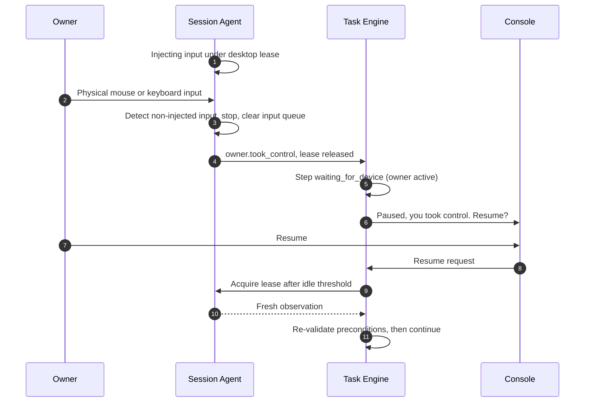

# 05 · Capability Registry, Routing, and Execution

Deliverable 11, part 1. Provider adapters, connectors, and budgets are in [06](06-connectors-providers-budgets.md). Terms are defined in the [README glossary](README.md#glossary).

---

# 11. Capabilities and execution

## 11.1 Terms

| Term | Definition | Unit of | Where it lives | Example | How it gets authority |
|---|---|---|---|---|---|
| **Tool** | One typed operation with a descriptor | Invocation | Registry descriptor, plus executor or connector code | `tool:fs.move` | A grant per call |
| **Connector** | Integration with one external service or account: auth, tools, health, and the service's automation policy | Account connection | Plugin package | `connector:google.gmail` | OAuth scopes (EP) plus grants per call |
| **Skill** | A versioned, tested procedure for a class of goals | Skill run | Skill package | `skill:travel.book_accommodation` | Declares required effects. Never authorizes itself. |
| **Workflow** | A deterministic step graph | Workflow run | Inside a skill package, or a schedule | `procedure/workflow.yaml` | Through its skill or schedule |
| **Plugin** | An installable bundle of connectors, tools, skills, panels, or adapters | Installation | `plugins/<id>/<version>/` | `plugin:google-workspace` | None. Installing grants nothing. |
| **Worker** | A bounded reasoning executor | Work order | Adapter code | `worker:codex` | The work order's allowed capabilities and effects |
| **Model adapter** | A provider interface for one role | Request | Model Gateway | `model:vision.interpret → anthropic:claude-opus-5-5` | Budget and egress policy |
| **Executor** | A deterministic performer in one environment | NEP command | A process | Exec Host, Session Agent | Brokered envelopes only |

## 11.2 Capability descriptor

Every callable capability has a machine-readable descriptor.

```ts
interface CapabilityDescriptor {
  id: string;                          // "tool:gmail.messages.send"
  kind: "tool" | "skill" | "worker" | "model_function";
  version: string;                     // semver
  package: { id: string; version: string; hash: string; provenance_ref: string };
  title: string;
  purpose: string;                     // one paragraph; the main text for capability search
  goal_patterns?: string[];            // "send an email", "reply to a message"
  input_schema: JSONSchema;
  output_schema: JSONSchema;
  prerequisites: {
    capabilities?: string[];
    software?: { name: string; version_range: string; detect: string }[];
    config?: string[];
  };
  environment: {
    node_kinds: ("windows_desktop" | "cloud_runner" | "phone")[];
    requires_signed_in_session: boolean;
    requires_unlocked_desktop: boolean;
    os_min?: string;
    network: "none" | "local" | "internet";
  };
  auth: {
    type: "none" | "oauth2" | "api_key" | "browser_session" | "subscription_cli" | "os_user";
    account_binding: "required" | "optional" | "none";
    scopes?: string[];
  };
  side_effects: {
    effect_classes: EffectClass[];                     // every possible effect
    param_dependent?: { when: PolicyCondition; effect_classes: EffectClass[] }[];
    reversibility: "reversible" | "compensable" | "irreversible" | "none";
    idempotency: "natural" | "key_supported" | "none";
    reconciliation?: string;                           // how to check an uncertain outcome
  };
  policy_scopes: string[];             // coarse scopes for rule matching, e.g. "gmail.send"
  cost: { kind: "free" | "subscription" | "metered"; unit?: string;
          estimate?: { typical: number; high: number; basis: string } };
  rate_limits?: { per_minute?: number; per_day?: number; notes?: string };
  cancellation: "immediate" | "cooperative" | "not_supported";
  timeouts: { default_s: number; max_s: number };
  verification: { method: "service_readback" | "service_confirmation" | "file_check" | "postcondition" | "none";
                  describe: string };
  evidence_emitted: EvidenceType[];
  known_limitations: string[];
  isolation_tier: "T0" | "T1" | "T2" | "T3";
  service_policy_ref?: string;         // automation policy of the target service (§11.8)
  lifecycle: "draft" | "under_test" | "validated" | "active" | "degraded" | "quarantined" | "superseded" | "retired";
  admin_state: "enabled" | "disabled"; // operational switch, orthogonal to lifecycle
}
```

Example (abridged, HYPOTHETICAL values):

```yaml
id: tool:gmail.messages.send
kind: tool
version: 1.3.0
purpose: Send an email from a connected Gmail account, with a JARVIS-generated Message-ID for reconciliation.
goal_patterns: [send an email, reply to email, email someone]
environment: { node_kinds: [windows_desktop, cloud_runner], requires_signed_in_session: true,
               requires_unlocked_desktop: false, network: internet }
auth: { type: oauth2, account_binding: required, scopes: ["gmail.send"] }   # exact scope strings verified in M2
side_effects:
  effect_classes: [communicate]
  reversibility: irreversible
  idempotency: key_supported          # JARVIS sets Message-ID; reconciliation searches Sent by it
  reconciliation: "Search Sent mail for rfc822msgid:<Message-ID>"
verification: { method: service_readback, describe: "Fetch the sent message by id and compare recipients, subject, body hash" }
evidence_emitted: [service_readback]
isolation_tier: T1
lifecycle: active
admin_state: enabled
```

## 11.3 Health is dynamic

```ts
interface CapabilityHealth {
  capability_id: string; node_id: string; account_id?: string;
  state: "installed" | "available" | "needs_auth" | "degraded" | "outdated"
       | "disabled" | "unsupported_on_node" | "unavailable_now";
  reason?: string;                     // "desktop locked", "token expired", "Chrome 1xx not yet verified"
  checked_at: string; probe: "active" | "passive";
  recent: { successes: number; failures: number; window: string };
}
```

- **Active probes** are cheap. A token validity check, a CLI `--version`, a connector "whoami" call.
- **Passive signals** come from error rates in recent invocations. For example, three failures in a row of the same class set the capability to `degraded`.
- **Node events** change availability instantly. Lock, sleep, and the Session Agent restarting make desktop capabilities `unavailable_now`.
- Health is per capability, **node, and account**. Gmail can be `available` for your personal account and `needs_auth` for your work account.

## 11.4 Discovery and selection

The boss never receives thousands of tool definitions. It always has a small set of **meta-tools**: `capability.search`, `capability.describe`, `tool.invoke`, `skill.run`, `workorder.dispatch`, `memory.search`, `ask_owner`, and task controls.

**`capability.search(query, filters)`**

1. **Candidates.** FTS over `title`, `purpose`, and `goal_patterns`, plus vector similarity when available.
2. **Hard filters.** `admin_state = enabled`. Lifecycle `active` or `validated`, unless the purpose is repair. Supported on an available node. Health not `disabled` or `unsupported_on_node`. Effect classes within the task's ceiling, or flagged "needs scope expansion" rather than hidden.
3. **Ranking.** Relevance, observed reliability for this goal class and account, verifiability, cost, latency, and the method ladder (§11.8).
4. **Compact cards.** Each result is about 50–100 tokens: id, purpose, effects, health, auth state, cost class. The default top k is 8.

The chosen capabilities' full schemas are loaded into the next model call. Anthropic's API offers a server-side tool search with `defer_loading`, and also supports a custom client-side search that returns `tool_reference` blocks [V: [Tool search tool](https://platform.claude.com/docs/en/agents-and-tools/tool-use/tool-search-tool)]. The Anthropic adapter may use either as an optimization. The registry's own search stays the provider-independent source of truth.

## 11.5 Installed is not authorized

Registering a capability makes it **discoverable**, nothing more. Authority always comes from grants evaluated per action (§10.6 in [04](04-policy-and-trust.md#106-authorization-sources-grounding-grants-and-re-checks)). A new capability has no standing permissions. First-party capabilities follow the same rule.

## 11.6 Shared error vocabulary

Every executor, connector, worker adapter, and skill maps its failures to these codes. Retry behavior is in [02 §8.8](02-boss-and-tasks.md#88-retry-policy-by-error-class).

| Code | Meaning | Typical `effect_state` | Retryable |
|---|---|---|---|
| `invalid_input` | Parameters fail the schema or domain validation | `none` | No |
| `missing_permission` | The Policy Engine denied, or the action is outside the task ceiling | `none` | No |
| `missing_credential` | No credential configured for the required account | `none` | No |
| `auth_required` | The credential expired or was revoked, or re-authentication or 2FA is needed | `none` | After you act |
| `unavailable_device` | The node is locked, asleep, offline, or its executor is down | `none` | When available |
| `unsupported_operation` | No route can express the operation | `none` | No, goes to the Gap Resolver |
| `transient_service_error` | 5xx, network glitch | `none` or `unknown` | If safe |
| `rate_limited` | Provider throttling or quota | `none` | After backoff |
| `uncertain_external_effect` | The request may or may not have taken effect | `unknown` | Reconcile first |
| `verification_failed` | The observed effect does not match the authorized parameters | `complete` or `partial` | Maybe, by another method |
| `precondition_changed` | Price, availability, terms, or account changed since preparation | `none` | Re-evaluate |
| `conflict` | Stale lease, fencing token, or task revision | `none` | Re-acquire or replan |
| `timeout` | Deadline exceeded | Depends on the operation | Per classification |
| `budget_exhausted` | An AI or cost cap was reached | `none` | No |
| `policy_unavailable` | The policy or memory store cannot be read, so JARVIS fails closed ([03 §9.9](03-memory.md#99-context-builder)) | `none` | After recovery |
| `expired` | A grant, remote command, or observation expired before use | `none` | No. Re-prepare or re-observe. |
| `external_refusal` | The service refused: account restricted, API access denied, automation blocked | `none` | No |
| `cancelled` | Cancelled by you or by a task revision | `none` or `partial` | No |
| `internal_error` | A bug in JARVIS | `unknown` | Once |

```ts
interface StructuredError {
  code: ErrorCode;
  message: string;                     // human-readable, secret-free
  retryable: boolean; retry_after_s?: number;
  effect_state: "none" | "unknown" | "partial" | "complete";   // did anything happen externally?
  details?: Record<string, unknown>;
  cause_ref?: string;                  // evd_/ev_ with raw evidence
  source: { capability_id: string; executor: string; node_id: string };
}
```

`effect_state` is the most important field in the system. It separates "nothing happened, safe to retry" from "something may have happened, reconcile first."

## 11.7 Registering generated tools and disabling them instantly

- Generated tools enter only through the **Release Manager** ([08 §13.10](08-workshop-and-release.md#1310-release-path-and-rollback)): candidate package → registry at `under_test` → `validated` → `active`, as evidence allows.
- **Disabling** sets `admin_state = disabled`. The Broker checks this on every dispatch, and a registry change event invalidates its cache immediately. Running invocations are cancelled or stopped at the next step boundary. Standing permissions linked to the capability are suspended. **History is kept.** Executions, evidence, and the package (read-only, by hash) remain, so past task records stay explainable.

## 11.8 Execution routing

**The method ladder.** This is the default preference. Exceptions are expected and explained.

1. A supported service API or application interface: the official REST or GraphQL API, the Office COM object model, OS APIs.
2. An SDK or CLI.
3. Structured browser automation in a dedicated profile: DOM, accessibility tree, stable selectors.
4. Structured desktop automation: UI Automation control patterns.
5. Visual computer use: pixels and coordinates.

Typical exceptions: the API lacks the operation; the API needs a scope you chose not to grant (see the fallback table); the UI route is easier for you to verify; the API is rate-limited for a one-off bulk task; latency.

**Router scoring.** Hard constraints first, then a score:

- **Hard constraints.** Authorization covers the effect (method-independent). The service's automation policy permits the method. The correct account is bound. The method can express the exact intended scope and parameters.
- **Score.** Observed reliability (by goal class, method, and account) + verifiability + current availability − cost − latency − interference with you (desktop methods while you are active).

**Scope is preserved when switching methods.** Effect classes, parameters, account, and bounds live on the action record, not in the method. Switching methods re-runs the policy check, which may be stricter for the new method, and never widens anything.

**When a fallback is legitimate.**

| Failure on the preferred route | Fall back to another route? |
|---|---|
| The API returns "insufficient scope" because **you** granted a narrower scope | **No, not automatically.** Your scope choice is treated as policy. JARVIS asks whether to extend the scope, or whether you explicitly authorize the other route for this action. |
| The API is **denied by the provider** (account type not allowed, API access refused) | **No.** That is a provider restriction. Report the blocker. |
| The API is temporarily **unavailable** (outage, 5xx) | **Yes**, if the action is independently authorized, the service permits the other method, and verification is possible |
| The API lacks the operation | **Yes**, under the same conditions |
| The service **prohibits UI automation** (for example, Upwork) | **No**, never through the browser or desktop |

**Service automation policies** are registry data with sources:

```ts
interface ServicePolicy {
  service: string;                     // "upwork.com"
  ui_automation: "allowed" | "restricted" | "prohibited" | "unknown";
  api: "public" | "approval_required" | "none";
  notes: string;
  sources: { url: string; checked_at: string; status: "V" | "V-S" | "U" }[];
}
```

For example, Upwork: `ui_automation: prohibited`, `api: approval_required`, sourced from Upwork's automation guidance and API help pages [V-S, 2026-09-25] ([06 §11.19](06-connectors-providers-budgets.md#1119-service-connectors)). When a site's policy is `unknown`, the default is **owner-attended mode**. JARVIS can navigate and prepare, but before automating submissions on that site it asks you once, showing any automation terms it found. Your answer is recorded as that site's policy.

## 11.9 Shared desktop and browser state

**Leases.** `desktop:input` is exclusive and you always have priority. `browser_profile:<name>` is exclusive per profile. Read-only research uses separate ephemeral contexts, so it runs concurrently.

**Protection against typing into the wrong place.**

- Before each input batch, the Session Agent verifies that the foreground window's handle, process, and title match the target, and that the intended element has keyboard focus (the UIA `HasKeyboardFocus` property [I]). It then injects a **small batch**, re-verifies, and aborts on any mismatch.
- Each observation has an ID and a maximum staleness (for example, 2 s on the desktop). Before a click, the element's UIA runtime ID and bounding rectangle are re-checked.
- Focus stealing is avoided. Windows restricts `SetForegroundWindow` [I], so JARVIS prefers UIA control patterns (Invoke, Value, SelectionItem) that do not need focus, and uses OS input only when necessary.

**Your activity comes first.** If physical input occurred in the last N seconds (default 10), JARVIS does not start OS-level input. It queues the step or asks ("I need the mouse for about 20 seconds. Go ahead?"), unless you have set a standing preference such as "take over when I've been idle for 2 minutes." Headless and CDP-based browser work does not use OS input, so it continues while you work.

**Takeover and yield.**



Physical input is distinguished from JARVIS's own injected input by the injected flag that low-level input hooks report [I]. After any yield, JARVIS always resumes from a **fresh observation**, never from the old one.

**Tabs and windows.** Each task owns its tabs, and the ownership is recorded. Tabs are never shared across tasks within a profile. JARVIS-opened windows try not to take focus [U, verified in M0].

## 11.10 Shell and process execution

```ts
interface ProcessRequest {
  program: string;                     // resolved absolute path, checked against the allowlist and catalog
  args: string[];                      // structured argv; never a concatenated command string
  cwd: string;                         // explicit; must be within leased paths for writes
  env_allowlist: string[];             // inherited variables permitted
  env_inject?: { name: string; secret_ref: string }[];   // secrets for this process only
  stdin_ref?: string;
  timeout_s: number;
  max_output_bytes: number;            // head plus tail capture beyond this
  tier: "T1" | "T2" | "T3";
  job_limits: { memory_mb?: number; cpu_percent?: number; max_processes?: number };
  script_hash?: string;                // for script files: must match the grant
}
```

- **Classification.** A catalog maps known programs and subcommands to effect classes. Read-only commands (`git status`, `Get-ChildItem`) are `read.local`. `git commit` is `write.local`. `git push` is `communicate` or `publish` depending on the remote. Package managers are `install` plus `execute_code`. Unknown programs are `execute_code`. PowerShell scripts are parsed with PowerShell's own parser to list the commands they use [I]. This is a heuristic, and an arbitrary script is treated as having your full effect.
- **Job Objects.** Each invocation gets its own job with kill-on-close, memory, CPU, and process-count limits, and breakaway disabled [I]. Timeout or cancellation terminates the **whole process tree**, including children that tried to detach.
- **Effects outside the tree.** Commands that register services or scheduled tasks produce effects outside the job. The catalog classifies them as `install` or `admin`, and the result flags them.
- **Output** capture is bounded (head, tail, and total bytes, with a truncation marker). Full output goes to an encrypted payload only when needed. Everything is redacted before persistence.
- **Secrets** go into environment variables for that one process, never onto the command line, where process listings would show them.
- **Evidence.** Exit code, duration, output digest, and, for write tasks, before/after hashes of the target files.

## 11.11 Broad computer access, and its honest boundaries

| Area | How JARVIS works there | Boundary |
|---|---|---|
| **Ordinary files** | Anywhere you can access. Paths are normalized: long paths, junctions, and symlinks are resolved before scope checks, so a link cannot escape an allowed folder. Overwrites are snapshotted to the recovery bin. Deletes go to the Recycle Bin by default. | Your rules. Folders protected by Defender's Controlled Folder Access may block JARVIS executables until you allow them [I]. JARVIS never disables antivirus. |
| **Protected files** | Admin-owned files and other users' files go through the T3 path with your consent | UAC, ACLs |
| **Applications** | App APIs first (COM object models such as Office, app CLIs), then UIA, then pixels | Custom-drawn UIs, games, and remote desktops expose little structure. Chromium and Electron apps may expose accessibility only when requested. Java apps need the Java Access Bridge [I]. |
| **Settings** | Documented APIs, PowerShell cmdlets, per-user registry keys within scope | Machine-wide settings need T3 |
| **Package managers** | `winget`, `npm`, `pip`, and similar are classified `install` plus `execute_code`. Development dependencies are installed in the Workshop (T2). Machine-wide tools go through T3. | Install scripts are third-party code |
| **Development environments** | The Workshop ([08](08-workshop-and-release.md)) | — |
| **Administrative operations** | UAC batch per task, or the optional Elevated Helper catalog ([04 §10.10](04-policy-and-trust.md#1010-elevated-operations)) | The secure desktop needs you |
| **Elevated application windows** | Cannot be driven from normal integrity because of UIPI | An optional UIAccess Session Agent in M6 [V-S] |

Breadth of *capability* is separate from the privileges each process holds at any moment. The Coordinator never runs elevated. Downloaded plugins never run as you unless you promote them to T1. Admin rights exist only inside a consented, single-purpose batch process.

## 11.12 The browser subsystem

**Profile strategy.**

| | A. Your existing browser session | B. Dedicated JARVIS profiles (persistent) | C. Ephemeral contexts |
|---|---|---|---|
| Convenience | Highest: already signed in | Sign in once per site, inside the JARVIS profile | No sign-in |
| Interference with your browsing | High. Tabs, focus, and state are shared. | Low. Separate windows or headless. | None |
| Reliability | Low to medium. Your extensions and state vary. | High. Known extensions and settings. | High |
| Credential exposure | Every session you have is reachable | Only sites you signed into in that profile | None |
| Platform support | Chrome 136+ ignores `--remote-debugging-port` and `--remote-debugging-pipe` for the **default** user data directory [V-S: [Chrome blog](https://developer.chrome.com/blog/remote-debugging-port)]. Playwright states that automating the default Chrome profile is not supported [V-S: [Playwright BrowserType](https://playwright.dev/docs/api/class-browsertype)]. Only a browser extension could do this. | Playwright persistent contexts with installed Chrome or Edge [I] | Playwright contexts |

**Recommendation: B for signed-in work, plus C for research.** A is not a viable automation base: the platform deliberately blocks it, and it exposes every session you have.

**Migration path.**

- M2: dedicated profiles, for example `jarvis-personal` and `jarvis-work`.
- M5: an optional browser extension in your own browser that shares "what I'm looking at" context (read-mostly), with per-site permission.
- Later, if you want it: per-site action delegation through the extension, as a separate decision.

**Choosing browser, profile, account, window, and tab.** A profile registry records each profile's browser channel, purpose, and the accounts signed in per site (observed and confirmed by you). The task contract binds the account. Before any consequential action, a site-specific **identity probe** reads the signed-in identity (an account menu or email element, declared by the skill or connector) and compares it with the bound account. Windows and tabs are owned per task.

**Structured page data first.** Accessibility snapshots, role and name selectors, test IDs, and stable attributes. Brittle CSS paths are avoided. Element handles are re-resolved after navigation. Pixels are used for canvas-heavy pages and for visual verification.

**Re-observation triggers.** Navigation, reload, a dialog opening or closing, a significant DOM mutation, a focus change, and staleness past a threshold.

**A click is not proof.** For externally meaningful submissions the Browser Runtime records:

1. A pre-submit snapshot of the critical fields: price, terms, dates, recipient.
2. The write-ahead action.
3. The click.
4. A post-submit observation: URL, confirmation elements.
5. The extracted confirmation ID.
6. Verification against a service record: a "My bookings" page, or a confirmation email through the Gmail connector.

**Page content is untrusted.** Visible text, hidden text, and downloaded documents alike ([04 §10.11](04-policy-and-trust.md#1011-trust-model-for-content)).

**Downloads and uploads.** Downloads land in a task-scoped folder and are hashed. Uploads use Playwright's file-input API, with no OS dialog needed [I]. If a site forces a native file picker, the Session Agent handles it through UIA under the desktop lease.

**Conditions: automatic versus needing you.**

| Condition | Handled automatically | Needs you |
|---|---|---|
| Login expired | Detected (login page or 401). The task moves to `waiting_for_auth`, and a visible JARVIS-profile window opens at the sign-in page. | You sign in |
| Multiple accounts | The identity probe and account binding catch it. Switching happens only through declared skill steps. | You choose, if ambiguous |
| Two-factor challenge | Detected, then wait | You approve or enter the code |
| CAPTCHA | Detected, then wait. **JARVIS never solves or bypasses CAPTCHAs.** | You solve it |
| Cookie and consent banners | Known patterns: choose "reject non-essential" where offered | Otherwise asked once per site |
| Pop-ups and permission prompts | Notifications and location denied by default. Known pop-ups dismissed. | Unusual dialogs |
| Browser update | Compatibility check. The capability is marked `degraded` until verified. | Rarely |
| A closed tab or a crash | Reopen from the last URL and re-observe. A mid-submission form becomes `uncertain` and is reconciled. | Only if reconciliation is inconclusive |
| File pickers | Playwright file input, or the Session Agent fallback | — |

JARVIS never exports cookies, never extracts saved passwords, and never evades bot detection. If a site blocks automation, that is a service restriction ([00 §1.7](00-product.md#17-the-recovery-principle)).

## 11.13 Visual computer use

- **When.** No structured interface exists: canvas apps, remote desktops, custom-drawn UIs, or pages where structure is insufficient.
- **How.** An Agent Worker in the `vision.act` role. With Anthropic, that means the computer-use toolset `computer_toolset_20260801`, generally available on Claude 5.5-and-later models. The **client application executes every action**, and the model only requests them [V: [Computer use tool](https://platform.claude.com/docs/en/agents-and-tools/tool-use/computer-use-tool)]. JARVIS turns each requested action into a Session Agent NEP command through the Broker, with policy, lease, and staleness checks. A model's click is a *proposal*.
- **Coordinate mapping.** The model's coordinates are in the pixel space of the screenshot JARVIS returned. When JARVIS downscales, it scales coordinates back [V]. JARVIS runs with Per-Monitor-V2 DPI awareness [I]. It captures at physical resolution and records monitor layout (origins, including negative coordinates for monitors left of or above the primary), scale factors, capture time, and window handle. The chain is model coordinates → screenshot pixels → physical monitor pixels → virtual-desktop coordinates for `SendInput` [I].
- **Stale screenshots.** Every screenshot has an observation ID. An action referencing an observation older than the threshold, or taken before a detected change (window moved, foreground changed), is rejected, and the screen is recaptured.
- **Verification after every interaction.** Recapture or read UIA, and check that the expected change occurred. Pixel-based evidence is graded weak or moderate ([14 §19.4](14-verification-and-observability.md#194-observability)).
- **Uncertain readings are labeled** ("It looks like the total is €178, but the text is small. Checking with zoom."). JARVIS then seeks a better observation: zoom, UIA, or OCR cross-checks.
- **Batches stop at the first failure**, as the tool documentation requires [V].

## 11.14 Common result envelope and evidence

Every execution method, whether API, CLI, browser, desktop, visual, or worker, returns the same shape. That lets the boss reason about outcomes without trusting success-shaped prose.

```ts
interface ToolResult {
  invocation_id: string;               // inv_…
  action_id?: string;                  // act_… for externally meaningful actions
  status: "ok" | "error" | "partial";
  effect_state: "none" | "unknown" | "partial" | "complete";
  output?: unknown;                    // validated against the descriptor's output_schema
  error?: StructuredError;
  evidence: EvidenceRef[];             // typed and graded: 14 §19.4
  observations?: { kind: "page" | "uia" | "screenshot" | "file" | "api"; ref: string; at: string }[];
  timing: { started_at: string; ended_at: string };
  usage?: UsageReport;
  executor: { id: string; version: string; node_id: string };
  correlation: Correlation;            // task_id, step_id, action_id, work_order_id
}
```

The evidence types, their strengths, and their limitations are defined in [14 §19.4](14-verification-and-observability.md#194-observability).
