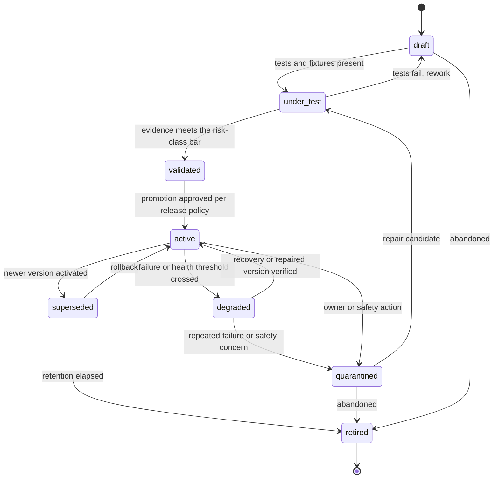
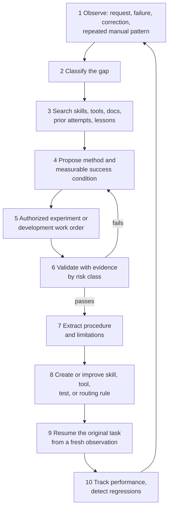
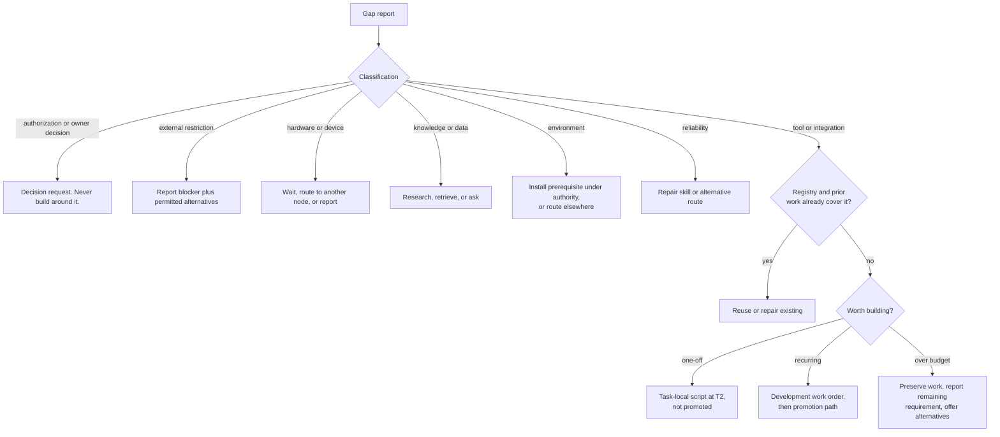

# 07 · Skills, the Learning Loop, and the Capability-Gap Resolver

Deliverable 12. Terms are defined in the [README glossary](README.md#glossary).

---

# 12. Skills and learning

## 12.1 What a skill is

A **skill** is a reusable method for achieving a class of goals. It carries enough structure to execute, verify, and maintain it. Skills are JARVIS's **procedural memory**. They reference tools, scripts, browser procedures, sub-skills, or development instructions, and they are versioned, tested, and promoted on evidence.

Skills follow the **Agent Skills** open format for the human-readable part: a folder with a `SKILL.md` whose frontmatter uses the standard fields `name`, `description`, `license`, `compatibility`, `metadata`, and `allowed-tools` [V: [Claude Code skills](https://code.claude.com/docs/en/skills)]. Coding workers can therefore read a JARVIS skill's instructions natively. JARVIS adds a machine-readable manifest, `skill.yaml`, for parameters, permissions, verification, tests, and lifecycle.

**`allowed-tools` in `SKILL.md` grants nothing in JARVIS.** Permissions come only from the manifest's *declared* effects plus the Policy Engine's grants.

## 12.2 Package layout

```text
skills/<skill-id>/<version>/          # immutable once released; content hash recorded in skill_versions
  SKILL.md                            # human-readable instructions (Agent Skills frontmatter)
  skill.yaml                          # JARVIS manifest (§12.3)
  procedure/
    workflow.yaml                     # deterministic steps (workflow and hybrid strategies)
    prompts/                          # versioned templates for judgement steps
  scripts/                            # optional executable assets, with lockfiles; run at their declared tier
  tests/
    cases/                            # parameterized cases: inputs, expected postconditions, negative cases
    fixtures/                         # synthetic data, recorded DOM/UIA snapshots, mock service responses
    holdout.ref                       # pointer to a holdout set stored OUTSIDE the package
  examples/                           # example invocations, with no personal data
  CHANGELOG.md
  provenance.json                     # written by the Release Manager: sources, hashes, builders, SBOM
```

Personal constants never appear in a package. A home address, for example, is a memory reference such as `{{mem:mem_A7#value}}`, resolved at run time and late-bound by the Broker ([03 §9.9](03-memory.md#99-context-builder)).

## 12.3 Manifest

An illustrative manifest for a mature booking skill (HYPOTHETICAL sites and values):

```yaml
schema: jarvis.skill/1
id: skill:travel.book_accommodation
name: Book accommodation on a web booking site
version: 0.4.0
description: >
  Search, compare, prepare, and (when authorized) book accommodation on supported booking sites,
  then verify the booking against the site's records.
author: { kind: workshop, work_order: wo_01JB..., workers: [claude_code], reviewed_by: [codex] }
provenance: { created_from_task: tsk_01JA..., source_hash: "sha256:9f2c...", release: rls_01JC... }

goal_patterns: [book a hotel, find accommodation near, reserve a room]
not_for:
  - flights or trains (use skill:travel.book_rail)
  - more than 4 rooms
  - sites whose service policy prohibits UI automation

parameters:                          # JSON Schema, abridged
  type: object
  required: [site, location, check_in, check_out, guests, mode]
  properties:
    site: { type: string, description: "site profile id, e.g. site:examplestays" }
    location: { type: string }
    near: { type: string }
    check_in: { type: string, format: date }
    check_out: { type: string, format: date }
    guests: { type: integer, minimum: 1 }
    max_price_per_night: { $ref: "#/defs/money" }
    require_free_cancellation: { type: boolean }
    requirements: { type: array, items: { type: string } }   # from memory, e.g. step-free access
    mode: { enum: [find_options, prepare, book] }
outputs:
  type: object
  properties:
    options: { type: array }
    booking:
      type: object
      properties:
        confirmation_id: { type: string }
        total: { $ref: "#/defs/money" }
        cancellation_deadline: { type: string, format: date-time }
artifacts: [options_table.md, confirmation_evidence (retention 30d)]

compatibility:
  node_kinds: [windows_desktop]
  browsers: [msedge, chrome]
  sites:
    - { id: site:examplestays, layout_fingerprint: "7c1e…", verified: "2026-10-12" }
    - { id: site:staydirect,   layout_fingerprint: "a9d2…", verified: "2026-10-20" }
  account_binding: required          # site account in a JARVIS browser profile
requires:
  capabilities: ["tool:browser.*", "tool:gmail.messages.search?"]   # "?" = optional, used for reconciliation
  config: [site profile with identity probe]

permissions:
  tier: T1
  effects_by_mode:
    find_options: [read.account]
    prepare: [read.account, write.account]
    book: [read.account, write.account, commit, spend]
  network_hosts: [examplestays.example, staydirect.example]

strategy:
  kind: hybrid
  procedure: procedure/workflow.yaml
  judgement_steps: [rank_options]                    # model-assisted, schema-validated output
  guided_fallback_steps: [locate_search_form, locate_room_selector]

success_criteria:
  - id: c1
    description: A booking exists with the authorized dates, room, and total within bounds
    check: { kind: service_readback, via: "site my-bookings page" }
    acceptable_evidence: [service_readback, service_confirmation]
  - id: c2
    description: The confirmation id was captured and matches the confirmation email (if Gmail is connected)
    check: { kind: confirmation_captured }
    acceptable_evidence: [service_confirmation]

failure_classes:
  - { class: layout_changed, detect: "required element missing or layout fingerprint mismatch",
      recovery: [guided_fallback, repair_proposal] }
  - { class: auth_required, recovery: [waiting_for_auth] }
  - { class: wrong_account, recovery: [stop, ask_owner] }
  - { class: price_out_of_bounds, recovery: [decision_request] }
  - { class: submission_uncertain, recovery: [reconcile_my_bookings, reconcile_email], forbid: [blind_retry] }
compensation:
  possible: "Cancel through the site within the free-cancellation window"
  limits: "Non-refundable bookings cannot be compensated. Fees may apply."

tests:
  suites: [tests/cases/search.yaml, tests/cases/prepare.yaml, tests/cases/negative.yaml]
  fixtures: [tests/fixtures/examplestays-2026-10/, tests/fixtures/staydirect-2026-10/]
  holdout: "holdout:skill.travel.book_accommodation/v2"
  live_verification: { last: "2026-10-20", scope: "prepare mode, stop before submit", result: pass }
validation_evidence: ["rls_01JC...#report"]
last_successful_run: { task: tsk_01JD..., at: "2026-10-14T09:12:00Z", mode: book }
cost: { typical_model_tokens: 40000, high_model_tokens: 120000, basis: "12 runs", confidence: medium }
risk_class: R3
lifecycle: { state: active, since: "2026-10-14", reason: "promoted after a supervised live run" }
```

Field reference, mapped to the brief's list:

| Brief requirement | Manifest fields |
|---|---|
| ID, name, description, version, author or generating task, provenance | `id`, `name`, `description`, `version`, `author`, `provenance` |
| Goal patterns and conditions for non-use | `goal_patterns`, `not_for` |
| Parameter, output, and artifact schemas | `parameters`, `outputs`, `artifacts` |
| Environments, accounts, applications, compatibility | `compatibility` |
| Required capabilities, packages, configuration | `requires` (plus `scripts/` lockfiles) |
| Declared permissions and side effects | `permissions` |
| Execution strategy | `strategy` |
| Success criteria and verification | `success_criteria` |
| Failure classes, recovery, rollback and compensation limits | `failure_classes`, `compensation` |
| Tests, fixtures, validation evidence, last successful run | `tests`, `validation_evidence`, `last_successful_run` |
| Resource and cost estimates with uncertainty | `cost` (with basis and confidence) |
| Lifecycle status and reason | `lifecycle` |

## 12.4 Execution strategies: choosing the level of flexibility

| Strategy | Description | Best for |
|---|---|---|
| `workflow` | Deterministic steps: tool calls with typed parameters, conditions, loops, and postconditions. A model is used only at declared **judgement steps** that return schema-validated output. | APIs, stable applications, file processing |
| `guided` | `SKILL.md` instructions plus a tool allowlist, run by an Agent Worker, with declared verification | Novel or highly variable environments |
| `hybrid` | A workflow skeleton with guided sub-steps at declared points. Each guided sub-step ends with a postcondition check. | Websites that change, desktop apps with shifting layouts |

**Choose the least flexible strategy that meets observed reliability.** If a guided skill produces N consistent successful traces, the Learning Service proposes **compiling it into a workflow** (a workflow-optimization improvement). If a workflow step keeps failing because the environment varies, it proposes a guided fallback at that step.

An excerpt from `procedure/workflow.yaml`:

```yaml
steps:
  - id: open_site
    tool: tool:browser.navigate
    params: { profile: "{{binding.profile}}", url: "{{site.base_url}}" }
    post: { page_matches: "{{site.home_fingerprint}}" }
  - id: verify_identity
    tool: tool:browser.identity_probe
    params: { probe: "{{site.identity_probe}}" }
    post: { equals: "{{binding.account_identity}}" }
    on_fail: { class: wrong_account, action: stop }
  - id: search
    tool: tool:browser.fill_and_submit
    params: { form: "{{site.search_form}}", values: { location: "{{params.location}}",
              check_in: "{{params.check_in}}", check_out: "{{params.check_out}}", guests: "{{params.guests}}" } }
    post: { results_visible: true }
    on_fail: { class: layout_changed, action: guided_fallback }
  - id: rank_options
    judgement: { prompt: prompts/rank.md, output_schema: "#/defs/ranked_options" }
  - id: return_if_find_only
    when: "params.mode == 'find_options'"
    return: { options: "{{steps.rank_options.output}}" }
  # … prepare steps …
  - id: pre_commit_check
    tool: tool:browser.read_fields
    post: { within_bounds: "{{authorization.bounds}}", identity: "{{binding.account_identity}}" }
  - id: submit
    tool: tool:browser.click
    action: { effects: [commit, spend], reconciliation: [my_bookings_page, confirmation_email] }
  - id: verify
    verify: [c1, c2]
```

## 12.5 From trigger to interpreted output

1. **Match.** The Planner's capability search matches goal patterns, purpose, and `not_for` exclusions. Parameters are extracted from the contract.
2. **Validate parameters** against the schema. A missing required value goes through the materiality test: ask, default, or take it from memory.
3. **Check compatibility and prerequisites**: node, browser, site fingerprint, account binding, required capability health.
4. **Check permissions.** The manifest's effects for the chosen mode must be within the task ceiling. Grants and standing permissions are consulted, and some permissions require `lifecycle: active`.
5. **Pin** `skill_id@version#hash` (§12.9).
6. **Execute** through the Skill Runtime (workflow or hybrid) or an Agent Worker (guided).
7. **Verify** the skill's `success_criteria` and the task's criteria.
8. **Handle failure.** Map it to a declared failure class and apply the declared recovery. Otherwise go to the Gap Resolver (§12.15).
9. **Interpret output.** Validate against `outputs`, register artifacts, and write a `SkillExecutionRecord` (§12.10).

## 12.6 Composition and exploration

- **Composition.** A skill may call other skills declared in `requires.capabilities`. Version ranges are resolved and pinned at run start. The dependency graph must be acyclic, which is checked at install time. Composition avoids having a model rediscover known sequences.
- **Exploration.** When no skill fits, the Boss composes tools in *exploratory mode*: bounded budget, read-only and preparatory steps first, consequential steps only under normal authority. The run is recorded as a candidate procedure trace.
- **From exploration to skill.** After a verified exploratory success, the Learning Service drafts a skill or proposes an improvement to an existing one (§12.7).

## 12.7 A new method versus a one-time parameter

Extracting a skill from a trace:

- **Varying values** (dates, names, amounts, IDs in URLs) become **parameters**.
- **Your constants** (an address, a loyalty number) become **memory references**, never skill content.
- **Site or app constants** (URLs, selectors, identity probes) go into a **site profile** within the skill.
- **Decisions** become **judgement steps** with output schemas.

Before creating anything, a **similarity check** runs against existing skills by goal patterns, capability signature, and site. A match produces an **improvement proposal**: a new version, or a new site profile for an existing skill. It never produces a duplicate.

| Situation | Result |
|---|---|
| "Book a meeting with Dana for Tuesday" when `skill:calendar.schedule_meeting` exists | Reuse, with parameters `attendee=Dana`, `day=Tuesday`. The skill's execution evidence is updated. No new skill. |
| First successful booking on a new site with the booking skill's guided fallback | A new site profile for `skill:travel.book_accommodation` (improvement proposal) |
| A genuinely new procedure, such as reconciling invoices against bank exports | A new draft skill |

## 12.8 Lifecycle, promotion, and rollback



**Promotion by risk class.** The author's say-so is never evidence.

| Class | Effects | Evidence needed for `validated` | Promotion to `active` |
|---|---|---|---|
| **R0** | Read-only, local drafts | Schema valid, fixture tests pass, 1 supervised successful run | Automatic |
| **R1** | Reversible `write.local` or `write.account` | R0 plus holdout tests, postcondition checks, and a dry run | Automatic, with a notice |
| **R2** | `communicate`, `delete.*` | R1 plus simulated-service tests (mocks or test accounts), negative cases, and second-worker review of code | Your one-tap approval |
| **R3** | `spend`, `commit`, `publish`, `access_control`, `admin`, and `install` at T1 | R2 plus a test-account run, or a dry run up to the pre-commit check, plus a **supervised first live run** (decision card) | Your approval, and the first live runs are supervised |

**Degradation triggers.** For example, 2 failures of the same class in the last 5 runs, a failing health probe, or a site layout fingerprint mismatch. A degraded skill still runs if you ask, with a warning. Standing permissions that require `active` skills are suspended until it recovers.

**Rollback** re-activates the previous version pointer, immediately. Packages are immutable, so rollback is exact.

**Retrieval filters.** Capability search excludes `draft`, `under_test`, `quarantined`, `retired`, and disabled versions, unless the purpose is testing or repair. It also excludes versions incompatible with the current node, browser, site, or app.

## 12.9 Version pinning

- When a skill step starts, `skill_id@range` resolves to one version, and the plan step records `id@version#hash`. Every sub-step runs from that immutable package.
- If a newer version is activated while a task is running, the running skill continues on its pinned version. The Task Engine records a "newer version available" event.
- The planner may choose the newer version only for a **later, fresh** skill invocation at a step boundary. A single run never executes half of one version and half of another.

## 12.10 Skill execution record

```ts
interface SkillExecutionRecord {
  skill_run_id: string;                // skr_…
  skill_id: string; version: string; package_hash: string;
  task_id: string; step_id: string; mode?: string;
  params_ref: string;                  // payload; may contain late-bound sensitive values // SENSITIVE
  environment: { node_id: string; browser?: string; app_versions?: Record<string, string>;
                 site_fingerprint?: string; account_id?: string };
  steps: { id: string; status: string; started_at: string; ended_at: string;
           evidence_ids: string[]; guided_fallback_used?: boolean }[];
  outcome: "verified_success" | "partial" | "failed" | "cancelled";
  failure_class?: string; gap_id?: string;
  duration_s: number; usage: UsageReport;
  owner_intervention?: ("sign_in" | "2fa" | "captcha" | "decision" | "takeover")[];
}
```

## 12.11 The recursive learning loop



| Step | What happens | Component | Artifact | Evidence |
|---|---|---|---|---|
| 1 Observe | A task outcome, skill failure, your correction, or a repeated manual pattern ("you have done this by hand 4 times") | Learning Service, via the Event Store | — | Events |
| 2 Classify | Knowledge, data, tool, integration, authorization, environment, or reliability. Owner decision and external restriction are separate classes. | Gap Resolver | `GapReport` | Failure evidence |
| 3 Search | Registry, prior gap reports with the same signature, prior work orders, lessons, vendor documentation through research | Gap Resolver | — | — |
| 4 Propose | A method plus a **measurable** success condition, for example "≥95% cell accuracy on 20 held-out synthetic PDFs; scanned pages flagged, not guessed" | Boss or Learning Service | Improvement proposal (`imp_…`) | — |
| 5 Execute | A read-only or prepare-mode experiment under authority, or a development work order | Broker or Workshop | Candidate | Run records |
| 6 Validate | Tests, holdouts, dry runs, supervised runs, by risk class | Release Manager | Validation report | Graded evidence |
| 7 Extract | Parameters, constants, judgement steps, compatibility conditions, `not_for`, known limitations | Learning Service | Draft manifest | — |
| 8 Improve | New or updated skill, tool, test, or routing rule ("for site X prefer the API") | Release Manager | Release record (`rls_…`) | Promotion evidence |
| 9 Resume | The original task continues from the failed step, re-observing first | Task Engine | — | — |
| 10 Track | Production success rate, time, cost, corrections. A regression reopens step 1. | Learning Service | Metrics | Execution records |

## 12.12 Meta-improvement with guardrails

The same loop can improve the learning machinery itself:

- Test-generation templates for the Workshop.
- Capability matching: goal patterns, ranking weights.
- Failure-diagnosis playbooks.
- Dependency-selection heuristics.
- Work-order templates.
- Context-packing weights.

**How it is validated.** An offline **replay benchmark** runs on archived, redacted cases from a held-out time window. A change must improve its primary metric without regressing guardrail metrics. Meta changes are released as versioned `learning-config` releases through the same Release Manager.

**What it can never touch.** These are invariants, enforced by path and ownership checks in the release pipeline ([08 §13.11](08-workshop-and-release.md#1311-self-improvement-of-jarvis-itself)):

- The Policy Engine, the rules, and authority of any kind.
- Verification requirements and the Verifier.
- The evaluation harness, **holdout sets**, and **metric definitions**. Holdouts live outside skill packages, and only the Release Manager can read them. That is separation of duties: the learner cannot grade itself.
- Failure history and audit records.
- Budgets and bounds, which only you set.
- The Update Supervisor.

## 12.13 Bounds, cycles, and no-progress detection

```ts
interface LearningBounds {             // defaults; configurable, and overridable per task by you
  max_dev_depth: 2;                    // development subtask nesting
  max_concurrent_builders: 1;
  max_attempts_per_gap_signature: 3;
  max_cost_per_dev_project: Money;     // you set it at onboarding
  max_wall_time_per_gap: string;       // e.g. "PT4H"
  max_improvement_proposals_per_week: 10;
}
```

- **Cycles.** Development subtasks form a tree with capability dependencies. Before a subtask starts, the resolver checks whether the capability it needs is being built by an ancestor or depends on one. For example: skill A needs tool B, whose tests invoke skill A. A detected cycle stops the subtask and escalates with the dependency chain shown.
- **No progress.** Each attempt must record a hypothesis and the variable it changed. The failure signature is error class, location, and an evidence hash. The same signature with no new evidence after K attempts stops the loop, and you receive actionable diagnostics: what was tried, the evidence, the suspected cause, and what is needed.
- **Budget accounting.** A gap's spend counts against the task's development budget. When the budget runs out, work is preserved and you are asked (§12.15).

## 12.14 Candidate lessons versus accepted knowledge

| Lesson kind | Becomes accepted when | Notes |
|---|---|---|
| Method ("search results load only after scrolling") | Tests validate it, or it held across ≥2 independent verified successes (different days or inputs) with no contradicting failure | A lucky single success stays a candidate |
| Pitfall ("the portal logs out after 10 minutes idle") | One verified failure with clear evidence | Accepting cautionary knowledge cheaply is the conservative direction |
| Parameter default ("usually 1 guest") | Your confirmation, or ≥3 consistent observations. It becomes an *inferred preference* in memory, not a skill constant. | — |
| Environment fact ("site uses layout X") | A verified observation with a timestamp and an **expiry** | Site facts go stale |

A worker's confident explanation is not evidence. Rejected lessons are kept with their reason, so the same mistake is not proposed again.

## 12.15 The capability-gap resolver

```ts
interface GapReport {
  gap_id: string;                      // gap_…
  task_id: string; step_id: string;
  intended_step: { description: string; capability_intent: string; params_ref?: string; effects: EffectClass[] };
  observed_failure: StructuredError;
  environment: { node_id: string; os: string; apps?: Record<string, string>;
                 site_fingerprint?: string; account_id?: string };
  attempted_methods: { method: string; capability?: string; result: string; evidence_ids: string[] }[];
  evidence_ids: string[];
  classification: "knowledge" | "data" | "tool" | "integration" | "authorization" | "environment"
                | "reliability" | "owner_decision" | "external_restriction" | "hardware";
  minimum_missing_capability: string;  // "extract tables from scanned PDFs: OCR plus table detection"
  signature: string;                   // hash(capability intent, classification, failure class, environment key)
  options: ResolverOption[];
  decision?: { option_id: string; reason: string; decided_by: "resolver" | "owner"; at: string };
  status: "open" | "resolving" | "resolved" | "blocked" | "abandoned";
  links: { dev_task_id?: string; prior_gap_ids: string[] };
}

interface ResolverOption {
  id: string;
  kind: "use_existing_differently" | "repair_auth" | "retrieve_data" | "ask_owner" | "alternative_route"
      | "repair_skill" | "build_tool" | "install_prerequisite" | "wait" | "report_blocker";
  description: string;
  est_cost?: Money; est_time?: string;                   // estimates, labeled as such
  success_likelihood: "high" | "medium" | "low";
  reuse_value: "none" | "low" | "medium" | "high";
  requires_authority?: EffectClass[];
}
```



- **Engineering failure and authorization failure are different things.** Authorization, owner-decision, and external-restriction gaps never produce development work orders. A code generator is never asked to solve a missing decision, or to bypass a service's rules.
- **Search before building.** The resolver checks the registry, prior gap reports with the same signature, and earlier development work orders. Duplicate connectors are not rebuilt.
- **Is it worth building?** Expected reuse (how often similar goal classes appear in experiences and in your stated goals) is weighed against build cost, risk, and the current task's budget.
  - One-off need: a **task-local script** at T2, kept as an ephemeral artifact and promotable later if it gets reused.
  - Recurring need: a proper tool or connector through the release path.
- **Preserve and resume.** The development subtask links to the original (`parent_task_id`), and the original waits in `waiting_for_subtask`. When the capability is released, the original resumes at the failed step, **after a fresh observation** of external state.
- **Budget exhausted.** The workspace, artifacts, and diagnostics are preserved. The gap stays `open` with a statement of the remaining requirement, and you get the partial result plus practical alternatives. Unfinished engineering is never labeled a success.
