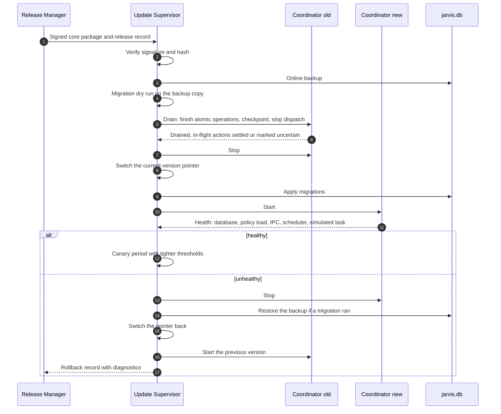

# 08 · The Development Workshop, Evaluation, Release, and Self-Improvement

Deliverable 13. It also covers brief §31–§33. Terms are defined in the [README glossary](README.md#glossary).

---

# 13. Workshop and controlled release

## 13.1 Purpose and flow

The Workshop is where JARVIS builds what it lacks: tools, connectors, skills, scripts, UI components, and changes to itself. It never modifies the active system in place. Everything is built, tested, packaged, and then **activated** through a controlled release path.

```mermaid
flowchart LR
    GAP["Gap report or<br/>improvement proposal"] --> WO["Development work order"]
    WO --> WS["Provision isolated workspace"]
    WS --> BLD["Coding worker builds candidate"]
    BLD --> HO["Handoff: package, tests,<br/>dependencies, risks"]
    HO --> VAL["Validation pipeline<br/>in the sandbox"]
    VAL -->|fails| BLD
    VAL --> REV{"Review needed?"}
    REV -->|yes| RW["Second worker review"]
    RW --> PROMO
    REV -->|no| PROMO{"Promotion policy<br/>by risk class"}
    PROMO -->|approved| ACT["Atomic activation<br/>in the registry"]
    ACT --> CAN["Canary period"]
    CAN -->|healthy| LIVE["Active"]
    CAN -->|regression| RB["Automatic rollback"]
```



## 13.2 Development work order

A development work order extends the generic work order ([02 §7.5](02-boss-and-tasks.md#75-work-orders-and-worker-results)):

```ts
interface DevWorkOrder extends WorkOrder {
  dev: {
    problem: string;                   // the concrete problem, from the gap report
    target: { kind: "tool" | "connector" | "skill" | "skill_repair" | "script" | "core_change" | "ui";
              capability_id?: string; version_bump?: "patch" | "minor" | "major" };
    interface_contract: {
      contract: "jarvis.capability/1" | "jarvis.skill/1" | "jarvis.connector/1";
      descriptor_draft: Partial<CapabilityDescriptor>;
      input_schema: JSONSchema; output_schema: JSONSchema;
    };
    io_expectations: { inputs: string; outputs: string; examples_ref: string };
    environment_constraints: {
      runtime: "node" | "python" | "dotnet" | "powershell";
      os: "linux_wsl" | "windows_sandbox";
      network: { build: "none" | "allowlist"; runtime: "none" | "allowlist"; allowlist?: string[] };
    };
    available_dependencies: { allowed_registries: string[]; preapproved_packages?: string[]; license_allowlist: string[] };
    permission_boundaries: {
      declared_effects: EffectClass[]; tier: "T1" | "T2";
      filesystem: { inputs: string; outputs: string };
    };
    test_requirements: {
      fixtures_ref: string;            // synthetic data the builder may see
      negative_cases: string[];        // e.g. "unsupported file type", "service unavailable", "wrong account"
      holdout_ref: string;             // run by the Release Manager; never visible to the builder
      live_checks?: string[];          // later, if authorized
    };
    artifact_location: string;         // workspace path for the candidate package
    data_policy: { synthetic_only: boolean; authorized_samples?: ArtifactRef[] };
    review: { second_worker: boolean; reviewer?: "codex" | "claude_code" };
  };
}
```

## 13.3 Isolation options

| Option | What it is | Boundary strength | Used for | Requirements |
|---|---|---|---|---|
| **W1: WSL2 Workshop distro** (default) | A dedicated distro, `jarvis-workshop`. `/etc/wsl.conf` sets `[interop] enabled=false` and `appendWindowsPath=false`, which blocks launching Windows binaries and PATH leakage, and `[automount] enabled=false`, so there is no `/mnt/c` [V-S: [WSL configuration](https://learn.microsoft.com/en-us/windows/wsl/wsl-config)]. Workers run as an unprivileged user **without sudo**, so they cannot mount Windows drives manually. | A VM boundary. Your Windows files, the database, and the vault are unreachable **if** interop and mounts are truly closed. This is verified empirically in M0. | Coding workers, Linux-compatible builds and tests, T2 runtime for generated tools | WSL2 enabled |
| **W2: Windows Sandbox** | A disposable Windows VM. `.wsb` configuration with read-only mapped input folders, one writable output folder, and networking disabled unless needed. The `wsb` CLI (Windows 11 24H2+) can start sandboxes, share folders, and run commands [V-S: [Windows Sandbox](https://learn.microsoft.com/en-us/windows/security/application-security/application-isolation/windows-sandbox/)]. | Strong and disposable | Testing Windows-native tools: PowerShell, .NET, UI Automation against test apps | Windows Pro, Enterprise, or Education. **Not available on Home** [V-S]. |
| **W3: Restricted local account** | A standard local user, `jarvis-lab`, whose ACLs allow only its own workspace | An account boundary. It shares the OS and network. | Fallback when W1 or W2 is unavailable | Any edition |
| *(Codex native Windows sandbox)* | Codex's "elevated" mode: dedicated lower-privilege sandbox users, filesystem permission boundaries, firewall rules [V-S] | Defense in depth for Codex on Windows | Windows-native Codex work | Codex on Windows |

**Defense in depth inside W1.** The Claude Code Worker runs with the Claude Code sandbox in strict mode (`allowUnsandboxedCommands: false`), with its Linux dependencies (bubblewrap, socat) and the optional seccomp filter installed. On WSL2, the seccomp filter is what blocks sandboxed commands from reaching the Windows host through the Unix socket that WSL uses to launch Windows binaries [V: [sandboxing](https://code.claude.com/docs/en/sandboxing)]. The Codex Worker uses Codex's Linux sandbox.

**Network egress.** At provisioning time, a filtering proxy with a domain allowlist is configured as root: package registries, the provider APIs, and GitHub when needed. At run time the worker user cannot change it [I, verify in M0]. The only JARVIS service reachable from the distro is the token-authenticated MCP Gateway endpoint for the current work order. Named pipes are not reachable.

**Staged I/O.** The Exec Host copies authorized inputs *into* the workspace (for example through `\\wsl.localhost\jarvis-workshop\…` [I]) and copies validated outputs *out*. Your folders are never mounted into a sandbox.

**Coding workers' own credentials.** Subscription logins live inside W1, under the worker user's `CLAUDE_CONFIG_DIR` and Codex's `~/.codex`, outside any workspace. The risks and mitigations:

- **Risk.** Code executed in the same environment could read the login token.
- **Mitigations.** Claude Code's sandbox can deny or mask credential files for sandboxed commands [V]. The egress allowlist blocks arbitrary exfiltration. Tokens can be revoked by logging out.
- **Residual risk**, stated plainly: a sandbox escape, or a tool whose sandbox does not protect its own credentials, could expose the subscription token. That token can make model requests on your plan. It cannot reach your files or accounts.

W2 is disposable, so it is used to **test** artifacts, not to host long-lived subscription logins.

**Data minimization.** Workers receive **synthetic fixtures** generated by the Workshop: synthetic PDFs, synthetic voice notes produced with TTS, rendered screenshots. Real samples are used only with your permission, in the minimum quantity, copied in and deleted after the build.

## 13.4 Choosing the coding worker

The selection criteria are capability fit (language and tooling), availability (health and quota), account support (subscription verified or not), cost, **observed reliability** for this task class (success rate *after* validation), and your preference.

The default policy: your preference first. If you have none, the first N development tasks alternate between workers as an explicit, budgeted experiment, to build evidence. After that, choose by measured results. No brand hierarchy is hard-coded.

## 13.5 Workspace layout and invocation hygiene

```text
/home/worker/ws/<wo_id>/
  repo/          # git worktree (a new repository for a new tool, or a worktree of an existing package)
  CONTEXT.md     # objective, constraints, interface contract, acceptance criteria (no personal data)
  spec/          # schemas, the descriptor draft, the connector's service policy
  fixtures/      # synthetic data
  out/           # candidate package
```

Invocation details per worker are in [06 §11.18](06-connectors-providers-budgets.md#1118-coding-worker-adapters).

- **Claude Code** runs with user settings only, hooks disabled, the JARVIS MCP configuration, a JSON result schema, and a permission setup in which sandboxed commands run and anything else is denied without prompting (`--permission-prompts none`).
- **Codex** runs through app-server threads with workspace-write sandboxing. Its approval requests are answered by the Workshop Manager against the work order's boundaries.

## 13.6 Handoff protocol

Worker-to-Workshop events:

| Event | Payload | Handling |
|---|---|---|
| `dev.progress` | Phase (`analyzing`, `implementing`, `testing`, `packaging`) and a note | Shown in the task view as "Building a tool I need: testing" |
| `dev.question` | Question, why, whether it blocks | Answered from the specification and context. Escalated to you only if it is material. |
| `dev.artifact` | Path and kind (`patch`, `package`, `report`) | Hashed and registered as an artifact |
| `dev.test_results` | Suite, counts, report reference | Recorded. It is not trusted until the pipeline reruns the tests itself. |
| `dev.dependency_change` | Packages added, removed, or updated, with versions and licenses | Fed into the dependency audit |
| `dev.risk` | A known limitation or risk | Copied into the validation report |

The final `WorkerResult.output` follows this schema:

```ts
interface DevResult {
  package_path: string; patch_ref?: string;
  tests: { suite: string; passed: number; failed: number; report_ref: string }[];
  dependencies: { name: string; version: string; license: string; new: boolean }[];
  declared_permissions: object;
  known_limitations: string[]; remaining_risks: string[];
  notes_for_reviewer: string;
}
```

**Parallel work** happens in separate worktrees. An integration step merges them in the Workshop. A conflict goes to a resolver worker with tests, or to you if intent is unclear. The full test suites rerun after every merge.

## 13.7 Independent review

- **When.** R2 or R3 capabilities, credential handling, network code, code writing outside its declared outputs, and security-sensitive parsing.
- **How.** A second worker, preferably from the other provider, receives the specification, diff, tests, and validation report, but **not** the author's rationale. It returns structured findings: severity, location, reasoning. Findings feed a fix loop or are accepted with notes.
- **Limits.** Two models agreeing is not proof. They can share blind spots. Review is one evidence input alongside tests and observed behavior. R3 promotions also get your review of a plain-language summary and the **permission delta**.

## 13.8 Validation pipeline

The pipeline runs deterministic tooling in the sandbox:

1. **Structure and contract.** Package layout, manifest schema, descriptor conformance: schemas present, effects declared, verification method declared, error mapping to the shared vocabulary.
2. **Static checks.** Lint and type-check. Forbidden APIs relative to declarations, for example sockets when `network: none`, or process spawning when not declared. Imports compared with declared capabilities.
3. **Dependency audit.** A pinned lockfile. The license allowlist. Known-vulnerability checks with the ecosystem's audit tools [I]. Heuristics for look-alike names and very new packages. Install scripts flagged.
4. **Secret scan** over code, tests, fixtures, and logs.
5. **Behavior tests.** Unit and fixture tests. Negative cases. **Holdout tests**, run by the Release Manager, that the builder never saw.
6. **Egress and filesystem observation during tests.** Observed network destinations compared with the allowlist. Written paths compared with declared outputs [I, mechanism per environment verified in M0].
7. **Permission delta** against the previous version: effects, hosts, tier.
8. **Integration test.** Register in a staging registry on a test node, invoke through the Broker against simulators, and check evidence emission and error mapping.
9. **Validation report.** What was tested, what remains untested, environment, versions, and the limits on confidence.

## 13.9 Evaluation and promotion evidence

| Level | What it catches | Example | Type |
|---|---|---|---|
| Schema validation | Contract drift | The manifest or descriptor fails its schema | Deterministic |
| Unit tests | Logic errors | Date parsing across DST boundaries | Deterministic |
| Integration tests | Wiring errors | Tool → Broker → executor → evidence round trip | Deterministic or simulated |
| Simulated external effects | Wrong effect, no double submission | Fake booking site, fake SMTP, fake calendar | Simulated |
| End-to-end workflows | Whole-task behavior | "Find options, then prepare, then book" against the fake site | Simulated |
| Limited live verification | Real-world drift | Prepare mode on the real site, stopping before submit, once authorized | Live (later) |

**Principles.**

- **Tests must be able to fail.** Tests are written from the specification, not the implementation. Holdout tests are authored separately (by another worker, or from recorded real cases). An optional mutation-testing spot check confirms the tests catch injected faults.
- **Negative cases are required**: unavailable service, wrong account, changed page structure, malformed input, permission denied.
- **Browser and desktop skills are tested on observations and postconditions**, not click sequences. A click sequence can complete while producing the wrong result.
- **Tests never send, buy, or book for real.** Test runs execute on a `test` node profile. Effectful connectors are replaced with simulators, and the Policy Engine has a hard rule that tasks flagged as tests cannot perform real `communicate`, `spend`, `commit`, or `publish` actions.

```ts
interface PromotionEvidence {
  release_candidate: string; capability_id: string; version: string;
  tested: { level: string; suite: string; result: string; environment: string }[];
  untested: string[];                  // explicit, e.g. "sites that present a CAPTCHA"
  holdout: { set: string; result: string };
  review?: { reviewer: string; findings: number; unresolved: number };
  live_checks?: { scope: string; result: string; at: string }[];
  confidence_limits: string;           // plain statement
  permission_delta: { added: string[]; removed: string[] };
}
```

**Regression suites.**

- A **core suite** of about 50 deterministic and simulated scenarios: the task loop, policy decisions, memory scope, reconciliation, the scheduler, and recovery. It runs nightly and before every release.
- **Targeted suites** for each changed skill and its dependents.
- A memory update does not trigger a full suite. Only changes to retrieval code do ([03 §9.10](03-memory.md#910-retrieval-quality-evaluation)).

## 13.10 Release path and rollback

1. **Candidate.** The package is registered as `under_test` in the staging registry.
2. **Validation report**, and review where required.
3. **Promotion decision** by risk class ([07 §12.8](07-skills-and-learning.md#128-lifecycle-promotion-and-rollback)). **Any permission delta requires your review, regardless of risk class.**
4. **Activation.** The Release Manager copies the immutable, content-addressed package into `skills/<id>/<version>/` (or `plugins/…`), readable but not writable by non-core processes. It then flips the registry pointer **in one database transaction**.
5. **Canary.** The first N uses run under tighter thresholds. For R2 and R3, any failure triggers automatic rollback to the previous version.
6. **Active.** A `ReleaseRecord` is written ([12 §17.7](12-stack-and-contracts.md#177-central-schemas-and-schema-index)).

The Workshop **never writes into active directories**. Rollback is a pointer revert. Running executions are unaffected because they are pinned ([07 §12.9](07-skills-and-learning.md#129-version-pinning)).

## 13.11 Self-improvement of JARVIS itself

**Change classes.**

| Class | Examples | Mechanism | Validation | Approval | Activation | Rollback |
|---|---|---|---|---|---|---|
| **Configuration** | Name, tone, personality, verbosity, preferred models per role, notification behavior, default schedules | Settings screen or conversation, stored as versioned config revisions | Schema | Immediate (you made it) | Instant | Revert the revision |
| **Skill update** | A new site profile, a repair | Workshop | By risk class | By risk class | Registry pointer | Pointer revert |
| **Connector update** | Support for a new API version | Workshop | Integration tests against mocks, plus a live read-only check | R-class of its effects | Registry pointer | Pointer revert |
| **Model routing** | Switching `boss.reasoning` to a new model | Evaluation suite comparison | Metrics against baseline | Yours, if cost or privacy changes | Config revision | Revert |
| **UI change** | A new panel | Workshop builds the UI bundle | UI tests | Yours, one tap | App update | Previous bundle |
| **Core runtime** | Task Engine, Broker, Policy Engine, Memory Service | Core improvement project (below) | Full core suite, migration tests, invariant tests | **Always yours** | Update Supervisor | Supervisor rollback, plus database restore if the migration was irreversible |

**Personalization without code changes.** Name, tone, personality, preferred models, notification behavior, and default workflows are configuration or skills. They never need a core release.

**Core self-improvement is a versioned development project.**

1. An improvement proposal (`imp_…`) with rationale, target metrics, and risk.
2. Development work orders against a **git worktree of the JARVIS source** inside the Workshop, never against the installed application.
3. The full core suite, migration tests on synthetic databases plus a schema-only snapshot, and invariant tests. With your permission, the Update Supervisor itself (not a worker) can also dry-run the migration locally on a copy of your backup.
4. **Protected-module gate.** Any diff touching `policy/`, `broker/`, `verifier/`, `audit/`, or the Update Supervisor requires a second-worker review **and** your review of a plain-language summary.
5. **Signing.** Core packages must carry a signature from a local release key that is used only after your approval. Your approval *is* the signature. The Launcher refuses unsigned or mis-signed core packages.
6. **Apply** through the Update Supervisor:



**The Update Supervisor sits outside what it updates.** It is part of the Launcher, keeps several previous versions side by side, and writes an update **journal**, so after a power loss mid-update it resumes or rolls back at next start. The self-improvement pipeline never modifies it. It changes only through an installer package from the signed release channel.

**Migrations** use the expand/contract pattern where possible, so the new core can read the old schema during the canary. Irreversible migrations are flagged, need a fresh backup and your approval, and their release notes state that rollback means restoring the backup, which **loses data written after the migration**.

**What JARVIS cannot do to itself.** It cannot silently change its own authority, erase failure history to look better, disable verification, redefine success metrics, or alter the evaluation holdouts. Four things enforce this:

1. The Workshop has no write access to the installed application, the database, or the holdouts.
2. The protected-path gates in the Release Manager.
3. Policy-decision invariance tests ([04 §10.8](04-policy-and-trust.md#108-policy-revisions-and-propagation)).
4. Your signature on core releases.

The honest limit: if you approve a harmful change, it can still do harm. Reviews and tests reduce that risk. They do not eliminate it.

**Measuring whether an improvement helped.** Every release gets a report card comparing comparable task classes before and after, with sample sizes stated:

- Verified completion rate.
- Partial and failed rate.
- Your corrections per 100 tasks.
- Time to completion.
- Cost per task class.
- Interruptions per day.
- False-completion incidents, which must stay at zero.
- Regressions.

No single number is optimized at the expense of the rest.
