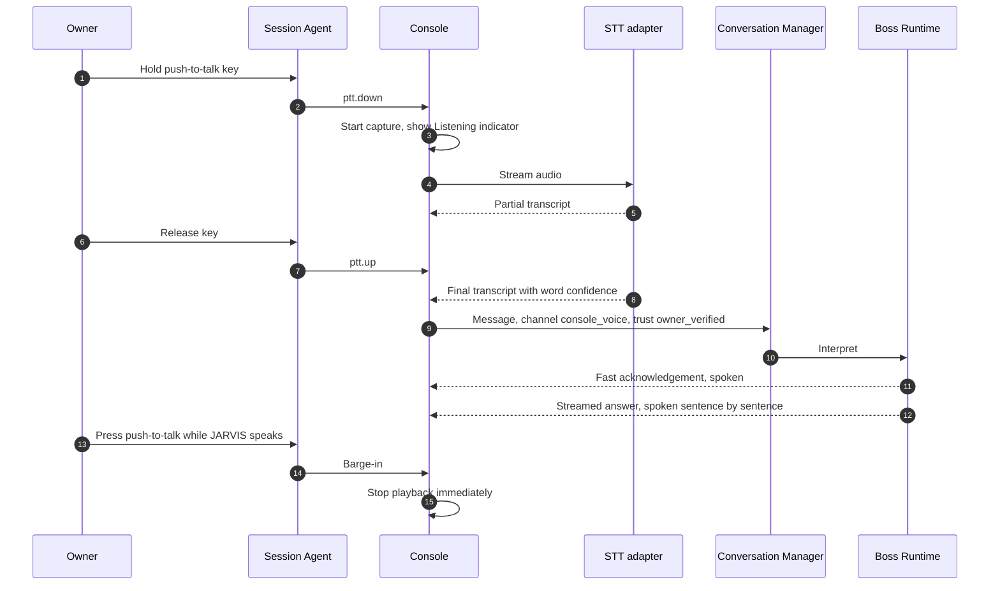

# 09 · Interface, Voice, Images, and Screen Context

Deliverable 14. It also covers brief §9 and §10. Terms are defined in the [README glossary](README.md#glossary).

---

# 14. Interface and modalities

## 14.1 Design principles

1. **Conversation and work side by side.** You talk in one place and see tasks progress in the same place.
2. **Honest status.** Every waiting state has a meaningful label and a next expected event. There are no bare spinners.
3. **Control is always one step away.** Stop speaking, pause, steer, cancel, and emergency stop.
4. **Detail on demand.** Implementation details stay out of the conversation unless they help you decide. Logs live behind a "technical view" toggle.
5. **Quiet by default.** Interrupt only when something matters (§14.5).
6. **Accessible from the start** (§14.6).

## 14.2 Screens and information hierarchy

A left rail holds the screens. A **"Needs you"** badge (decisions, sign-ins, clarifications) is visible from every screen.

| Screen | Primary content | Key actions |
|---|---|---|
| **Conversation** (home) | The thread. Inline **task cards**: a one-line interpretation, a state chip, the next expected event. Proposal and decision cards. "Saved: …" memory chips. A "Something wrong?" correction chip on answers. | Composer: text, attach files and images, screenshot (window, region, or screen), push-to-talk button. A **focus chip** ("Talking about: Lisbon hotel ▾") that directs steering. **Stop speaking.** |
| **Tasks** | Needs you, Active (with wait reasons and next events), Scheduled and Monitors, Recent (completed, partial, failed, cancelled) | Pause, resume, steer, cancel |
| **Task detail** | Objective, mode, state, next event. **"What I'm doing, within what limits"**: scope, effects, bounds, budget. Plan steps. External **actions timeline**, including `uncertain`. **Evidence per success criterion.** Artifacts. Cost (actual, estimated, unknown). | Pause, resume, steer, cancel, compensation options. **"Why is this waiting?"** Technical view. |
| **Results and artifacts** | Outputs by task, project, and type, with provenance and retention badges | Open, reveal in Explorer, preview, attach to a new request |
| **Memory** | Profile, preferences, people and organizations, projects, commitments, facts, lessons, the **Inferred** review queue, recently changed | Edit, correct scope, mark local-only, temporary, or project-private, delete, export, "Forget everything about…" |
| **Rules and permissions** | Rules by kind, each in plain text with its structured interpretation. Protected badges. Standing-permission **usage meters**. Policy revision history. | Create (confirmation flow), edit, suspend, revoke. **"Why was this denied?"** lookup. |
| **Accounts and devices** | Connected accounts (identity, scopes, health, last refresh). Browser profiles (sites signed in). This PC's availability (unlocked, locked, asleep), capabilities, wake-timer test status. Providers (auth, budgets, usage, retention terms). | Connect, revoke, open a profile window to sign in, run the alarm reliability test |
| **Skills** | Library filtered by lifecycle. Per skill: versions, success rate, last run, failures, effects by mode, tests and evidence, changelog. **Improvement proposals** queue. | Approve or reject proposals, disable, roll back, run tests |
| **Activity and usage** | Consequential action history (sends, bookings, purchases, shares, installs, deletions). Usage by provider, role, and task. Notification log. Weekly report card. | Filter, export |
| **Settings** | Persona, voice, notifications and quiet hours, privacy (retention, egress by sensitivity, screenshot app denylist), models and routing, budgets and fallback chains, backup and restore status, updates, emergency-stop hotkey | — |

**Onboarding and discovery** happen on first run, and each item is explicit and consented:

- Profile and **timezone**.
- Privacy posture.
- Budgets and quiet hours.
- A voice test.
- Discovery of your environment. JARVIS lists each check *before* running it: Windows edition, WSL availability, Windows Sandbox availability, BitLocker status, GPU, microphone.
- A plain explanation of what JARVIS can and cannot do while the PC is locked, asleep, or off.
- An offer to run the alarm reliability test.
- Account connections, which you start yourself, in the order you choose.

Nothing is scanned silently.

## 14.3 Status vocabulary

| Internal state | What you see | Next expected event shown |
|---|---|---|
| `running` | "Working on it: comparing 6 hotels" | Current step |
| `waiting_for_owner` | **"Ready for your decision"** | Your choice |
| `waiting_for_auth` | **"Needs you to sign in to ExampleStays"** | "Resumes automatically after sign-in" |
| `waiting_for_device` (locked) | **"Waiting for your PC to be unlocked"** | "Resumes on unlock" |
| `waiting_for_device` (you are using the PC) | "Paused while you use the mouse" | Resume button |
| `waiting_for_quota` | "Waiting for Codex quota" | "Resets around 15:40 (reported)", or "Reset time not reported" |
| `waiting_for_subtask` | "Building a tool I need: testing" | Build phase |
| `waiting_for_resource` | "Waiting for the browser profile (another task is using it)" | Queue position |
| `waiting_until` | "Next check at 17:00" | Time |
| `verifying` | **"Checking the result"** | — |
| Action `uncertain` | "Not sure the booking went through. Checking your bookings page and email." | Next reconciliation time |
| `completed` | "Done, verified" | Evidence summary |
| `partially_completed` | "Partly done: 2 of 3 verified" | What remains |
| `blocked` | "Blocked: the site requires a CAPTCHA" | Smallest next step |
| `failed` | "Couldn't finish: …" | Options |
| `cancelled` | "Cancelled. 2 actions had already completed." | Compensation options |

## 14.4 Stop, pause, cancel, undo, emergency stop

| Control | Trigger | What it does | What it does **not** do |
|---|---|---|---|
| **Stop speaking** | Esc in the Console, a tap of the push-to-talk key, or "stop" while JARVIS is speaking | Stops speech playback immediately | Does not touch any task |
| **Pause task** | Pause button, Ctrl+P on the focused task, "pause that" | Stops new dispatches. The current atomic operation finishes. The desktop is released. | Does not undo anything |
| **Cancel task** | Cancel button, "cancel that" (a confirmation card appears if completed effects exist) | Stops permanently, kills workers, lists completed effects | Does not reverse completed effects |
| **Undo / compensate** | "Undo" options on completed actions | Proposes a compensating action, such as cancelling a booking within its free window | Never pretends an irreversible action was reversed |
| **Emergency stop** | Global hotkey, tray menu, Console button | Halts *all* automation ([04 §10.15](04-policy-and-trust.md#1015-emergency-stop-revocation-and-disablement)) | Does not delete state. Resuming needs your explicit action. |

## 14.5 Notifications: useful and quiet

- **Channels.** In-app. Windows notifications through the Session Agent. Sound (alarms). Speech, if you are at the PC and allow it. Later: phone push and an optional calendar mirror.
- **The attention model** ([10 §15.7](10-time-and-attention.md#157-proactive-assistance-and-the-attention-model)) decides between *interrupt now*, *next digest*, *attention view only*, and *drop*.
- **Routine unchanged monitoring results never notify.** A monitor's "no change" updates its cursor silently.
- **Grouping and rate limits.** Related notices collapse, per-source rate limits apply, and quiet hours are respected, except for alarms and anything you mark critical.
- **Acting from a notification.** Low-stakes buttons (snooze, dismiss, "open") work directly. **Consequential decisions open the full proposal card.** You cannot approve a purchase from a toast without seeing its terms.
- **Windows Focus / Do Not Disturb** may suppress toasts [I]. JARVIS does not bypass it. Alarms use audio playback, and whether that is affected is verified in M0 [U]. Suppressed notices wait in "Needs you."

## 14.6 Accessibility, shortcuts, global invocation, tray, and working alongside automation

**Accessibility.**

- A keyboard-complete UI.
- Screen-reader semantics: ARIA roles and labels, polite live regions for status changes, assertive for alarms.
- High contrast and theme support, font scaling, reduced motion, no color-only signals.
- Transcripts and captions for everything spoken, with adjustable speech rate.
- Stable focus: arriving events never steal keyboard focus.

**Default shortcuts.** All are configurable, and conflicts are checked in M0.

| Action | Default |
|---|---|
| Open or focus the Console | Ctrl+Alt+J |
| Push-to-talk (hold) | Right Ctrl. Hold-to-talk needs a low-level keyboard hook in the Session Agent [I]. A toggle mode is available. |
| Stop speaking | Esc in the Console, or a tap of the push-to-talk key |
| Pause the focused task | Ctrl+P in the Console |
| Send as steering for the focused task | Ctrl+Enter |
| Emergency stop | Ctrl+Alt+Shift+X (proposed) |

**Tray.** The icon shows idle, working, needs you (with a count), paused, **automation active** (distinct), and offline or safe mode. The menu has Open, Talk, Pause all, Emergency stop, Quiet for 1 hour, Close Console (JARVIS keeps running), and Stop JARVIS. Stop JARVIS warns that reminders and alarms will not fire while it is stopped.

**While JARVIS controls another window**, a small always-on-top pill reads "JARVIS is using your mouse and keyboard in *Excel*: Stop". The Session Agent excludes its own windows from targeting and screenshots. You can steer by voice while automation runs, because the push-to-talk key is consumed by the hook and never reaches the target app. Typing into the Console takes focus, which makes the automation yield. That is by design.

## 14.7 Voice

- **Two latencies.** The *conversation* response targets about 1 s from end of speech to acknowledgement (measured in M0). *Execution* is asynchronous. "On it" never implies "done."
- **Interruption semantics.** Barge-in stops speech only. "Stop" while JARVIS is speaking means stop speaking, the safe default. "Cancel that" is parsed as a task control by the deterministic control parser, applied to the focus task.
- **Voice activity detection** trims silence in push-to-talk mode. It is used for turn-taking only in the optional continuous mode.
- **Switching to text** keeps the same conversation and task. You can type a correction to a transcript ("I said Dana, not Donna"). If the task already started, it becomes a steering revision.
- **Correcting transcripts.** The transcript appears in the thread and is editable. Edits after work has started become revisions.
- **Consequential ambiguity is resolved before the affected action.** *Critical slots* are recipient, amount, address, dates and times, and destructive targets. A slot is confirmed if:
  - the speech-to-text word confidence for it is low,
  - n-best alternatives differ in it, or
  - the resolved entity is ambiguous (two Danas).
  Only that slot is confirmed, and the rest proceeds. Example (HYPOTHETICAL): "Send the invoice to Dana, 450 pounds" → *"Dana Reyes or Dana Okafor? And was that £450 or £415?"*
- **Background speech does not become a command.** Push-to-talk captures only while the key is held, a physical gesture on your machine. In the optional continuous mode, commands are `owner_unverified`, and consequential effects need confirmation through push-to-talk or the Console. Echo cancellation (the browser's `echoCancellation` capture constraint [I]) keeps JARVIS's own voice from being transcribed. Speaker verification, if enabled later, is advisory. It is fallible and spoofable, so it never authorizes consequential effects alone.
- **Recording indicators.** The Console pill, a tray icon change, and Windows' own microphone-in-use indicator [I].
- **Retention.** Raw audio is discarded after transcription by default, with an optional 24 hours for correction. Transcripts are stored as messages under your retention settings.
- **Later (M5), owner-controlled:** a local wake word and continuous listening. Always visible when on. Schedulable (for example, only during working hours at your desk). One-tap mute. The wake-word engine's license is to be verified.

## 14.8 Images

Images are handled as four separate capabilities ([06 §11.17](06-connectors-providers-budgets.md#1117-model-adapters)): **interpretation** (vision model), **OCR** (local Windows OCR first), **generation**, and **editing**. They differ in tools, cost, and privacy. JARVIS says what it is doing ("Reading the text in this screenshot locally…").

**Honesty about clarity.**

- *"The total reads €178. The text is clear."*
- *"It looks like €1?8. The middle digit is blurry. Can you confirm, or should I zoom in on the original?"*

A visual estimate is never presented as an exact reading.

## 14.9 Screen context

**Capture modes.** On demand ("look at my screen", or the screenshot button). Selected window. Region. UIA accessibility-tree snapshot of a window. Page snapshot for JARVIS-profile browsers, and for your own browser through the optional extension later.

| Prefer **structured data** (UIA or DOM) when | **Pixels** are necessary when |
|---|---|
| Reading text, form values, and list contents | Charts, images, video frames |
| Knowing element states (checked, disabled, focused) | Canvas or custom-drawn apps, games, remote desktops |
| Content is scrolled out of view but present in the tree | Verifying visual appearance and layout |
| You need exact values, not OCR guesses | The accessibility tree is missing or wrong |

**Retention.** Screenshots are ephemeral by default and kept only as evidence per policy. An **app denylist** (for example, your banking app) blocks capture and provider upload when that app is in the foreground. Evidence copies are cropped or redacted where possible. Coordinate mapping, DPI, multiple monitors, and staleness are covered in [05 §11.13](05-capabilities-and-execution.md#1113-visual-computer-use).

## 14.10 The phone, later

- The phone app is a **client** of the authoritative coordinator ([01 §5](01-architecture.md#5-phone-and-cloud-extension)). It shares conversation and task IDs, so a request started by voice on the PC can be approved on the phone.
- Approvals from the phone are signed with a device-bound key.
- Important alarms can be scheduled as **phone-native alarms** through the app, which improves reliability over PC-only alarms.
- **Controlling other phone apps is a separate capability with platform limits.** Android accessibility-based automation is subject to store policy restrictions [U]. iOS allows interaction with other apps essentially only through Shortcuts and App Intents [U]. Having a phone interface does not bring phone-wide automation with it.
