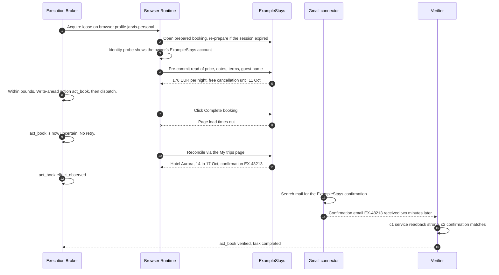
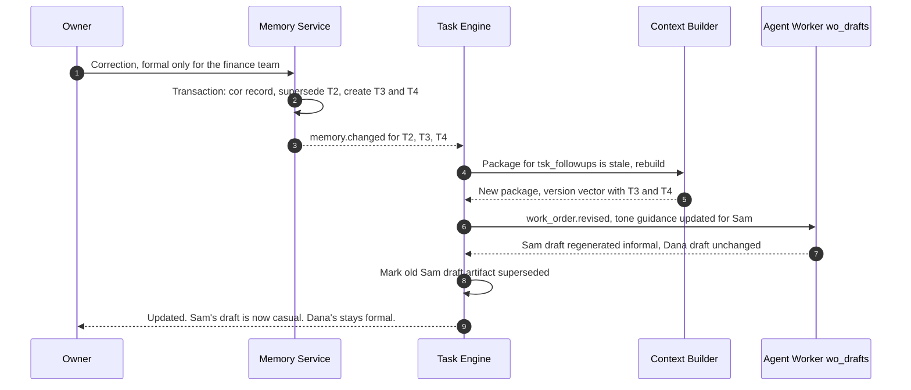

# 11 · End-to-End Worked Scenarios

Deliverable 16. Everything here is **HYPOTHETICAL**: people, companies, sites, amounts, paths, and dates are invented. No booking, message, or purchase is made. Each scenario ties together the task contract ([02](02-boss-and-tasks.md)), memory ([03](03-memory.md)), policy ([04](04-policy-and-trust.md)), execution ([05](05-capabilities-and-execution.md)), skills ([07](07-skills-and-learning.md)), the Workshop ([08](08-workshop-and-release.md)), and time ([10](10-time-and-attention.md)).

**Shared hypothetical context.**

- Owner timezone Europe/London. Quiet hours 22:00–07:30. Working hours 08:30–17:30.
- Connected: Gmail (read and send scopes), Google Calendar, an ExampleStays account signed in inside the `jarvis-personal` browser profile.
- Memory:
  - Project `prj_norddev`: the "NordDev Summit" in Lisbon, 15–16 Oct 2026, venue address stored.
  - Stated preference: "I travel alone to conferences."
  - Taste: quiet rooms.
- Rules:
  - `rul_nonrefundable`: "Never book non-refundable accommodation without asking."
  - `rul_archive`: "Never modify anything in `D:\Archive`." (protected)

---

## S1. Booking a hotel, from intent to verified outcome

### Three requests that mean three different things

| You say | Mode | Effect ceiling | Outcome |
|---|---|---|---|
| **A.** "Find me hotels near the conference venue for 14–17 October, under €180 a night, with free cancellation." | `research` | `read.*` | An options table artifact and a recommendation. Nothing is booked. |
| **B.** "Prepare the booking for the second one." | `prepare` | `read.account`, `write.account` | JARVIS fills everything up to the review page and stops: **"Ready for your decision."** |
| **C.** "Book the second one if it's still under €180 a night with free cancellation." | `execute` | `read.account`, `write.account`, `commit`, `spend` | Books without a redundant confirmation, provided everything is still within the bounds you gave |

### What C sets in motion

**Interpretation and contract (revision 3 of `tsk_lisbon`).**

| Item | Value | Source | Known or assumed |
|---|---|---|---|
| Service | ExampleStays | Option 2 in the artifact from A, which you saw | Known |
| Target | "Hotel Aurora", deluxe double, option 2 | Your selection of a displayed item | Known (`exact_target`) |
| Dates | Check in 14 Oct, check out 17 Oct 2026 | Message A | Known |
| Guests | 1 | Memory: "I travel alone to conferences" (stated) | Assumption, shown on the task card |
| Location | Near the venue | `prj_norddev` venue (memory) | Known |
| Price bound | ≤ €180 per night | Message C | Known (hard constraint) |
| Cancellation | Free cancellation required | Messages A and C | Known (hard constraint) |
| Account | ExampleStays personal | Account binding in the profile registry | Known, and checked at pre-commit |
| Payment | Card on file at the site | Site account. JARVIS never sees the number. | Known |

**The authorization envelope** has effects `commit` and `spend`, bounds as above, and `substitution: exact_target`. **Grounding passes:** every bound traces to your messages, to the option you selected from JARVIS's displayed list, or to confirmed memory ([04 §10.6](04-policy-and-trust.md#106-authorization-sources-grounding-grants-and-re-checks)). `rul_nonrefundable` is consistent with the "free cancellation" bound. The Policy Engine issues a single-use grant `grt_…` that expires in 30 minutes. **You are not asked again**, because your instruction already authorizes this exact commitment.

**Execution** runs the skill `skill:travel.book_accommodation@0.4.0` (pinned) in mode `book`:



**What you are told:**

> "Booked: Hotel Aurora, 14–17 Oct, €176/night (€528 plus local tax). Confirmation EX-48213, checked against your ExampleStays trips page and the confirmation email. Free cancellation until 11 Oct 23:59. I've set a reminder for 10 Oct at 18:00 so you can decide before that deadline. Remove it? Want it on your calendar too?"

The reminder is `notify_owner`, which is allowed by default and shown so you can remove it. The calendar event is `write.account`, so JARVIS offers it and does not add it on its own, unless you have a standing permission for trip entries.

### When things are not simple

| Situation | Behavior |
|---|---|
| Guest count not stated, and no memory | Price depends on guests, so it is material. One question before searching. |
| Two options fit equally | In A, both are shown with the deciding difference ("5 versus 12 minutes' walk; €8 difference"). In an `any_within_bounds` booking, the tie is broken by your stored tastes (quiet room). If still tied, a decision card. No blind pick. |
| Price becomes €178 | Within the €180 bound. Proceed, and log the drift. |
| Price becomes €186 | Out of bounds. Stop: "The price rose to €186, above your €180 limit. Book anyway, or see alternatives?" |
| Cancellation terms change to non-refundable | Violates the bound, and `rul_nonrefundable` also applies. Stop and ask. |
| The site asks you to sign in | `waiting_for_auth`. The JARVIS profile window opens at the sign-in page. You sign in and JARVIS resumes **after re-observing**. |
| CAPTCHA or 2FA at checkout | Waits for you. It is never solved or bypassed automatically. |
| Hotel Aurora sells out (`exact_target`) | Stop: "Aurora is sold out. The best alternative within your limits is Casa Lumen at €169, free cancellation. Book it?" |
| Sold out, but the instruction was "book one that fits" (`any_within_bounds`) | Substitutes automatically if every bound and requirement is met, and **states the substitution** in the report |
| The wrong account is signed in | Stop at pre-commit. You choose the account. |
| Reconciliation stays inconclusive (no trip listed, no email after 20 minutes) | "I can't confirm whether the booking went through. Nothing appears in My trips and no email has arrived. Retrying could double-book. Wait longer, check the site yourself, or retry?" |

### What is remembered, learned, and forgotten

| Item | Becomes |
|---|---|
| The booking (hotel, dates, confirmation ID, cancellation deadline) | A project fact on `prj_norddev`. The confirmation ID is `personal` sensitivity. |
| The cancellation deadline | A reminder schedule plus an open commitment ("decide by 11 Oct") |
| The €180 bound, the dates, option 2 | **Task parameters only.** They are not preferences. |
| The timeout followed by a successful booking | A candidate *pitfall* lesson: "ExampleStays confirmation can time out while the booking still succeeds; reconcile via My trips." Accepted, because a verified failure with clear evidence qualifies ([07 §12.14](07-skills-and-learning.md#1214-candidate-lessons-versus-accepted-knowledge)). It becomes a note in the skill through a minor-version improvement. |
| The skill run | A `SkillExecutionRecord`. Success count +1. |
| An experience record | Verified success, duration, cost (estimated), and the site fingerprint |
| **Not retained** | Payment-page content, card details (never seen), full page HTML, and other hotels' rates (kept only in the task artifact under task retention). The confirmation screenshot is kept as evidence for 30 days. |

### A newly encountered booking site

You ask JARVIS to book on **StayDirect**, a site with no profile in the booking skill.

1. **Gap.** Capability search finds the skill, but StayDirect is not in its `compatibility.sites`. The gap is classified `reliability/tool`, and the minimum missing capability is "a site profile for staydirect.example."
2. **Service policy is unknown**, so owner-attended mode applies: *"I haven't worked on StayDirect before. I found no terms that address automated use (link to their terms). Should I operate the site for you, or prepare everything and let you click Book?"* You choose "operate." That choice is recorded as the site's policy.
3. **Exploration** in guided mode: an Agent Worker with browser tools, effects limited to `read.account` and `write.account` (prepare mode), reaches the review page. It records a structural trace: roles and names, page fingerprints, the location of the identity probe.
4. **Draft site profile.** The Learning Service turns the trace into `site:staydirect`: selectors, fingerprints, and an identity probe.
5. **Tests without a booking.** Replays against the recorded DOM fixtures (search, select, review). Negative fixtures for a sold-out variant and a logged-out page. A **holdout**: a second recorded session with different dates that was not used to build the profile.
6. **Validation status: "prepare-mode verified; submit step unverified."** This is an R3 skill, so the **first live submission is supervised.** At pre-commit a decision card appears, even though your instruction authorized booking. The *method* is new, and the decision card says so explicitly.
7. **After a verified live success**, the site profile becomes `active` with stated validity conditions: `staydirect.example`, layout fingerprint `a9d2…`, personal account, verified 2026-10-20. A fingerprint change later degrades it automatically.

Testing never makes a real booking. Fixtures and simulators run in the `test` node profile, where real `commit` and `spend` are denied by rule ([08 §13.9](08-workshop-and-release.md#139-evaluation-and-promotion-evidence)).

---

## S2. Opportunity monitoring (Upwork)

**Your request:** "Check for new Upwork jobs that fit my experience and tell me about good matches."

### Where the criteria come from

At onboarding or on first use, JARVIS asks for criteria you have not already given, and stores them in memory under `prj_freelance` (all HYPOTHETICAL):

| Criterion | Stored as |
|---|---|
| Skills: TypeScript, React, Electron, Node | Facts about you, stated |
| Project types: desktop apps, internal tools, automation | Preference (taste) |
| Rate: at least $45/h, or fixed price at least $1,000 | Preference, `strength: strong` |
| Availability: about 15 hours per week until December | Fact with `valid_until` |
| Exclusions: crypto trading bots, scraping tools, unpaid test tasks | Preference, `kind: requirement` |
| A "good match": 2 or more core skills, the client's payment verified, budget meets the threshold, not excluded | Rubric (`rubric_ref`) |

JARVIS never invents your professional history.

### Choosing a permitted source

The Upwork service policy is `ui_automation: prohibited` and `api: approval_required`, based on Upwork's automation guidance and API help pages [V-S] ([06 §11.19](06-connectors-providers-budgets.md#1119-service-connectors)). JARVIS presents the permitted options as a decision, because the route matters:

| Option | How it works | Status |
|---|---|---|
| **(a) Upwork API** | If you hold an approved key for personal use. Job-search availability must be verified. | Apply at Upwork's developer portal. Review takes about a week. Personal and internal use only. |
| **(b) Your Upwork job-alert emails** (recommended now) | You set up saved searches and alerts in Upwork yourself. JARVIS reads the alert emails through the Gmail connector. | Works now. JARVIS sends no requests to Upwork. |
| **(c) You share jobs** | Paste text or links. JARVIS evaluates on demand. | Always available |

JARVIS does **not** scrape, open, or poll Upwork pages, and computer use does not disguise a scraper.

### The monitor (option b)

```yaml
monitor_id: mon_upwork_matches
source:
  capability: tool:gmail.messages.search
  account_id: acc_gmail_personal
  query: { from: "<Upwork alert sender, confirmed from your inbox>", newer_than_cursor: true }
  service_policy_ref: svc:upwork.com
schedule: every 30 min, 08:00–20:00 local, with jitter
rate_budget: { max_source_calls_per_day: 48, max_model_evals_per_day: 40 }
match:
  hard_filters: { not: { field: text, op: matches, value: "(?i)crypto trading|scrap(e|ing)|unpaid test" } }
  scoring: { method: model, criteria_memory_ids: [mem_skills, mem_rate, mem_types, mem_excl], rubric_ref: rub_good_match, threshold: high }
dedup: { key_fields: [upwork_job_id], seen_retention_days: 60 }
notify:
  policy: important_only
  digest_schedule_id: sch_digest_1800
  quiet_hours: respect
  max_interrupts_per_day: 3
allowed_effects: [read.account, notify_owner, write.local]
```

**Each run** ([10 §15.5](10-time-and-attention.md#155-monitors)):

1. **Ingest.** Parse new alert emails into items: title, snippet, budget or rate, posted time, the job link and ID taken from the email.
2. **Deduplicate.** The same job in several alert emails becomes one item.
3. **Filter.** Exclusions and budget thresholds. An unknown budget is kept at a lower score.
4. **Score.** A model applies the rubric and returns fit (high, medium, low), reasons, and missing information. The result is cached per job ID.
5. **Freshness.** Items older than 48 hours lose urgency.
6. **Threshold.** A high-fit job posted within 3 hours interrupts, at most 3 times a day. Medium fits go to the 18:00 digest. Low fits are only recorded.
7. **Evidence.** Each notice shows *why* it matched and links to the source email, so you can check.
8. **Record.** Items are kept 30 days with shown or dismissed status, so a job is never announced twice.
9. **No new matches means silence.** The cursor advances and nothing is sent.

Your feedback ("not this kind", "good one") becomes an *inferred* preference proposal scoped to this monitor, or an edit to the explicit criteria if you state one.

### Separate actions need their own scope

| You say | What happens |
|---|---|
| "Draft a proposal for #2" | A new task in `draft` mode (`write.local`). Allowed. |
| "Apply to #2" | Needs an explicit instruction **and** a permitted route. If an approved API supports submission [U], it is an execute task with `commit` and `communicate`. Otherwise JARVIS prepares the text and **you** submit on Upwork. JARVIS never automates Upwork's interface. |
| Spending Connects | `spend`. Only by you, or through an approved API route with explicit authorization. |
| "Message the client" | `communicate`. The same permitted-route rule applies. |

**Reuse.** The same monitor framework serves grant deadlines (a funder's announcement emails), price changes (a retailer API or price-alert emails), and account events (bank alert emails). Each only changes the source capability and rubric, and each works only where the source's rules permit.

---

## S3. Alarms, reminders, and natural-language time

**Context.** It is Friday 25 Sep 2026, 16:40 BST, in Europe/London. There is no stored meaning for "afternoon."

| You say | Interpretation | Asked? | Stored |
|---|---|---|---|
| "Remind me tomorrow afternoon to call the landlord." | Saturday 26 Sep, **14:00** (default for "afternoon"). A reminder, not an alarm. | No. An approximate time is fine, and the exact interpretation is shown: *"Reminder: Sat 26 Sep, 14:00, 'call the landlord.' Change time?"* | `sch_…` reminder, `floating_local`, `start_local 2026-09-26T14:00`, missed-run `fire_if_within 24h`. Plus a commitment `cmt_…` "call the landlord" due Sat 14:00. |
| "Set an alarm for 7." | Candidates: 19:00 today (in 2 h 20 min) or 07:00 Saturday | **Yes**, unless history is decisive. If 9 of your last 10 alarms were morning wake-ups, JARVIS sets **07:00 Sat** and shows a one-tap switch: *"Alarm: 7:00 AM Saturday. [Switch to 7:00 PM today]."* Without such history: *"7 AM tomorrow or 7 PM today?"* | `sch_…` alarm, `wake_system: true`, overrides quiet hours (07:00 is inside them). Shows wake-test status. |
| "Make that 8 instead." | Resolves `last_referenced_schedule_id` to the alarm | No | **Revision** of the same `sch_…` to 08:00. *"Alarm moved to 8:00 AM Saturday."* There is no second alarm. |
| "Every weekday, tell me what needs attention." | A scheduled task running `skill:briefing.daily` at 08:30 Monday to Friday (start of working hours), `follow_owner_tz: true` | No | Envelope limited to `read.*` and `notify_owner`. Missed-run `coalesce_once` within 4 hours. Interpretation: *"Weekdays at 08:30 London time, starting Monday 28 Sep."* |

**DST.** On Monday 26 Oct 2026, the day after DST ends, the briefing fires at 08:30 GMT. The wall clock stays the same.

**Correcting the interpretation teaches it.** Saying "afternoon means 3 for me" stores a preference `time.afternoon = 15:00`. `skill:time.interpret`, which turns natural language into structured schedules, reads such preferences and grows its test cases: DST edges, AM versus PM, "end of day", "first thing". **The timing itself stays deterministic Scheduler code.**

**Windows-only reality** for these schedules:

| Condition | Result |
|---|---|
| Console closed | Everything still fires. The Coordinator runs in the background. |
| JARVIS stopped, or you are signed out | Nothing fires. Missed-run policy at next start. |
| PC asleep at 07:00 | Fires only if the wake timer works (tested status shown). Otherwise: "Missed alarm: 07:00." |
| PC powered off | Nothing fires. Missed-run policy at next sign-in. |
| Backup option | For important items: mirror to Google Calendar with a pop-up reminder, so your phone alerts you, if connected and authorized |

**Cancelling** ("cancel the alarm") sets the schedule to `cancelled` and removes its OS wake task.

---

## S4. An unfamiliar task that requires building something

**Your request:** "Turn my collection of voice notes, screenshots, and documents into a searchable project archive, organized the way I work."

The inputs (HYPOTHETICAL): `D:\Notes\Voice` (about 300 `.m4a` files), `D:\Screenshots` (about 1,200 `.png`), `D:\Docs\Clients` (about 800 `.pdf`, `.docx`, `.md`).

### 1. Understand the goal and the constraints

- **Contract.** Mode `build` then `execute`. Effects: `read.local` on the three folders, `write.local` to the destination, `execute_code` and `install` only at T2 (sandbox).
- **Destination.** The first proposal, `D:\Archive\ProjectArchive`, **conflicts with the protected rule `rul_archive`**, and the Policy Engine flags it while the plan is being validated. JARVIS proposes `D:\Knowledge\ProjectArchive` instead and says why.
- **Privacy.** Your privacy posture marks file contents `local_only`. Therefore transcription, OCR, and classification must run **locally**. No file content goes to a cloud model.
- **"The way I work"** is resolved from memory: projects and clients (entities), the folder convention "Clients/<Client>/<Year>", and naming conventions.

### 2. Break it into capabilities and find the gap

| Needed capability | Registry | Status |
|---|---|---|
| Enumerate files | `tool:fs.list` | ✓ |
| Batch local transcription with timestamps | — | ✗ missing (only streaming push-to-talk speech-to-text exists) |
| OCR | `tool:ocr.windows` | ✓, but the sandbox cannot call Windows OCR directly |
| Document text (PDF text layer, DOCX, MD) | `tool:doc.extract` | Partial: scanned PDFs are not supported |
| Local classification into projects | Rules plus the local embedding model | ✓ (no cloud) |
| Archive index and search UI | — | ✗ missing |

**Gap report** `gap_…`: classification `tool`. Minimum missing capability: "batch local transcription, multi-format extraction, a local index builder, and search." Reuse value: **high**, because you have several projects and archiving recurs. **Resolver:** no existing or prior work covers it, so **build**. The estimated development cost is shown as an estimate, within the task's development budget. Your instruction already covers building the tool, so there is no separate approval.

### 3. The development work order (abridged)

```yaml
dev:
  problem: "Build a local, offline archive builder and search for audio, images, and documents."
  target: { kind: tool, capability_id: "tool:archive.build_index", version_bump: minor }
  io_expectations:
    inputs: "m4a/mp3/wav; png/jpg; pdf (text and scanned), docx, md, txt; staged read-only copies"
    outputs: "SQLite FTS5 archive DB plus per-item JSON sidecars plus a local static search UI plus report.json"
  item_schema: "id, source_path, type, created, modified, project_id, entity_ids, text, transcript segments (t0, t1, text),
                ocr text with confidence, extraction_status, content_hash"
  environment_constraints:
    runtime: python
    os: linux_wsl
    network: { build: allowlist, runtime: none,
               allowlist: ["package registry", "pinned model download host (hash-pinned)"] }
  available_dependencies: { license_allowlist: [MIT, Apache-2.0, BSD-3-Clause] }   # e.g. whisper.cpp family, Tesseract [I]
  permission_boundaries: { declared_effects: [read.local, write.local], tier: T2,
                           filesystem: { inputs: "/in (read-only staged)", outputs: "/out" } }
  test_requirements:
    fixtures_ref: "synthetic: TTS-generated voice notes with known text; rendered screenshots; generated PDF/DOCX, including one scanned-style PDF"
    negative_cases: ["unsupported .heic", "password-protected PDF", "corrupted audio", "zero-byte file"]
    holdout_ref: "holdout:archive-builder/v1 (20 unseen synthetic items plus 20 queries)"
  success_criteria:
    - ">= 95% of supported synthetic items indexed"
    - "transcript word error rate <= threshold on clean synthetic audio"
    - "OCR key-phrase recall >= threshold; low-confidence text flagged, not silently trusted"
    - "unsupported and failed items reported with reasons, never silently dropped"
    - ">= 18 of 20 holdout queries return the expected item in the top 5"
  review: { second_worker: false }     # R1: writes only its own output folder
```

### 4. Build, validate, register

- **Build.** The Claude Code Worker, per your preference and its reliability record, works in W1. You see: *"Building a tool I need: testing (3 of 4)."* The original task is `waiting_for_subtask`.
- **Validation.** The pipeline stages run ([08 §13.8](08-workshop-and-release.md#138-validation-pipeline)). Holdout: 19 of 20 queries pass. Observed runtime network: none. The dependency audit flags the model download, which is pinned by hash.
- **Registration.** `tool:archive.build_index@0.1.0` and `tool:archive.search@0.1.0` at T2 with staged I/O, plus a draft skill `skill:knowledge.build_project_archive@0.1.0`. The skill is hybrid: enumerate, stage, build, classify, verify, publish. R1, so it becomes `active` automatically, with a notice.

### 5. Resume the original task

1. **Pre-flight.** A disk-space check, then staging copies of the authorized inputs into the sandbox.
2. **Run the builder.** Transcribing 300 notes on CPU takes hours. Progress checkpoints ("processed 120 of 300") survive restarts.
3. **Classify** items into projects using your conventions, locally.
4. **Publish** to `D:\Knowledge\ProjectArchive` (`write.local`).
5. **Verify.** Counts discovered against processed. Sample queries on known project and client names. The UI opens. Spot checks.

**Presented result:**

> "Archive ready: 2,241 of 2,300 items indexed, organized by client and year as in your folder convention. 59 need attention: 41 scans with low OCR confidence (searchable but marked uncertain), 12 password-protected PDFs, 6 corrupted audio files. Open search · See the list of 59."

**Generalization.** The skill's parameters are source folders, destination, organization scheme (a *memory reference*), language, and privacy mode. The code contains no personal data. Your conventions are read from memory at run time. Another project reuses the same skill with different parameters.

### Failure branches

| Failure | Behavior |
|---|---|
| Unsupported type (for example, `.heic` photos) | Listed in the report with the reason. An improvement proposal is offered ("Add HEIC support?"). Never silently skipped. |
| OCR uncertain | Items are flagged with confidence. Their text is searchable but labeled "low confidence," never presented as exact. |
| A dependency is unavailable (model host blocked, license rejected) | The development subtask is `blocked` with the concrete prerequisite named. The resolver proposes a smaller model or asks. The original task offers a partial result: documents and screenshots now, audio later. |
| Development budget exhausted mid-build | The workspace and partial tool are preserved: *"The tool is about 70% done: transcription works, scanned-PDF OCR tests fail. Finishing needs an estimated N more budget. Continue, skip scanned PDFs, or stop here?"* |
| Local compute too slow | An honest estimate ("about 5 hours on this CPU"). Offer to run overnight as a scheduled task. |

---

## S5. Memory correction, end to end

This walk-through uses the records from [03 §9.7](03-memory.md#97-worked-examples-scope-time-and-correction).

1. **You state a preference.** Tuesday: "For Northwind, keep it formal." → `mem_T2` (tone `formal`, scope entity `ent_northwind`, stated, `owner_verified`). Echo after commit: *"Noted: formal tone with Northwind."*
2. **Stored with scope and source.** It carries `source_refs: [msg_…B]`, and the global `mem_T1` (informal) is untouched.
3. **A later task applies it.** Thursday: "Draft follow-up emails for all overdue invoices." → task `tsk_followups` in `draft` mode. An Agent Worker (`wo_drafts`) drafts five emails. The Context Builder resolves Dana (Northwind finance lead) and Sam (Northwind designer) through `member_of ent_northwind`, so both drafts are formal. Other clients get the global informal tone.
4. **You correct it while drafting is in progress.** "Actually, formal only for their finance team. Sam's fine with casual."
5. **The authoritative record changes, in one transaction:**
   - Correction `cor_…` (`wrong_scope`).
   - `mem_T2` becomes `superseded` (`valid_until` now).
   - New `mem_T3`: formal, scope `ent_northwind_finance`.
   - New `mem_T4`: informal, scope `ent_sam`.
   - `generalization_limit` recorded.
6. **Derived data is invalidated.** The Northwind card, Sam card, and communication-profile summaries become `stale`. The context package for `tsk_followups` (whose version vector included `mem_T2 r1`) is invalidated.
7. **The running worker receives the update:**



   No email had been sent, because the task was in `draft` mode. Had a send been pending, its action would have been **invalidated**, because its body was derived from a stale context package ([03 §9.9](03-memory.md#99-context-builder)).
8. **After a restart** (the PC reboots overnight), "Reply to Sam's question about the logo" builds context from the database: `mem_T4` applies, so the tone is casual. Nothing depends on a provider's conversation history or on an in-memory cache.

---

## S6. A recurring workflow breaks, JARVIS repairs it, and learns

**The workflow:** on the 1st of each month, download the electricity bill PDF from the BrightPower portal and file it in `D:\Finance\Bills\<year>`. It runs as `skill:finance.fetch_utility_bill@1.2.0`: R1, `read.account` plus `write.local`, site profile `brightpower`.

1. **It starts failing because the site changed.** On the 1 October run, step `open_bills_page` fails its postcondition: "Bills & payments" was not found, and the layout fingerprint does not match. The identity probe passed, so the login is fine.
2. **Classify and degrade.** The failure class is `layout_changed`: not authentication, not an outage (the page loaded), not the wrong account. The fingerprint changed, so the skill becomes `degraded` for `brightpower` at once. The run moves to `waiting_for_subtask`. Your notice: *"BrightPower changed its website. I'm adapting my procedure. Your bill download is paused, nothing else is affected."*
3. **Examine the evidence.** A structural DOM snapshot (roles and names, not content), a redacted screenshot, and the prior fixtures. The diff shows the navigation moved into an account menu.
4. **A coding worker develops a compatible revision.** A `skill_repair` work order goes to Codex, with the old fixtures, new snapshots captured read-only now (redacted), and the failure evidence. Constraints: preserve the original behavior, add the new fingerprint, **do not widen permissions**.
5. **Tests cover the original behavior and the changed environment.**
   - The old-layout fixture still passes, in case the site A/B tests layouts.
   - The new-layout fixture passes.
   - Negative cases: logged-out page, no bill available yet.
   - Holdout: a new-layout snapshot from a separate read-only exploration, not shown to the builder.
   - Live check: navigate to the bill list and download to the task folder, which is within R1.
6. **Activate under the release policy.** R1 with no permission delta, so automatic activation with a notice. `1.3.0` becomes `active`, and the next two runs are the canary.
7. **The interrupted task resumes** from the failed step with a fresh observation. It downloads the bill, verifies it (`file_check`: the PDF opens and contains the expected statement date and the account-number placeholder match), files it to `D:\Finance\Bills\2026`, and completes.
8. **Later runs show whether the fix actually helped.** Execution records track success over the canary and beyond (for example, "3 of 3 since the repair"). A recurrence triggers a rollback to `1.2.0` if the old layout returns, or another repair.

### Improving capability selection and tests, without touching authority

The Learning Service notices that three browser skills failed from layout changes in two months, each detected only at failure time. It proposes a **meta-improvement**:

- A weekly **read-only** layout-fingerprint probe for active browser skills that have upcoming scheduled runs.
- A test-generation rule: always capture structural fixtures on successful runs.

A replay over the last two months shows the probe would have caught two of the three breakages a day early. The change is released as a versioned `learning-config` update.

It **cannot** weaken owner rules or grant itself anything. The probe uses only the `read.account` access those skills already had. The Release Manager's permission-delta check confirms nothing was added. Had the probe needed a new effect or account, it would have required your approval ([07 §12.12](07-skills-and-learning.md#1212-meta-improvement-with-guardrails)).
