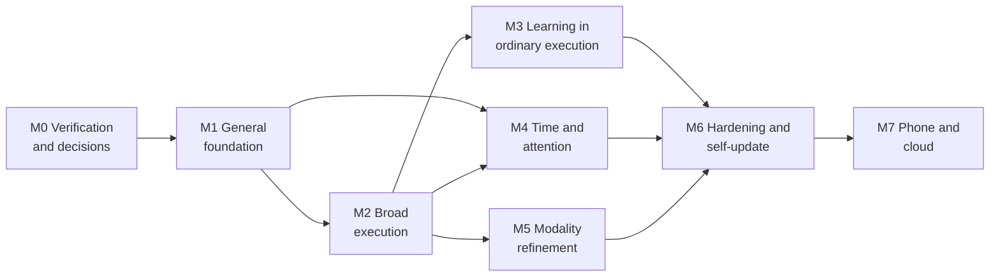

# 13 · Dependency-Aware Build Plan

Deliverable 18. It also covers brief §44. Failure-scenario IDs (F01…) refer to the matrix in [14 §19.1](14-verification-and-observability.md#191-failure-and-acceptance-matrix).

---

# 18. Build plan

## 18.1 Principles

1. **General from the first usable release.** M1 already has the open task loop, persistent memory and rules, routing across several execution methods, a development path for missing capabilities, and durable execution history. Later milestones add reach, not generality.
2. **Contracts first.** Task contracts, the event envelope, IDs, NEP, the capability descriptor, and the policy decision are defined in M1 exactly as the cloud-era system will use them.
3. **Every milestone ends with a novel-task test.** The representative tasks are regression tests. Acceptance also requires a task the developers did not see in advance, chosen by you at acceptance time, and solved by composition or the development path.
4. **Verify before building on it.** Integration assumptions marked [U] or [V-S] are tested in M0 before any design depends on them.
5. **Basic voice, images, and reminders come early** (M1), because interaction modality shapes conversation and task identity. Refinement comes later (M5).

## 18.2 Dependencies

M4 and M5 can run in parallel with M3 when two people are available.

## 18.3 Milestones

### M0: Verification and decisions

**User-visible result.** None beyond a verification report and your decisions. This is deliberate.

**Spikes**, each with explicit pass or fail criteria:

1. **Claude Code Worker.** `claude -p` with `stream-json` inside the WSL2 Workshop distro, on a subscription login. Strict sandbox mode. MCP Gateway connection. Interrupt and resume. The configuration-hygiene flags. Credential masking.
2. **Codex Worker.** app-server over stdio: generate the schema from the installed CLI, confirm the thread and turn lifecycle, confirm the approval-request names and handling, steer and interrupt. ChatGPT login inside WSL. The native Windows sandbox modes.
3. **Terms.** Review what your Claude and ChatGPT plans permit for automated *personal* use of Claude Code and Codex, and read the Agent SDK note in context. Output: the worker billing routes (owner decision).
4. **Boss model evaluation.** `claude-opus-5` against `claude-opus-5-5`, plus a fast-model candidate, on a 30-scenario boss suite: interpretation, materiality, grounding, injection resistance.
5. **WSL isolation red-team.** With interop and automount disabled and an unprivileged user: try to read Windows files, launch Windows binaries, reach the Coordinator's pipes, and exceed the network allowlist. **All must fail.**
6. **Windows Sandbox and the `wsb` CLI** on your edition, or confirmation that fallback W3 is needed.
7. **Session Agent.** UI Automation on five applications you choose. Input injection with focus checks. Takeover detection by the injected flag. Behavior while locked. DPI and multi-monitor coordinate mapping.
8. **Browser.** Playwright persistent contexts with installed Edge or Chrome. Profile isolation. Identity probes. Headless versus headed behavior while locked.
9. **Wake timers and alarm audio** on your PC, on mains power and on battery.
10. **Voice.** Local speech-to-text latency on your hardware. Windows voices. The push-to-talk hook.
11. **Google OAuth.** Your own Cloud project. Token lifetime in Testing versus production. The `drive.file` flow.
12. **Upwork.** API eligibility (if you want to pursue it), and a sample alert email that you provide.
13. **SQLite.** The Node binding with FTS5, WAL, and the backup API. Loading `sqlite-vec` on Windows.
14. **Emergency-stop latency.**

**Kit.** The runnable Phase 0 kit is in [`jarvis/phase0/`](../../jarvis/phase0/README.md). Its README maps each spike above to a step, or marks it as still open.

**Acceptance evidence.** A verification report listing every assumption as confirmed, refuted, or design-changed, plus updates to the decision log ([15](15-decisions-and-traceability.md)). Prototypes are archived, not shipped.

**Incomplete by design.** No product.

### M1: General assistant foundation

**User-visible result.** A Windows app you can talk to by text, push-to-talk voice, images, and files. It:

- Remembers what you tell it, and lets you inspect, correct, and delete memory.
- Obeys the rules you set, and says which rule when it declines.
- Works with your files and command-line tools, with undo for local changes.
- Researches the web.
- Sets reminders and alarms (while the PC is on).
- Shows honest task status and recovers from restarts.
- **When it lacks a capability, builds a sandboxed tool with a coding worker, tests it, and finishes your task.**

**Modules.**

| Area | M1 scope |
|---|---|
| Launcher | Start at sign-in, supervise, restart with backoff, safe mode |
| Boss Runtime | Conversation and task loops, intent interpretation, contract builder, planner and validator, delegation (single worker), Reporter with wording guard |
| Task Engine | Contracts and revisions, full task state machine, plan steps, checkpoints, the external-action lifecycle with a reconciliation framework, leases |
| Memory Service | Profile, facts, preferences, projects, commitments, entities and relationships, experiences. FTS5. Explicit remember, correction, deletion, export. |
| Context Builder | Pipeline without vectors. Rule applicability. Egress filter and placeholders. Invalidation. |
| Policy Engine | Rules with compile-and-confirm, grants, grounding checks, precedence, effect ceilings, revisions, denial reasons |
| Execution Broker and Router | Files, shell, headless browser, generated T2 tools. Evidence. The shared error vocabulary. |
| Capability Registry | Descriptors, health, search, service policies |
| Skill Runtime v0 | Workflow engine for simple skills. "Save this as a skill" on request. |
| Model Gateway | Anthropic adapter, role routing, budgets, usage ledger, fallback chains |
| Event Store | Events, evidence, artifacts, payload separation, hash chain |
| Verifier | File, read-back, test, postcondition, and model-judgement checks |
| Scheduler v1 | Alarms, reminders, scheduled tasks while the PC is on. Missed-run policies. Fire idempotency. |
| Notification Router v1 | Console and toast. Quiet hours. |
| Exec Host v1 | Job Objects, structured process requests, recovery bin, Recycle Bin deletes, DPAPI |
| Session Agent v0 | Hotkeys (including push-to-talk and emergency stop), notifications, lock and power events, on-demand screen capture. **No input injection yet.** |
| Browser Runtime v0 | Headless ephemeral contexts for research and downloads |
| Console v1 | Conversation, task list and detail, memory, rules, usage, settings, onboarding |
| Workshop v1 | W1 WSL distro, development work orders, one coding-worker adapter (whichever passed M0 first), validation stages 1–5, 7, and 9, T2 tool registration, Release Manager v0 (pointer activation and rollback) |
| Gap Resolver v1 | Classification, registry search, build, ask, or report. Resume. |
| Backups v1 | Nightly encrypted backups, weekly restore test |

**Acceptance evidence.**

- Automated: F01, F02, F03, F04, F07, F11 (background work continues while locked; the desktop is reported unavailable), F12 (simulated quota), F13 (simulated service), F15, F17, F18 (simulated clock), F21, F22, F25, F29, and F30 (boss adapter switched to a second model).
- Plus two representative tasks you choose, and **one novel task revealed at acceptance**.

**Incomplete at the end of M1.** Signed-in browser work, desktop actuation, Google connectors, automatic skill learning, monitors, proactive suggestions, wake timers, the Guard, elevated batches.

### M2: Broad execution

**User-visible result.** JARVIS works inside your desktop applications and your signed-in web accounts (in its own browser profiles). It connects to Gmail, Calendar, and Drive. It performs administrative tasks with one UAC consent per task. It handles uncertain external outcomes safely.

**Modules.**

- Session Agent v1: UIA actuation, input with leases and focus checks, takeover and yield, the automation overlay, the local emergency-stop path.
- Browser Runtime v1: persistent profiles, identity probes, action records, sign-in and 2FA waits, uploads and downloads.
- Visual computer use through the Agent Worker.
- Google connectors with OAuth and the vault.
- Elevated UAC batches.
- The second coding-worker adapter.
- Per-connector reconciliation strategies.
- Value grounding for `communicate` and `spend`.

**Predecessor.** M1.

**Acceptance evidence.** F08, F09 (takeover), F10, F13 (against a real test account), F14 (simulated booking site), F26, and a novel desktop or browser task.

**Incomplete.** Automatic learning, monitors, wake timers, the Guard.

### M3: Learning in ordinary execution

**User-visible result.** Successful novel procedures become draft skills. They are validated and promoted on evidence, then reused. Degradation is noticed and repaired through the Workshop. You can see and govern all of it on the Skills screen.

**Modules.**

- Skill extraction.
- Packages with `SKILL.md` and manifests.
- Lifecycle and promotion by risk class.
- Version pinning.
- The protected holdout store.
- The full validation pipeline: egress observation, integration tests, second-worker review.
- Canaries and automatic rollback.
- The lessons pipeline.
- Local embeddings for experiences and skills.
- Gap Resolver v2: signatures, cycles, no-progress detection.
- The improvement-proposal queue.
- Test simulators: booking site, mail.

**Predecessors.** M1 (Workshop), M2 (browser and desktop procedures worth learning).

**Acceptance evidence.** F05, F06, F16, F24 (red team against the E2 boundary), F27, an S6-style repair after a simulated site change, and a novel task.

### M4: Time and attention

**User-visible result.**

- Alarms with **tested** wake behavior.
- A calendar mirror for important reminders.
- Monitors that stay silent unless something matters, including Upwork through a permitted route.
- A daily briefing if you want one.
- "What needs my attention."
- Budgeted proactive suggestions.

**Modules.** Wake timers and the reliability test. The calendar mirror. The monitor framework. The attention model. Digests. Suggestions. The commitments view. The Upwork alert-email monitor, and the Upwork API connector if you are approved.

**Predecessors.** The M1 Scheduler and the M2 connectors.

**Acceptance evidence.** F18 (with a real wake test), F19, F20, DST boundary tests, and a novel monitoring task on a different source.

### M5: Modality refinement

**User-visible result.**

- More natural voice: streaming speech in both directions, better barge-in.
- Optional wake word and continuous mode, **off by default**.
- Better screen understanding, fusing UIA and vision.
- Image generation and editing, if you choose a provider.
- An optional "what I'm looking at" browser extension.

**Predecessors.** M1 voice, and the M2 Session Agent and vision.

**Acceptance evidence.** F25 (critical-slot ambiguity), F26, and a continuous-mode injection test: audio from speakers cannot trigger a consequential action.

### M6: Hardening, packaging, self-update

**User-visible result.**

- A machine-wide installation.
- Rules, credentials, and audit protected from other software on the PC: the Guard, plus Windows Hello for protected changes.
- Safe self-updates with rollback.
- Optionally, pre-approved admin operations without prompts.

**Modules.**

- Guard service.
- Program Files installer.
- Optional UIAccess Session Agent.
- Optional Elevated Helper.
- The core self-improvement pipeline with protected-module gates.
- The full Update Supervisor: journal, canary, migration dry runs.
- Optional continuous WAL shipping.
- Restore drills.
- A threat-model review.

**Predecessors.** M3 (Release Manager), plus M1–M5.

**Acceptance evidence.** F23, F24 (E3 test), a protected rule change requiring presence proof, and an update interrupted by simulated power loss.

### M7: Phone and cloud

**User-visible result.**

- Talk to JARVIS from your phone.
- Approve decisions remotely.
- Notifications and phone-native alarms.
- In topology B, monitors and headless tasks keep running while the PC is off.

**Modules.** The Device Link, a relay or cloud coordinator, the phone client, push notifications, device registration and revocation, and (topology B) a cloud runner node.

**Predecessor.** M6: device keys and hardened protocols.

**Acceptance evidence.** F28, device revocation, offline phone commands expiring correctly, and honest availability reporting.

## 18.4 The exact boundaries of M1

**In M1:**

- One Windows PC, per-user installation, running while you are signed in.
- Text, push-to-talk voice, image and file input. Spoken replies.
- An open task loop with no fixed intent list. Task contracts, the full state machine, checkpoints, restart recovery.
- Memory categories 1 and 3–8 ([03 §9.2](03-memory.md#92-categories-and-authoritative-stores)), with correction, deletion, export, and nightly encrypted backups. The Credential Vault (category 9) holds provider API keys.
- Rules and standing permissions with enforcement at the Broker (E1), grounding, and effect ceilings.
- Execution through files (with recovery bin), shell (Job Objects), headless web research and downloads, and generated sandboxed tools (T2, E2).
- The external-action lifecycle and reconciliation framework. In M1 it is exercised against simulated services and local effects.
- The capability registry with search and health.
- One coding worker in the WSL Workshop, with a minimal validation pipeline and a release manager (pointer activation and rollback).
- The Gap Resolver with resume-after-build.
- Alarms, reminders, and scheduled tasks while the PC is on, with honest missed-run behavior.
- A budgeted Anthropic boss adapter with a visible usage ledger. The boss model is switchable, and that is proven by F29.
- Session Agent v0: hotkeys, notifications, lock and power events, on-demand screen capture.

**Not in M1:**

- Desktop input injection and visual computer use.
- Signed-in browser profiles.
- Email, calendar, and Drive connectors.
- Automatic skill extraction.
- Monitors, suggestions, briefings.
- Wake timers.
- UAC batches (admin needs produce exact instructions for you instead).
- The Guard and Elevated Helper.
- Core self-update. Updates come by installer.
- Phone and cloud.

M1 is a *general* assistant with a narrower set of executors. It is not five hard-coded automations. Any request that files, shell, web research, and a sandboxed generated tool can satisfy is in scope from day one.

## 18.5 Effort ranges and assumptions

| Milestone | Range (engineer-weeks) | Main uncertainty |
|---|---|---|
| M0 | 2–4 | Account-level findings, such as worker terms, may change routes |
| M1 | 10–16 | Boss prompt and evaluation iteration. Workshop isolation details. |
| M2 | 8–12 | UIA variability across your applications. OAuth verification friction. |
| M3 | 6–10 | Quality of automatic skill extraction |
| M4 | 5–8 | Wake-timer reliability on your hardware |
| M5 | 4–8 | Voice latency and quality targets |
| M6 | 6–10 | Installer, service, and signing mechanics |
| M7 | 8–14 | Topology choice. Phone platform work. |
| **Total** | **49–82** | Roughly 12–20 months for one engineer |

**Assumptions.**

- One experienced engineer (TypeScript and some C#), full-time equivalent, heavily assisted by Codex and Claude Code.
- You are available about 1–2 hours a week for decisions and acceptance.
- No major provider API upheaval during the build.
- Moderate UI polish.
- App-store publishing overhead for the phone is excluded.

A second engineer shortens the schedule mostly by running M4 and M5 alongside M3, not linearly. **Confidence is low to medium.** These ranges should be re-estimated after M0. They are not delivery dates.
