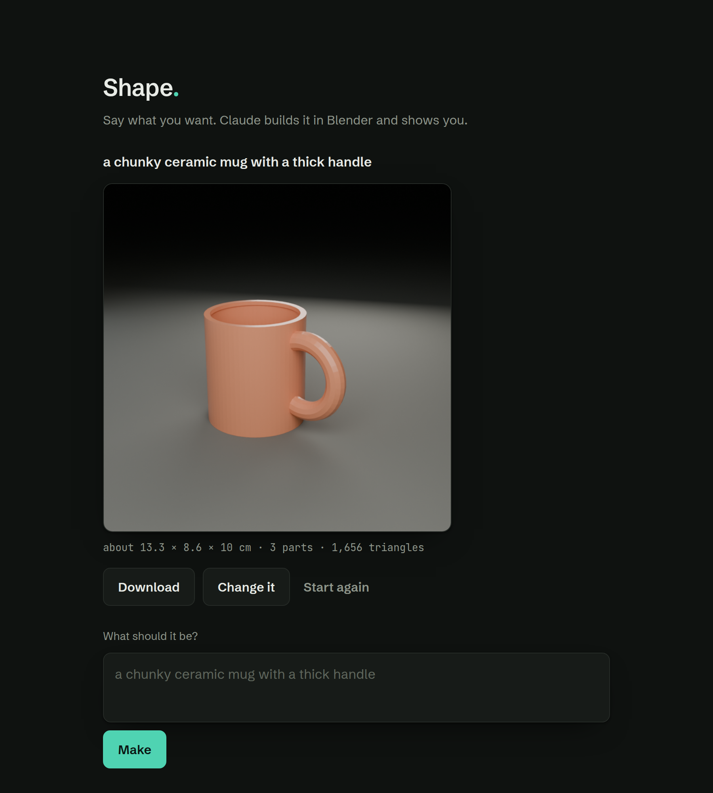

# Shape

Say what you want. Claude writes a Blender script, Blender builds and renders it,
and you get the picture and the model.

One screen. One box. No commands to learn.



## Run it

```sh
cd shape
python3 -m venv .venv && .venv/bin/pip install anthropic
export ANTHROPIC_API_KEY=sk-ant-...        # or paste a key into the page
.venv/bin/python server.py
```

Open http://127.0.0.1:7000. Blender must be on your PATH (`BLENDER=/path/to/blender`
if it is somewhere else).

## What happens when you press Make

1. Claude writes a Blender script for what you asked for.
2. The script is checked against a short allow-list.
3. Blender runs it headless, lights it, frames it, renders it, and exports a model.
4. You see the picture, the real size, and a download.

"Change it" sends the previous script back with your change, so the object keeps
its identity instead of being rebuilt from scratch.

About fifteen seconds end to end, most of it the render.

## The five files

| File | What it does |
| --- | --- |
| `server.py` | The web server. Four routes, no framework. |
| `maker.py` | Asks Claude for the script. Gives it one chance to fix a rejected one. |
| `guard.py` | What a generated script may do. |
| `build.py` | Runs inside Blender: build, light, frame, render, export. |
| `web/index.html` | The screen. |

## Safety, said plainly

Claude writes code and this runs it. The guard allows six imports
(`bpy`, `bmesh`, `math`, `mathutils`, `random`, `colorsys`), and refuses file
access, network, shell, dunder attributes, and the Blender operators that reach
outside the job folder. A rejected script is sent back once for a rewrite and
then reported, not run.

**That is a guard, not a sandbox.** It raises the cost of a bad script; it does
not make one harmless. Before this serves anyone but you:

- Run Blender in a container with no network and nothing writable except the job
  folder.
- Keep the process unprivileged, with a memory and CPU limit.
- Keep the server on localhost until both of those are true. It binds to
  `127.0.0.1` for that reason.

The key is used for the request and nothing else: never written to disk, never
logged, never returned in a job's status.

## What is not built

- No accounts, no billing, no queue. One machine, one person at a time.
- No preview you can spin — you get a render, not a viewer.
- Renders are Cycles on the CPU, because EEVEE needs a display library this
  machine does not have.
